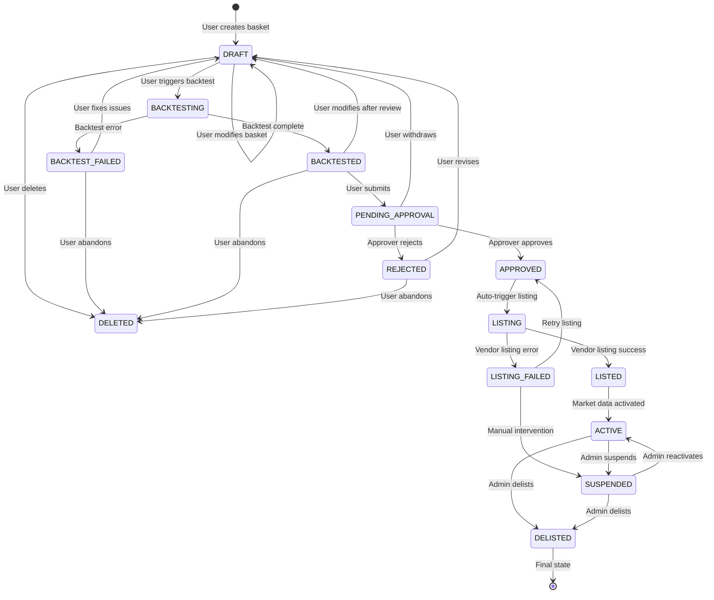

# Basket Lifecycle State Machine Implementation

## Overview

The Basket State Machine manages the complete lifecycle of thematic baskets from creation to live trading. It enforces proper workflow progression, security, and auditability across all basket operations.

## State Diagram



## States Definition

### Creation States
- **DRAFT**: User is creating/editing basket (User Editable: Yes)
- **DELETED**: Basket permanently deleted (Terminal State)

### Backtesting States
- **BACKTESTING**: Running historical analysis (User Editable: No)
- **BACKTESTED**: Backtest completed successfully (User Editable: Yes)
- **BACKTEST_FAILED**: Backtest encountered errors (User Editable: Yes)

### Approval States
- **PENDING_APPROVAL**: Submitted for approval (User Editable: No)
- **APPROVED**: Approved by designated approver (User Editable: No)
- **REJECTED**: Rejected by approver (User Editable: Yes)

### Publishing States
- **LISTING**: Publishing to vendor platforms (User Editable: No)
- **LISTED**: Successfully listed on vendor platforms (User Editable: No)
- **LISTING_FAILED**: Failed to list on vendor platforms (User Editable: Yes)

### Operational States
- **ACTIVE**: Live basket with real-time pricing (User Editable: No)
- **SUSPENDED**: Temporarily suspended from trading (User Editable: Yes)
- **DELISTED**: Removed from vendor platforms (Terminal State)

## Events Definition

### User Actions
- `CREATE_BASKET`: User creates new basket
- `MODIFY_BASKET`: User modifies basket contents
- `TRIGGER_BACKTEST`: User initiates backtesting
- `SUBMIT_FOR_APPROVAL`: User submits for approval workflow
- `WITHDRAW_SUBMISSION`: User withdraws from approval
- `DELETE_BASKET`: User deletes basket

### System Events
- `BACKTEST_COMPLETED`: Backtest process finished successfully
- `BACKTEST_FAILED`: Backtest process encountered errors

### Approval Events
- `APPROVE_BASKET`: Approver approves the basket
- `REJECT_BASKET`: Approver rejects the basket

### Publishing Events
- `START_LISTING`: Begin vendor listing process
- `LISTING_COMPLETED`: Vendor listing successful
- `LISTING_FAILED`: Vendor listing failed
- `RETRY_LISTING`: Retry failed listing

### Operational Events
- `ACTIVATE_TRADING`: Start real-time pricing
- `SUSPEND_TRADING`: Pause trading operations
- `RESUME_TRADING`: Resume trading operations
- `DELIST_BASKET`: Remove from vendor platforms

### Admin Events
- `ADMIN_SUSPEND`: Administrator suspends basket
- `ADMIN_RESUME`: Administrator resumes basket
- `ADMIN_DELIST`: Administrator delists basket

## State Transition Rules

### From DRAFT
- **MODIFY_BASKET** → DRAFT (User edits)
- **TRIGGER_BACKTEST** → BACKTESTING (Guard: basketValidGuard)
- **DELETE_BASKET** → DELETED (User deletes)

### From BACKTESTING
- **BACKTEST_COMPLETED** → BACKTESTED (System event)
- **BACKTEST_FAILED** → BACKTEST_FAILED (System event)

### From BACKTEST_FAILED
- **MODIFY_BASKET** → DRAFT (User fixes issues)
- **DELETE_BASKET** → DELETED (User abandons)

### From BACKTESTED
- **MODIFY_BASKET** → DRAFT (User revises after review)
- **SUBMIT_FOR_APPROVAL** → PENDING_APPROVAL (Guard: backtestValidGuard)
- **DELETE_BASKET** → DELETED (User abandons)

### From PENDING_APPROVAL
- **APPROVE_BASKET** → APPROVED (Guard: approverAuthGuard)
- **REJECT_BASKET** → REJECTED (Guard: approverAuthGuard)
- **WITHDRAW_SUBMISSION** → DRAFT (Guard: ownerAuthGuard)

### From REJECTED
- **MODIFY_BASKET** → DRAFT (User revises)
- **DELETE_BASKET** → DELETED (User abandons)

### From APPROVED
- **START_LISTING** → LISTING (Auto-triggered)

### From LISTING
- **LISTING_COMPLETED** → LISTED (System event)
- **LISTING_FAILED** → LISTING_FAILED (System event)

### From LISTING_FAILED
- **RETRY_LISTING** → LISTING (Guard: retryLimitGuard)
- **ADMIN_SUSPEND** → SUSPENDED (Manual intervention)

### From LISTED
- **ACTIVATE_TRADING** → ACTIVE (System event)

### From ACTIVE
- **ADMIN_SUSPEND** → SUSPENDED (Guard: adminAuthGuard)
- **ADMIN_DELIST** → DELISTED (Guard: adminAuthGuard)

### From SUSPENDED
- **ADMIN_RESUME** → ACTIVE (Guard: adminAuthGuard)
- **ADMIN_DELIST** → DELISTED (Guard: adminAuthGuard)

## Guards (Authorization & Validation)

### basketValidGuard
- Minimum 2 constituents
- Total weight equals 100%
- All constituents have valid symbols

### backtestValidGuard
- Backtest results exist
- Results are valid and complete
- No critical errors in backtest

### approverAuthGuard
- User has approval permissions for this basket
- User is not the basket creator (segregation of duties)
- Approval role is active

### ownerAuthGuard
- User is the basket creator OR
- User has admin role

### adminAuthGuard
- User has administrator role
- Admin role is active

### retryLimitGuard
- Listing retry count < 3
- No permanent listing blocks

## Actions Implementation

### State Transition Actions

#### modifyBasketAction
- Update basket contents
- Clear previous backtest results
- Publish BasketModifiedEvent
- Update last modified timestamp

#### startBacktestAction
- Validate basket constituents
- Create backtest request
- Trigger async backtest process
- Set backtest start timestamp

#### backtestCompletedAction
- Store backtest results
- Calculate performance metrics
- Publish BacktestCompletedEvent
- Update basket with results

#### backtestFailedAction
- Log error details
- Store failure reason
- Publish BacktestFailedEvent
- Allow user retry

#### submitForApprovalAction
- Create approval request
- Notify designated approvers
- Publish BasketSubmittedForApprovalEvent
- Set submission timestamp

#### approveBasketAction
- Record approver and timestamp
- Auto-trigger listing process
- Publish BasketApprovedEvent
- Update approval audit trail

#### rejectBasketAction
- Record rejection reason
- Notify basket creator
- Publish BasketRejectedEvent
- Allow user revision

#### startListingAction
- Prepare vendor-specific formats
- Trigger async listing process
- Publish ListingStartedEvent
- Track listing attempts

#### listingCompletedAction
- Record vendor confirmations
- Publish ListingCompletedEvent
- Auto-trigger trading activation
- Update listing status

#### listingFailedAction
- Log failure details
- Increment retry counter
- Publish ListingFailedEvent
- Allow manual intervention

#### activateTradingAction
- Start real-time pricing
- Publish BasketActivatedEvent
- Initialize market data feeds
- Begin price calculations

#### suspendTradingAction
- Pause real-time pricing
- Publish BasketSuspendedEvent
- Stop price publishing
- Maintain data feeds

#### resumeTradingAction
- Restart real-time pricing
- Publish BasketResumedEvent
- Resume price publishing
- Validate data feeds

#### delistBasketAction
- Stop all pricing operations
- Remove from vendor platforms
- Publish BasketDelistedEvent
- Archive basket data

## Technology Stack

### Spring State Machine
```xml
<dependency>
    <groupId>org.springframework.statemachine</groupId>
    <artifactId>spring-statemachine-starter</artifactId>
    <version>3.2.0</version>
</dependency>
```

### Database Schema
```sql
-- State tracking table
CREATE TABLE basket_states (
    basket_id VARCHAR(50) PRIMARY KEY,
    current_state VARCHAR(30) NOT NULL,
    previous_state VARCHAR(30),
    last_transition_at TIMESTAMP NOT NULL,
    transition_count INTEGER DEFAULT 0,
    created_at TIMESTAMP DEFAULT CURRENT_TIMESTAMP,
    updated_at TIMESTAMP DEFAULT CURRENT_TIMESTAMP
);

-- State transition audit
CREATE TABLE basket_state_transitions (
    id UUID PRIMARY KEY DEFAULT gen_random_uuid(),
    basket_id VARCHAR(50) NOT NULL,
    from_state VARCHAR(30),
    to_state VARCHAR(30) NOT NULL,
    event VARCHAR(50) NOT NULL,
    triggered_by VARCHAR(100) NOT NULL,
    transition_at TIMESTAMP NOT NULL,
    success BOOLEAN NOT NULL,
    error_message TEXT,
    context_data JSONB
);
```

## Performance Considerations

### State Machine Factory
- Use StateMachineFactory for basket-specific instances
- Implement connection pooling for database operations
- Cache frequently accessed state configurations

### Async Processing
- Use CompletableFuture for long-running actions
- Implement proper error handling and timeouts
- Provide progress tracking for async operations

### Event Publishing
- Use async event publishing to avoid blocking
- Implement retry mechanisms for failed events
- Monitor event processing performance

## Monitoring & Metrics

### State Distribution
- Track basket count per state
- Monitor state transition frequency
- Alert on stuck transitions

### Performance Metrics
- State transition latency
- Action execution time
- Guard evaluation performance

### Business Metrics
- Approval success rate
- Listing success rate
- Time to market (creation to active)

## Error Handling

### Transition Failures
- Log all transition attempts
- Provide clear error messages
- Implement compensation actions

### Action Failures
- Rollback partial state changes
- Retry transient failures
- Escalate persistent failures

### Guard Failures
- Validate inputs before transitions
- Provide actionable error messages
- Log security violations

## Testing Strategy

### Unit Tests
- Test each state transition
- Validate guard conditions
- Mock external dependencies

### Integration Tests
- Test complete workflows
- Validate async operations
- Test error scenarios

### Performance Tests
- Load test state transitions
- Stress test concurrent operations
- Validate database performance

## Security Considerations

### Authorization
- Validate user permissions on every transition
- Implement role-based access control
- Audit all state changes

### Data Protection
- Encrypt sensitive basket data
- Implement secure communication
- Protect against injection attacks

## Future Enhancements

### Workflow Customization
- Support configurable approval workflows
- Implement parallel approval paths
- Add time-based automatic transitions

### Advanced Features
- Implement basket versioning
- Add rollback capabilities
- Support batch operations

### Integration
- Connect with external workflow engines
- Implement API rate limiting
- Add webhook notifications
