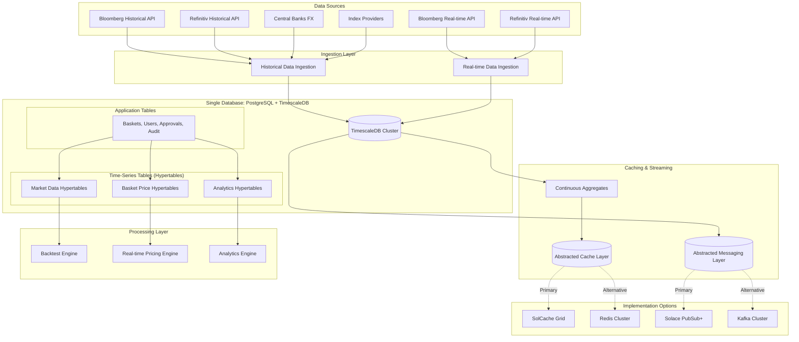

# Data Architecture Design with TimescaleDB

## Overview

The Custom Index Basket Management Platform implements a **unified data architecture** using PostgreSQL with TimescaleDB extension. This design provides both time-series optimization for historical market data and full ACID compliance for application data, all within a single database technology.

## Unified Data Architecture Diagram



## TimescaleDB Schema Design

### Hypertables for Time-Series Data

```sql
-- Enable TimescaleDB extension
CREATE EXTENSION IF NOT EXISTS timescaledb;

-- Daily stock prices (main hypertable for backtesting)
CREATE TABLE stock_prices_daily (
    time TIMESTAMPTZ NOT NULL,
    symbol TEXT NOT NULL,
    exchange TEXT,
    currency CHAR(3),
    sector TEXT,
    open DECIMAL(15,4),
    high DECIMAL(15,4),
    low DECIMAL(15,4),
    close DECIMAL(15,4),
    volume BIGINT,
    adjusted_close DECIMAL(15,4),
    dividend DECIMAL(8,4) DEFAULT 0,
    split_ratio DECIMAL(8,4) DEFAULT 1,
    data_source TEXT DEFAULT 'BLOOMBERG',
    created_at TIMESTAMPTZ DEFAULT NOW()
);

-- Convert to hypertable (partition by time with 1-month chunks)
SELECT create_hypertable('stock_prices_daily', 'time', 
    chunk_time_interval => INTERVAL '1 month');

-- Intraday prices for recent high-frequency data
CREATE TABLE stock_prices_intraday (
    time TIMESTAMPTZ NOT NULL,
    symbol TEXT NOT NULL,
    exchange TEXT,
    currency CHAR(3),
    price DECIMAL(15,4),
    volume INTEGER,
    bid DECIMAL(15,4),
    ask DECIMAL(15,4),
    last_trade_time TIMESTAMPTZ,
    data_source TEXT DEFAULT 'BLOOMBERG'
);

-- Convert to hypertable with 1-day chunks for high frequency data
SELECT create_hypertable('stock_prices_intraday', 'time', 
    chunk_time_interval => INTERVAL '1 day');

-- Index prices for benchmark comparison
CREATE TABLE index_values (
    time TIMESTAMPTZ NOT NULL,
    index_code TEXT NOT NULL,
    index_name TEXT,
    currency CHAR(3),
    value DECIMAL(15,4),
    volume BIGINT,
    market_cap DECIMAL(20,2),
    constituent_count INTEGER,
    data_source TEXT DEFAULT 'BLOOMBERG'
);

SELECT create_hypertable('index_values', 'time', 
    chunk_time_interval => INTERVAL '1 month');

-- FX rates for currency conversion
CREATE TABLE fx_rates (
    time TIMESTAMPTZ NOT NULL,
    base_currency CHAR(3) NOT NULL,
    quote_currency CHAR(3) NOT NULL,
    rate DECIMAL(15,8),
    bid DECIMAL(15,8),
    ask DECIMAL(15,8),
    volatility DECIMAL(8,4),
    data_source TEXT DEFAULT 'CENTRAL_BANK'
);

SELECT create_hypertable('fx_rates', 'time', 
    chunk_time_interval => INTERVAL '1 week');

-- Real-time basket valuations
CREATE TABLE basket_valuations (
    time TIMESTAMPTZ NOT NULL,
    basket_code TEXT NOT NULL,
    total_value DECIMAL(15,4),
    base_currency CHAR(3),
    constituent_count INTEGER,
    last_updated TIMESTAMPTZ,
    calculation_source TEXT DEFAULT 'REAL_TIME'
);

SELECT create_hypertable('basket_valuations', 'time', 
    chunk_time_interval => INTERVAL '1 day');

-- Backtest performance data
CREATE TABLE backtest_performance (
    time TIMESTAMPTZ NOT NULL,
    backtest_id UUID NOT NULL,
    basket_code TEXT NOT NULL,
    portfolio_value DECIMAL(15,4),
    daily_return DECIMAL(8,6),
    cumulative_return DECIMAL(8,4),
    benchmark_value DECIMAL(15,4),
    benchmark_return DECIMAL(8,6)
);

SELECT create_hypertable('backtest_performance', 'time', 
    chunk_time_interval => INTERVAL '1 month');
```

### Regular Tables for Application Data

```sql
-- Baskets (regular table for ACID compliance)
CREATE TABLE baskets (
    basket_code VARCHAR(50) PRIMARY KEY,
    basket_name VARCHAR(255) NOT NULL,
    description TEXT,
    basket_type VARCHAR(50) NOT NULL,
    base_currency CHAR(3) NOT NULL,
    total_weight DECIMAL(5,2) DEFAULT 100.00,
    status VARCHAR(30) NOT NULL,
    version VARCHAR(20) DEFAULT 'v1.0',
    previous_version VARCHAR(20),
    created_by VARCHAR(100) NOT NULL,
    created_at TIMESTAMPTZ DEFAULT NOW(),
    updated_at TIMESTAMPTZ DEFAULT NOW(),
    approved_by VARCHAR(100),
    approved_at TIMESTAMPTZ,
    listed_at TIMESTAMPTZ,
    activated_at TIMESTAMPTZ
);

-- Basket constituents
CREATE TABLE basket_constituents (
    id UUID PRIMARY KEY DEFAULT gen_random_uuid(),
    basket_code VARCHAR(50) NOT NULL,
    symbol VARCHAR(20) NOT NULL,
    symbol_name VARCHAR(255),
    weight DECIMAL(8,4) NOT NULL,
    shares BIGINT,
    target_allocation DECIMAL(8,4),
    sector VARCHAR(100),
    country VARCHAR(100),
    currency CHAR(3),
    added_at TIMESTAMPTZ DEFAULT NOW(),
    FOREIGN KEY (basket_code) REFERENCES baskets(basket_code),
    UNIQUE(basket_code, symbol)
);

-- State machine tracking
CREATE TABLE basket_states (
    basket_code VARCHAR(50) PRIMARY KEY,
    current_state VARCHAR(30) NOT NULL,
    previous_state VARCHAR(30),
    last_transition_at TIMESTAMPTZ NOT NULL,
    transition_count INTEGER DEFAULT 0,
    retry_count INTEGER DEFAULT 0,
    created_at TIMESTAMPTZ DEFAULT NOW(),
    updated_at TIMESTAMPTZ DEFAULT NOW(),
    FOREIGN KEY (basket_code) REFERENCES baskets(basket_code)
);

-- Approval workflow
CREATE TABLE approvals (
    approval_id UUID PRIMARY KEY DEFAULT gen_random_uuid(),
    basket_code VARCHAR(50) NOT NULL,
    submitted_by VARCHAR(100) NOT NULL,
    submitted_at TIMESTAMPTZ DEFAULT NOW(),
    approver VARCHAR(100),
    approved_at TIMESTAMPTZ,
    status VARCHAR(20) NOT NULL DEFAULT 'PENDING',
    comments TEXT,
    approval_type VARCHAR(20) DEFAULT 'SINGLE',
    FOREIGN KEY (basket_code) REFERENCES baskets(basket_code)
);

-- Backtest results summary
CREATE TABLE backtest_results (
    id UUID PRIMARY KEY DEFAULT gen_random_uuid(),
    basket_code VARCHAR(50) NOT NULL,
    backtest_name VARCHAR(255),
    start_date DATE NOT NULL,
    end_date DATE NOT NULL,
    initial_value DECIMAL(15,4),
    final_value DECIMAL(15,4),
    total_return DECIMAL(8,4),
    annualized_return DECIMAL(8,4),
    volatility DECIMAL(8,4),
    sharpe_ratio DECIMAL(8,4),
    max_drawdown DECIMAL(8,4),
    benchmark_results JSONB,
    detailed_results JSONB,
    created_at TIMESTAMPTZ DEFAULT NOW(),
    FOREIGN KEY (basket_code) REFERENCES baskets(basket_code)
);

-- Audit trail
CREATE TABLE audit_trail (
    id UUID PRIMARY KEY DEFAULT gen_random_uuid(),
    entity_type VARCHAR(50) NOT NULL,
    entity_id VARCHAR(50) NOT NULL,
    action VARCHAR(50) NOT NULL,
    old_values JSONB,
    new_values JSONB,
    changed_by VARCHAR(100) NOT NULL,
    changed_at TIMESTAMPTZ DEFAULT NOW(),
    ip_address INET,
    user_agent TEXT
);
```

### Optimized Indexes

```sql
-- Hypertable indexes (time column automatically indexed)
-- Additional composite indexes for common query patterns

-- Stock prices indexes
CREATE INDEX idx_stock_daily_symbol_time ON stock_prices_daily (symbol, time DESC);
CREATE INDEX idx_stock_daily_sector_time ON stock_prices_daily (sector, time DESC) 
    WHERE sector IS NOT NULL;
CREATE INDEX idx_stock_daily_exchange_time ON stock_prices_daily (exchange, time DESC)
    WHERE exchange IS NOT NULL;

-- Intraday prices indexes
CREATE INDEX idx_stock_intraday_symbol_time ON stock_prices_intraday (symbol, time DESC);
CREATE INDEX idx_stock_intraday_price_volume ON stock_prices_intraday (price, volume)
    WHERE volume > 0;

-- Index values indexes
CREATE INDEX idx_index_code_time ON index_values (index_code, time DESC);
CREATE INDEX idx_index_value_time ON index_values (value, time DESC);

-- FX rates indexes
CREATE INDEX idx_fx_currency_pair_time ON fx_rates (base_currency, quote_currency, time DESC);

-- Basket valuations indexes
CREATE INDEX idx_basket_valuations_code_time ON basket_valuations (basket_code, time DESC);
CREATE INDEX idx_basket_valuations_value_time ON basket_valuations (total_value, time DESC);

-- Backtest performance indexes
CREATE INDEX idx_backtest_performance_id_time ON backtest_performance (backtest_id, time);
CREATE INDEX idx_backtest_performance_basket_time ON backtest_performance (basket_code, time);

-- Application table indexes
CREATE INDEX idx_baskets_status ON baskets(status);
CREATE INDEX idx_baskets_created_by ON baskets(created_by);
CREATE INDEX idx_baskets_created_at ON baskets(created_at);
CREATE INDEX idx_constituents_symbol ON basket_constituents(symbol);
CREATE INDEX idx_constituents_sector ON basket_constituents(sector);
CREATE INDEX idx_states_current_state ON basket_states(current_state);
CREATE INDEX idx_approvals_status ON approvals(status);
CREATE INDEX idx_approvals_submitted_by ON approvals(submitted_by);
CREATE INDEX idx_backtest_basket_code ON backtest_results(basket_code);
CREATE INDEX idx_audit_entity ON audit_trail(entity_type, entity_id);
CREATE INDEX idx_audit_changed_by ON audit_trail(changed_by);
CREATE INDEX idx_audit_changed_at ON audit_trail(changed_at);
```

### Continuous Aggregates for Performance

```sql
-- Daily OHLCV aggregates from intraday data
CREATE MATERIALIZED VIEW stock_daily_agg
WITH (timescaledb.continuous) AS
SELECT 
    time_bucket('1 day', time) AS day,
    symbol,
    exchange,
    currency,
    FIRST(price, time) AS open,
    MAX(price) AS high,
    MIN(price) AS low,
    LAST(price, time) AS close,
    SUM(volume) AS volume,
    COUNT(*) AS tick_count,
    AVG(price) AS avg_price,
    STDDEV(price) AS price_volatility
FROM stock_prices_intraday
GROUP BY day, symbol, exchange, currency;

-- Weekly basket performance aggregates
CREATE MATERIALIZED VIEW basket_weekly_performance
WITH (timescaledb.continuous) AS
SELECT 
    time_bucket('1 week', time) AS week,
    basket_code,
    FIRST(total_value, time) AS week_open,
    MAX(total_value) AS week_high,
    MIN(total_value) AS week_low,
    LAST(total_value, time) AS week_close,
    (LAST(total_value, time) - FIRST(total_value, time)) / FIRST(total_value, time) * 100 AS weekly_return,
    AVG(total_value) AS avg_value,
    STDDEV(total_value) AS volatility
FROM basket_valuations
GROUP BY week, basket_code;

-- Monthly index performance for benchmarking
CREATE MATERIALIZED VIEW index_monthly_performance
WITH (timescaledb.continuous) AS
SELECT 
    time_bucket('1 month', time) AS month,
    index_code,
    FIRST(value, time) AS month_open,
    MAX(value) AS month_high,
    MIN(value) AS month_low,
    LAST(value, time) AS month_close,
    (LAST(value, time) - FIRST(value, time)) / FIRST(value, time) * 100 AS monthly_return,
    AVG(value) AS avg_value,
    STDDEV(value) AS volatility
FROM index_values
GROUP BY month, index_code;

-- Hourly FX rate aggregates
CREATE MATERIALIZED VIEW fx_hourly_agg
WITH (timescaledb.continuous) AS
SELECT 
    time_bucket('1 hour', time) AS hour,
    base_currency,
    quote_currency,
    FIRST(rate, time) AS hour_open,
    MAX(rate) AS hour_high,
    MIN(rate) AS hour_low,
    LAST(rate, time) AS hour_close,
    AVG(rate) AS avg_rate,
    STDDEV(rate) AS rate_volatility
FROM fx_rates
GROUP BY hour, base_currency, quote_currency;

-- Enable real-time aggregation policies
SELECT add_continuous_aggregate_policy('stock_daily_agg',
    start_offset => INTERVAL '3 days',
    end_offset => INTERVAL '1 hour',
    schedule_interval => INTERVAL '1 hour');

SELECT add_continuous_aggregate_policy('basket_weekly_performance',
    start_offset => INTERVAL '2 weeks',
    end_offset => INTERVAL '1 day',
    schedule_interval => INTERVAL '1 day');

SELECT add_continuous_aggregate_policy('index_monthly_performance',
    start_offset => INTERVAL '2 months',
    end_offset => INTERVAL '1 week',
    schedule_interval => INTERVAL '1 week');

SELECT add_continuous_aggregate_policy('fx_hourly_agg',
    start_offset => INTERVAL '2 days',
    end_offset => INTERVAL '10 minutes',
    schedule_interval => INTERVAL '10 minutes');
```

### Data Retention and Compression Policies

```sql
-- Compression policies (compress older data for storage efficiency)
SELECT add_compression_policy('stock_prices_daily', INTERVAL '7 days');
SELECT add_compression_policy('stock_prices_intraday', INTERVAL '1 day');
SELECT add_compression_policy('index_values', INTERVAL '7 days');
SELECT add_compression_policy('fx_rates', INTERVAL '1 day');
SELECT add_compression_policy('basket_valuations', INTERVAL '1 day');
SELECT add_compression_policy('backtest_performance', INTERVAL '30 days');

-- Retention policies (automatically drop old data)
SELECT add_retention_policy('stock_prices_intraday', INTERVAL '2 years');
SELECT add_retention_policy('basket_valuations', INTERVAL '5 years');
SELECT add_retention_policy('fx_rates', INTERVAL '10 years');
-- Keep daily prices and index values indefinitely for backtesting

-- Drop old chunks policy for backtest performance (keep only recent backtests)
SELECT add_retention_policy('backtest_performance', INTERVAL '1 year');
```

## Data Access Patterns

### Market Data Service Implementation

```java
@Service
public class TimescaleMarketDataService {
    
    @Autowired
    private JdbcTemplate jdbcTemplate;
    
    @Autowired
    private CacheService cacheService;  // Abstracted cache interface
    
    /**
     * Get historical prices for backtesting with optimized query
     */
    public Flux<MarketPrice> getHistoricalPrices(String symbol, LocalDate startDate, LocalDate endDate) {
        String sql = """
            SELECT time, symbol, open, high, low, close, volume, adjusted_close
            FROM stock_prices_daily 
            WHERE symbol = ? 
              AND time >= ? 
              AND time <= ?
            ORDER BY time
            """;
        
        return Flux.fromStream(
            jdbcTemplate.queryForList(sql, symbol, startDate, endDate).stream()
        ).map(this::mapToMarketPrice)
        .onErrorResume(ex -> {
            log.error("Error fetching historical prices for {}: {}", symbol, ex.getMessage());
            return Flux.empty();
        });
    }
    
    /**
     * Get basket constituents historical data with parallel processing
     */
    public Flux<BasketHistoricalData> getBasketHistoricalData(String basketCode, 
                                                              LocalDate startDate, 
                                                              LocalDate endDate) {
        // Get basket constituents with weights
        List<BasketConstituent> constituents = getBasketConstituents(basketCode);
        
        // Optimized query for multiple symbols
        String sql = """
            SELECT 
                spd.time, 
                spd.symbol, 
                spd.close, 
                spd.adjusted_close, 
                spd.volume,
                bc.weight
            FROM stock_prices_daily spd
            JOIN basket_constituents bc ON spd.symbol = bc.symbol
            WHERE bc.basket_code = ?
              AND spd.time >= ? 
              AND spd.time <= ?
            ORDER BY spd.symbol, spd.time
            """;
        
        return Flux.fromStream(
            jdbcTemplate.queryForList(sql, basketCode, startDate, endDate).stream()
        ).map(this::mapToBasketHistoricalData);
    }
    
    /**
     * Calculate real-time basket valuation using continuous aggregates
     */
    @Cacheable(value = "basketPrices", key = "#basketCode")
    public Mono<BasketValuation> getCurrentBasketPrice(String basketCode) {
        String sql = """
            SELECT 
                bv.time, 
                bv.basket_code, 
                bv.total_value, 
                bv.base_currency,
                bv.constituent_count
            FROM basket_valuations bv
            WHERE bv.basket_code = ?
            ORDER BY bv.time DESC 
            LIMIT 1
            """;
        
        return Mono.fromCallable(() -> 
            jdbcTemplate.queryForObject(sql, this::mapToBasketValuation, basketCode)
        ).doOnNext(valuation -> {
            // Cache for 5 seconds using abstracted cache
            String cacheKey = "basket:price:" + basketCode;
            cacheService.put(cacheKey, valuation, Duration.ofSeconds(5))
                .subscribe();
        }).onErrorReturn(new BasketValuation()); // Return empty if not found
    }
    
    /**
     * Store real-time prices efficiently with batch inserts
     */
    @Async
    public CompletableFuture<Void> storeRealtimePrices(List<MarketPrice> prices) {
        return CompletableFuture.runAsync(() -> {
            String sql = """
                INSERT INTO stock_prices_intraday 
                (time, symbol, exchange, currency, price, volume, bid, ask, data_source)
                VALUES (?, ?, ?, ?, ?, ?, ?, ?, ?)
                ON CONFLICT (time, symbol) DO UPDATE SET
                price = EXCLUDED.price,
                volume = EXCLUDED.volume,
                bid = EXCLUDED.bid,
                ask = EXCLUDED.ask
                """;
            
            List<Object[]> batchArgs = prices.stream()
                .map(price -> new Object[]{
                    price.getTimestamp(),
                    price.getSymbol(),
                    price.getExchange(),
                    price.getCurrency(),
                    price.getPrice(),
                    price.getVolume(),
                    price.getBid(),
                    price.getAsk(),
                    price.getSource()
                })
                .collect(Collectors.toList());
            
            jdbcTemplate.batchUpdate(sql, batchArgs);
            log.debug("Stored {} real-time prices", prices.size());
        });
    }
    
    /**
     * Get aggregated daily data from continuous aggregates
     */
    public Flux<DailyOHLCV> getDailyAggregates(String symbol, LocalDate startDate, LocalDate endDate) {
        String sql = """
            SELECT 
                day, symbol, open, high, low, close, volume, 
                avg_price, price_volatility, tick_count
            FROM stock_daily_agg 
            WHERE symbol = ? 
              AND day >= ? 
              AND day <= ?
            ORDER BY day
            """;
        
        return Flux.fromStream(
            jdbcTemplate.queryForList(sql, symbol, startDate, endDate).stream()
        ).map(this::mapToDailyOHLCV);
    }
}
```

### Backtesting with Advanced SQL Queries

```java
@Service
public class TimescaleBacktestService {
    
    @Autowired
    private JdbcTemplate jdbcTemplate;
    
    /**
     * Run comprehensive backtest using SQL window functions
     */
    public BacktestResult runAdvancedBacktest(BacktestRequest request) {
        String sql = """
            WITH basket_data AS (
                SELECT 
                    bc.symbol,
                    bc.weight,
                    bc.basket_code
                FROM basket_constituents bc
                WHERE bc.basket_code = ?
            ),
            price_data AS (
                SELECT 
                    spd.time,
                    spd.symbol,
                    spd.adjusted_close,
                    bd.weight,
                    bd.basket_code
                FROM stock_prices_daily spd
                JOIN basket_data bd ON spd.symbol = bd.symbol
                WHERE spd.time >= ? AND spd.time <= ?
            ),
            daily_portfolio AS (
                SELECT 
                    time,
                    basket_code,
                    SUM(adjusted_close * weight / 100.0) AS portfolio_value
                FROM price_data
                GROUP BY time, basket_code
                ORDER BY time
            ),
            portfolio_returns AS (
                SELECT 
                    time,
                    portfolio_value,
                    LAG(portfolio_value) OVER (ORDER BY time) AS prev_value,
                    (portfolio_value - LAG(portfolio_value) OVER (ORDER BY time)) / 
                    LAG(portfolio_value) OVER (ORDER BY time) AS daily_return,
                    -- Rolling statistics
                    AVG(portfolio_value) OVER (
                        ORDER BY time ROWS BETWEEN 29 PRECEDING AND CURRENT ROW
                    ) AS ma_30,
                    STDDEV(
                        (portfolio_value - LAG(portfolio_value) OVER (ORDER BY time)) / 
                        LAG(portfolio_value) OVER (ORDER BY time)
                    ) OVER (
                        ORDER BY time ROWS BETWEEN 29 PRECEDING AND CURRENT ROW
                    ) AS volatility_30d,
                    -- Drawdown calculation
                    portfolio_value / MAX(portfolio_value) OVER (
                        ORDER BY time ROWS UNBOUNDED PRECEDING
                    ) - 1 AS drawdown
                FROM daily_portfolio
            ),
            performance_metrics AS (
                SELECT 
                    COUNT(*) AS trading_days,
                    MIN(time) AS start_date,
                    MAX(time) AS end_date,
                    FIRST_VALUE(portfolio_value) OVER (ORDER BY time) AS initial_value,
                    LAST_VALUE(portfolio_value) OVER (ORDER BY time) AS final_value,
                    AVG(daily_return) AS avg_daily_return,
                    STDDEV(daily_return) AS daily_volatility,
                    MIN(drawdown) AS max_drawdown,
                    -- Sharpe ratio calculation (assuming 2% risk-free rate)
                    (AVG(daily_return) - 0.02/252) / STDDEV(daily_return) * SQRT(252) AS sharpe_ratio,
                    -- Calculate percentile returns
                    PERCENTILE_CONT(0.05) WITHIN GROUP (ORDER BY daily_return) AS var_5,
                    PERCENTILE_CONT(0.95) WITHIN GROUP (ORDER BY daily_return) AS var_95
                FROM portfolio_returns
                WHERE daily_return IS NOT NULL
            )
            SELECT 
                start_date,
                end_date,
                initial_value,
                final_value,
                (final_value - initial_value) / initial_value * 100 AS total_return,
                POWER((final_value / initial_value), (365.0 / trading_days)) - 1 AS annualized_return,
                daily_volatility * SQRT(252) AS annualized_volatility,
                sharpe_ratio,
                max_drawdown * 100 AS max_drawdown_pct,
                var_5 * 100 AS var_5_pct,
                var_95 * 100 AS var_95_pct,
                trading_days
            FROM performance_metrics
            """;
        
        Map<String, Object> result = jdbcTemplate.queryForMap(sql, 
            request.getBasketCode(), 
            request.getStartDate(), 
            request.getEndDate());
        
        return mapToBacktestResult(result, request);
    }
    
    /**
     * Compare basket performance vs benchmarks using continuous aggregates
     */
    public List<IndexComparison> compareWithBenchmarks(String basketCode, 
                                                      LocalDate startDate, 
                                                      LocalDate endDate) {
        String sql = """
            WITH basket_monthly AS (
                SELECT 
                    month,
                    basket_code,
                    weekly_return,
                    volatility
                FROM basket_weekly_performance 
                WHERE basket_code = ? 
                  AND month >= ? 
                  AND month <= ?
            ),
            benchmark_monthly AS (
                SELECT 
                    month,
                    index_code,
                    monthly_return,
                    volatility
                FROM index_monthly_performance 
                WHERE month >= ? 
                  AND month <= ?
                  AND index_code IN ('SPX', 'NDX', 'STOXX600', 'VTI', 'IWM')
            )
            SELECT 
                bm.index_code,
                CORR(basket.weekly_return, bm.monthly_return) AS correlation,
                AVG(basket.weekly_return) AS avg_basket_return,
                AVG(bm.monthly_return) AS avg_benchmark_return,
                STDDEV(basket.weekly_return) AS basket_volatility,
                STDDEV(bm.monthly_return) AS benchmark_volatility,
                -- Beta calculation
                COVAR_POP(basket.weekly_return, bm.monthly_return) / 
                VAR_POP(bm.monthly_return) AS beta,
                -- Alpha calculation (basket return - risk_free - beta * (benchmark - risk_free))
                AVG(basket.weekly_return) - 0.02 - 
                (COVAR_POP(basket.weekly_return, bm.monthly_return) / VAR_POP(bm.monthly_return)) * 
                (AVG(bm.monthly_return) - 0.02) AS alpha,
                -- Information ratio
                AVG(basket.weekly_return - bm.monthly_return) / 
                STDDEV(basket.weekly_return - bm.monthly_return) AS information_ratio
            FROM basket_monthly basket
            JOIN benchmark_monthly bm ON basket.month = bm.month
            GROUP BY bm.index_code
            ORDER BY correlation DESC
            """;
        
        return jdbcTemplate.query(sql, this::mapToIndexComparison, 
            basketCode, startDate, endDate, startDate, endDate);
    }
}
```

## Performance Optimization

### Query Optimization Strategies

```sql
-- Use time_bucket for efficient time-series aggregations
SELECT 
    time_bucket('1 hour', time) AS hour,
    symbol,
    AVG(price) AS avg_price,
    STDDEV(price) AS price_volatility,
    MAX(volume) AS max_volume
FROM stock_prices_intraday
WHERE time >= NOW() - INTERVAL '1 day'
  AND symbol IN ('AAPL', 'GOOGL', 'MSFT')
GROUP BY hour, symbol
ORDER BY hour, symbol;

-- Efficient OHLC calculations using FIRST/LAST
SELECT 
    time_bucket('1 day', time) AS day,
    symbol,
    FIRST(price, time) AS open,
    MAX(price) AS high,
    MIN(price) AS low,
    LAST(price, time) AS close,
    SUM(volume) AS total_volume
FROM stock_prices_intraday
WHERE symbol = 'AAPL' 
  AND time >= '2023-01-01'
GROUP BY day, symbol
ORDER BY day;

-- Optimized range queries with proper indexing
EXPLAIN (ANALYZE, BUFFERS) 
SELECT time, close, volume
FROM stock_prices_daily
WHERE symbol = 'AAPL' 
  AND time >= '2020-01-01' 
  AND time <= '2023-12-31'
ORDER BY time;
```

### Configuration Tuning for Financial Workloads

```sql
-- PostgreSQL configuration optimizations
-- postgresql.conf settings

# TimescaleDB extension
shared_preload_libraries = 'timescaledb'

# Memory settings
shared_buffers = 8GB                    # 25% of available RAM
effective_cache_size = 24GB             # 75% of available RAM
work_mem = 256MB                        # For complex analytical queries
maintenance_work_mem = 2GB              # For VACUUM, CREATE INDEX operations

# Query planning
random_page_cost = 1.1                  # SSD storage assumption
seq_page_cost = 1.0
cpu_tuple_cost = 0.01
cpu_index_tuple_cost = 0.005

# Checkpointing
checkpoint_completion_target = 0.9
checkpoint_timeout = 15min
max_wal_size = 4GB
min_wal_size = 1GB

# Logging for monitoring
log_statement = 'all'                   # Log all statements (for development)
log_min_duration_statement = 1000      # Log slow queries (>1 second)
log_checkpoints = on
log_connections = on
log_disconnections = on

# TimescaleDB specific settings
timescaledb.max_background_workers = 8
timescaledb.last_updated_optimizer = off
```

## Abstraction Layer Integration

### Messaging and Caching Abstraction with TimescaleDB

The unified TimescaleDB architecture seamlessly integrates with our abstraction layer for messaging and caching, providing technology flexibility while maintaining data consistency.

#### Data Flow with Abstraction

```yaml
Primary Configuration (Solace Ecosystem):
  Cache Layer: SolCache for hot data (5s-1h TTL)
  Messaging Layer: Solace PubSub+ for event streaming
  Stream Processing: Solace Event Streams
  Database: TimescaleDB for all persistent data
  
Alternative Configuration (Open Source):
  Cache Layer: Redis for hot data
  Messaging Layer: Kafka for event streaming  
  Stream Processing: Kafka Streams
  Database: TimescaleDB for all persistent data

Consistent Data Architecture:
  ✅ TimescaleDB remains the single source of truth
  ✅ Cache layer provides performance optimization
  ✅ Messaging layer enables real-time processing
  ✅ Business logic remains implementation-agnostic
```

#### Hybrid Data Strategies

```java
@Service
public class HybridMarketDataService {
    
    @Autowired
    private CacheService cacheService;        // SolCache or Redis
    
    @Autowired
    private EventPublisher eventPublisher;    // Solace or Kafka
    
    @Autowired
    private TimescaleDBRepository repository; // Always TimescaleDB
    
    /**
     * Multi-tier data access - implementation agnostic
     */
    public Mono<MarketPrice> getMarketPrice(String symbol) {
        return cacheService.get("price:" + symbol, MarketPrice.class)
            .switchIfEmpty(
                // L2: Query TimescaleDB for recent data
                repository.getLatestPrice(symbol)
                    .flatMap(price -> 
                        // Cache the result
                        cacheService.put("price:" + symbol, price, Duration.ofSeconds(5))
                            .thenReturn(price)
                    )
            )
            .switchIfEmpty(
                // L3: Request from external API and store
                fetchFromExternalAPI(symbol)
                    .flatMap(price -> 
                        // Store in TimescaleDB
                        repository.storePrice(price)
                            // Cache for immediate access
                            .then(cacheService.put("price:" + symbol, price, Duration.ofSeconds(5)))
                            // Publish event for downstream processing
                            .then(eventPublisher.publish("market.price.updated", symbol, price))
                            .thenReturn(price)
                    )
            );
    }
}
```

#### Configuration Examples

```yaml
# Solace + TimescaleDB Configuration
spring:
  profiles: solace-prod
  
solace:
  cache:
    regions:
      market-data:
        time-to-live: 5
        backup-to-timescale: true
      basket-prices:
        time-to-live: 10
        backup-to-timescale: true
        
timescaledb:
  continuous-aggregates:
    market-data:
      refresh-policy: "SCHEDULE '*/5 seconds'"
    basket-valuations:
      refresh-policy: "SCHEDULE '*/5 seconds'"

---
# Kafka + Redis + TimescaleDB Configuration  
spring:
  profiles: kafka-dev
  
redis:
  cache:
    regions:
      market-data:
        ttl: 5s
        backup-enabled: true
      basket-prices:
        ttl: 10s
        backup-enabled: true
        
kafka:
  topics:
    market-price-updates:
      partitions: 12
      replication-factor: 1
      
timescaledb:
  # Same configuration - database layer unchanged
  continuous-aggregates:
    market-data:
      refresh-policy: "SCHEDULE '*/5 seconds'"
```

## Benefits of TimescaleDB Architecture

### 1. Unified Database Management
```yaml
Single Technology Stack:
  ✅ One database to learn, manage, and optimize
  ✅ Consistent backup and recovery procedures
  ✅ Unified monitoring and alerting
  ✅ Standard PostgreSQL tooling and ecosystem

Operational Simplicity:
  ✅ No data synchronization between different databases
  ✅ ACID transactions across all data types
  ✅ Consistent security model
  ✅ Single connection pool management
```

### 2. Advanced SQL Capabilities
```yaml
Complex Analytics:
  ✅ Window functions for technical analysis
  ✅ Common Table Expressions (CTEs) for complex calculations
  ✅ JOINs between time-series and relational data
  ✅ Advanced statistical functions

Financial Calculations:
  ✅ Built-in statistical aggregates
  ✅ Percentile functions for risk metrics
  ✅ Correlation and covariance calculations
  ✅ Custom functions for financial formulas
```

### 3. Performance Optimizations
```yaml
Time-Series Optimizations:
  ✅ Automatic time-based partitioning
  ✅ Efficient compression (10:1 ratios typical)
  ✅ Continuous aggregates for real-time views
  ✅ Parallel query execution

Storage Efficiency:
  ✅ Columnar compression for analytical workloads
  ✅ Automatic chunk management
  ✅ Intelligent data lifecycle policies
  ✅ Tiered storage support
```

### 4. Enterprise Features
```yaml
Reliability:
  ✅ ACID compliance for all operations
  ✅ Point-in-time recovery
  ✅ Streaming replication
  ✅ Automatic failover support

Security:
  ✅ Row-level security
  ✅ Column-level encryption
  ✅ Role-based access control
  ✅ Audit logging capabilities
```

This unified TimescaleDB architecture provides enterprise-grade performance for both operational and analytical workloads while maintaining the simplicity and reliability of PostgreSQL.
