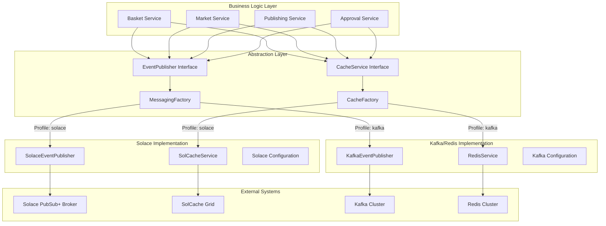

# Messaging and Caching Abstraction Design

## Overview

This document defines the **abstraction layers** for messaging and caching that enable seamless switching between different implementations (Solace PubSub+ ↔ Apache Kafka, SolCache ↔ Redis) without modifying business logic.

## Design Principles

```yaml
Abstraction Goals:
  ✅ Business logic remains implementation-agnostic
  ✅ Configuration-driven switching between implementations
  ✅ Consistent API across all implementations
  ✅ Performance characteristics preserved
  ✅ Feature parity maintained

Implementation Strategy:
  ✅ Interface-based design with factory patterns
  ✅ Spring profiles for environment-specific configurations
  ✅ Adapter pattern for vendor-specific features
  ✅ Strategy pattern for different messaging semantics
```

## Messaging Abstraction Architecture



## Core Abstractions

### 1. Event Publisher Interface

```java
package com.custom.indexbasket.messaging.core;

import reactor.core.publisher.Mono;
import reactor.core.publisher.Flux;
import java.time.Duration;
import java.util.Map;

/**
 * Universal event publishing interface
 * Abstracts messaging implementation (Solace vs Kafka)
 */
public interface EventPublisher {
    
    /**
     * Publish single event asynchronously
     */
    <T> Mono<Void> publish(String topic, String key, T event);
    
    /**
     * Publish single event with headers
     */
    <T> Mono<Void> publish(String topic, String key, T event, Map<String, String> headers);
    
    /**
     * Publish batch of events efficiently
     */
    <T> Mono<Void> publishBatch(String topic, Map<String, T> events);
    
    /**
     * Publish with guaranteed delivery (persistence)
     */
    <T> Mono<Void> publishGuaranteed(String topic, String key, T event);
    
    /**
     * Publish with delivery confirmation
     */
    <T> Mono<PublishResult> publishWithConfirmation(String topic, String key, T event);
    
    /**
     * Request-Reply pattern for synchronous operations
     */
    <T, R> Mono<R> request(String topic, String key, T request, Class<R> responseType, Duration timeout);
    
    /**
     * Check if topic exists and is healthy
     */
    Mono<Boolean> isTopicHealthy(String topic);
    
    /**
     * Get publishing metrics
     */
    Mono<PublishingMetrics> getMetrics();
}

/**
 * Event consumer interface for listening to events
 */
public interface EventConsumer {
    
    /**
     * Subscribe to topic with message handler
     */
    <T> Flux<T> subscribe(String topic, Class<T> messageType);
    
    /**
     * Subscribe with consumer group (load balancing)
     */
    <T> Flux<T> subscribe(String topic, String consumerGroup, Class<T> messageType);
    
    /**
     * Subscribe with custom processing options
     */
    <T> Flux<T> subscribe(String topic, String consumerGroup, Class<T> messageType, ConsumerOptions options);
    
    /**
     * Manual acknowledgment support
     */
    <T> Flux<MessageEnvelope<T>> subscribeWithAck(String topic, String consumerGroup, Class<T> messageType);
    
    /**
     * Get consumer health and lag metrics
     */
    Mono<ConsumerMetrics> getConsumerMetrics(String topic, String consumerGroup);
}

/**
 * Publishing result with metadata
 */
public class PublishResult {
    private String messageId;
    private String partition;
    private long offset;
    private long timestamp;
    private boolean acknowledged;
    
    // getters and setters
}

/**
 * Message envelope for manual acknowledgment
 */
public class MessageEnvelope<T> {
    private T payload;
    private Map<String, String> headers;
    private String messageId;
    private String topic;
    private String partition;
    private Acknowledgment acknowledgment;
    
    public void ack() {
        acknowledgment.acknowledge();
    }
    
    public void nack() {
        acknowledgment.nack();
    }
    
    // getters and setters
}
```

### 2. Cache Service Interface

```java
package com.custom.indexbasket.caching.core;

import reactor.core.publisher.Mono;
import reactor.core.publisher.Flux;
import java.time.Duration;
import java.util.Map;
import java.util.Set;

/**
 * Universal caching interface
 * Abstracts caching implementation (SolCache vs Redis)
 */
public interface CacheService {
    
    /**
     * Basic cache operations
     */
    <T> Mono<Void> put(String key, T value);
    <T> Mono<Void> put(String key, T value, Duration ttl);
    <T> Mono<T> get(String key, Class<T> type);
    Mono<Boolean> exists(String key);
    Mono<Boolean> delete(String key);
    
    /**
     * Batch operations for efficiency
     */
    <T> Mono<Void> putAll(Map<String, T> entries);
    <T> Mono<Void> putAll(Map<String, T> entries, Duration ttl);
    <T> Mono<Map<String, T>> getAll(Set<String> keys, Class<T> type);
    Mono<Long> deleteAll(Set<String> keys);
    
    /**
     * Advanced cache operations
     */
    <T> Mono<T> getAndPut(String key, T value, Class<T> type);
    <T> Mono<T> putIfAbsent(String key, T value, Class<T> type);
    <T> Mono<Boolean> replace(String key, T oldValue, T newValue);
    
    /**
     * Atomic operations
     */
    Mono<Long> increment(String key);
    Mono<Long> increment(String key, long delta);
    Mono<Double> increment(String key, double delta);
    
    /**
     * Set operations for collections
     */
    Mono<Boolean> addToSet(String key, String value);
    Mono<Boolean> removeFromSet(String key, String value);
    Mono<Set<String>> getSet(String key);
    Mono<Boolean> isSetMember(String key, String value);
    
    /**
     * List operations for ordered collections
     */
    Mono<Long> addToList(String key, String value);
    Mono<Long> addToListHead(String key, String value);
    Mono<String> popFromList(String key);
    Mono<String> popFromListTail(String key);
    Flux<String> getList(String key);
    
    /**
     * Hash operations for structured data
     */
    <T> Mono<Void> putHash(String key, String field, T value);
    <T> Mono<T> getHash(String key, String field, Class<T> type);
    <T> Mono<Map<String, T>> getAllHash(String key, Class<T> type);
    Mono<Boolean> deleteHashField(String key, String field);
    
    /**
     * Time-based operations
     */
    Mono<Boolean> expire(String key, Duration ttl);
    Mono<Duration> getTtl(String key);
    Mono<Boolean> persist(String key);
    
    /**
     * Pattern-based operations
     */
    Flux<String> keys(String pattern);
    Mono<Long> deleteByPattern(String pattern);
    
    /**
     * Cache statistics and health
     */
    Mono<CacheStats> getStats();
    Mono<Boolean> isHealthy();
    Mono<Void> clearAll();
    
    /**
     * Transactional operations (where supported)
     */
    <T> Mono<T> executeInTransaction(Mono<T> operations);
}

/**
 * Cache statistics
 */
public class CacheStats {
    private long hitCount;
    private long missCount;
    private double hitRatio;
    private long evictionCount;
    private long totalKeys;
    private long usedMemory;
    private long maxMemory;
    
    // getters and setters
}
```

### 3. Stream Processing Interface

```java
package com.custom.indexbasket.streaming.core;

import reactor.core.publisher.Flux;
import reactor.core.publisher.Mono;
import java.time.Duration;

/**
 * Stream processing abstraction
 * Supports both Kafka Streams and Solace streaming
 */
public interface StreamProcessor {
    
    /**
     * Create a processing topology
     */
    <T, R> Flux<R> process(String inputTopic, 
                          String outputTopic, 
                          StreamFunction<T, R> processor, 
                          Class<T> inputType, 
                          Class<R> outputType);
    
    /**
     * Windowed aggregations
     */
    <T, R> Flux<R> processWindowed(String inputTopic,
                                  String outputTopic,
                                  Duration windowSize,
                                  WindowedAggregator<T, R> aggregator,
                                  Class<T> inputType,
                                  Class<R> outputType);
    
    /**
     * Join two streams
     */
    <T1, T2, R> Flux<R> join(String leftTopic,
                            String rightTopic,
                            String outputTopic,
                            Duration joinWindow,
                            JoinFunction<T1, T2, R> joinFunction,
                            Class<T1> leftType,
                            Class<T2> rightType,
                            Class<R> outputType);
    
    /**
     * Filter and transform
     */
    <T> Flux<T> filter(String inputTopic,
                      String outputTopic,
                      StreamPredicate<T> predicate,
                      Class<T> messageType);
    
    /**
     * Start/stop stream processing
     */
    Mono<Void> start();
    Mono<Void> stop();
    Mono<Boolean> isRunning();
    
    /**
     * Stream health and metrics
     */
    Mono<StreamMetrics> getMetrics();
}

@FunctionalInterface
public interface StreamFunction<T, R> {
    R apply(T input);
}

@FunctionalInterface
public interface WindowedAggregator<T, R> {
    R aggregate(Flux<T> window);
}

@FunctionalInterface
public interface JoinFunction<T1, T2, R> {
    R apply(T1 left, T2 right);
}

@FunctionalInterface
public interface StreamPredicate<T> {
    boolean test(T input);
}
```

## Implementation Factories

### 1. Messaging Factory

```java
package com.custom.indexbasket.messaging.factory;

import org.springframework.beans.factory.annotation.Value;
import org.springframework.context.annotation.Bean;
import org.springframework.context.annotation.Configuration;
import org.springframework.context.annotation.Profile;

@Configuration
public class MessagingFactory {
    
    @Value("${messaging.provider:solace}")
    private String messagingProvider;
    
    @Bean
    @Profile("solace")
    public EventPublisher solaceEventPublisher() {
        return new SolaceEventPublisherImpl();
    }
    
    @Bean
    @Profile("kafka")
    public EventPublisher kafkaEventPublisher() {
        return new KafkaEventPublisherImpl();
    }
    
    @Bean
    @Profile("solace")
    public EventConsumer solaceEventConsumer() {
        return new SolaceEventConsumerImpl();
    }
    
    @Bean
    @Profile("kafka")
    public EventConsumer kafkaEventConsumer() {
        return new KafkaEventConsumerImpl();
    }
    
    @Bean
    @Profile("solace")
    public StreamProcessor solaceStreamProcessor() {
        return new SolaceStreamProcessorImpl();
    }
    
    @Bean
    @Profile("kafka")
    public StreamProcessor kafkaStreamProcessor() {
        return new KafkaStreamsProcessorImpl();
    }
}
```

### 2. Cache Factory

```java
package com.custom.indexbasket.caching.factory;

import org.springframework.beans.factory.annotation.Value;
import org.springframework.context.annotation.Bean;
import org.springframework.context.annotation.Configuration;
import org.springframework.context.annotation.Profile;

@Configuration
public class CacheFactory {
    
    @Value("${caching.provider:solcache}")
    private String cachingProvider;
    
    @Bean
    @Profile("solace")
    public CacheService solCacheService() {
        return new SolCacheServiceImpl();
    }
    
    @Bean
    @Profile("kafka")
    public CacheService redisService() {
        return new RedisServiceImpl();
    }
}
```

## Configuration Strategy

### 1. Profile-Based Configuration

```yaml
# application.yml (common configuration)
spring:
  profiles:
    active: solace  # or kafka

messaging:
  provider: solace  # or kafka
  
caching:
  provider: solcache  # or redis

# Common business configurations
basket:
  approval:
    timeout: 300s
    retry-attempts: 3
  
market-data:
  cache-ttl: 5s
  batch-size: 1000
```

### 2. Solace Profile Configuration

```yaml
# application-solace.yml
spring:
  profiles: solace

# Solace PubSub+ Configuration
solace:
  java:
    host: tcp://solace-broker.company.com:55555
    msg-vpn: basket-platform-prod
    client-username: ${SOLACE_USERNAME}
    client-password: ${SOLACE_PASSWORD}
    reconnect-retries: 3
    connection-retries-per-host: 3
    
  pubsub:
    # Publisher settings
    publisher:
      back-pressure-strategy: WAIT_WHEN_FULL
      buffer-size: 10000
      window-size: 1000
      acknowledgment-timeout: 60000
      
    # Consumer settings  
    consumer:
      consumer-group-prefix: basket-platform
      max-redelivery: 3
      session-timeout: 30000
      
  # SolCache Configuration
  cache:
    enabled: true
    cache-name: basket-cache-cluster
    time-to-live: 300  # 5 minutes default
    regions:
      market-data:
        time-to-live: 5  # 5 seconds for real-time data
        max-objects: 100000
      basket-definitions:
        time-to-live: 3600  # 1 hour for basket definitions
        max-objects: 10000
      user-sessions:
        time-to-live: 1800  # 30 minutes for sessions
        max-objects: 50000

# Topic mapping
topics:
  basket-approved: "basket/approved"
  basket-created: "basket/created"
  basket-updated: "basket/updated"
  market-data-updated: "market/data/updated"
  valuation-calculated: "valuation/calculated"
  price-published: "price/published"
  approval-requested: "approval/requested"
  audit-event: "audit/event"
```

### 3. Kafka Profile Configuration

```yaml
# application-kafka.yml
spring:
  profiles: kafka
  kafka:
    bootstrap-servers: ${KAFKA_BOOTSTRAP_SERVERS:localhost:9092}
    producer:
      acks: all
      retries: 3
      batch-size: 16384
      linger-ms: 10
      buffer-memory: 33554432
      key-serializer: org.apache.kafka.common.serialization.StringSerializer
      value-serializer: org.springframework.kafka.support.serializer.JsonSerializer
      
    consumer:
      group-id: basket-platform
      auto-offset-reset: latest
      enable-auto-commit: false
      key-deserializer: org.apache.kafka.common.serialization.StringDeserializer
      value-deserializer: org.springframework.kafka.support.serializer.JsonDeserializer
      properties:
        spring.json.trusted.packages: "com.custom.indexbasket"

# Redis Configuration
spring:
  redis:
    host: ${REDIS_HOST:localhost}
    port: ${REDIS_PORT:6379}
    password: ${REDIS_PASSWORD:}
    database: 0
    timeout: 2000ms
    lettuce:
      pool:
        max-active: 100
        max-idle: 20
        min-idle: 5
        max-wait: 2000ms

# Topic mapping (Kafka topics)
topics:
  basket-approved: "basket.approved"
  basket-created: "basket.created"
  basket-updated: "basket.updated"
  market-data-updated: "market.data.updated"
  valuation-calculated: "valuation.calculated"
  price-published: "price.published"
  approval-requested: "approval.requested"
  audit-event: "audit.event"
```

## Implementation Examples

### 1. Business Service Using Abstraction

```java
package com.custom.indexbasket.basket.service;

import com.custom.indexbasket.messaging.core.EventPublisher;
import com.custom.indexbasket.caching.core.CacheService;
import org.springframework.beans.factory.annotation.Autowired;
import org.springframework.stereotype.Service;
import reactor.core.publisher.Mono;

/**
 * Business service that works with any messaging/caching implementation
 */
@Service
public class BasketApprovalService {
    
    @Autowired
    private EventPublisher eventPublisher;  // Can be Solace or Kafka
    
    @Autowired
    private CacheService cacheService;      // Can be SolCache or Redis
    
    @Value("${topics.basket-approved}")
    private String basketApprovedTopic;
    
    /**
     * Approve basket - works with any implementation
     */
    public Mono<Void> approveBasket(String basketCode, String approver) {
        return getBasket(basketCode)
            .flatMap(basket -> {
                // Update basket status
                basket.setStatus("APPROVED");
                basket.setApprovedBy(approver);
                basket.setApprovedAt(LocalDateTime.now());
                
                // Cache updated basket
                return cacheService.put("basket:" + basketCode, basket, Duration.ofHours(1))
                    // Publish approval event
                    .then(eventPublisher.publish(
                        basketApprovedTopic, 
                        basketCode, 
                        new BasketApprovedEvent(basketCode, approver, LocalDateTime.now())
                    ))
                    // Store in database
                    .then(basketRepository.save(basket))
                    .then();
            });
    }
    
    /**
     * Get basket from cache with fallback to database
     */
    private Mono<Basket> getBasket(String basketCode) {
        return cacheService.get("basket:" + basketCode, Basket.class)
            .switchIfEmpty(basketRepository.findById(basketCode)
                .flatMap(basket -> 
                    cacheService.put("basket:" + basketCode, basket, Duration.ofHours(1))
                        .thenReturn(basket)
                ));
    }
    
    /**
     * Request-reply pattern for synchronous validation
     */
    public Mono<ValidationResult> validateBasket(String basketCode) {
        return eventPublisher.request(
            "validation.request",
            basketCode,
            new ValidationRequest(basketCode),
            ValidationResult.class,
            Duration.ofSeconds(30)
        );
    }
}
```

### 2. Market Data Service with Stream Processing

```java
package com.custom.indexbasket.marketdata.service;

import com.custom.indexbasket.messaging.core.EventPublisher;
import com.custom.indexbasket.caching.core.CacheService;
import com.custom.indexbasket.streaming.core.StreamProcessor;
import org.springframework.beans.factory.annotation.Autowired;
import org.springframework.stereotype.Service;

/**
 * Market data service using stream processing abstraction
 */
@Service
public class MarketDataProcessingService {
    
    @Autowired
    private EventPublisher eventPublisher;
    
    @Autowired
    private CacheService cacheService;
    
    @Autowired
    private StreamProcessor streamProcessor;
    
    @Value("${topics.market-data-updated}")
    private String marketDataTopic;
    
    @Value("${topics.valuation-calculated}")
    private String valuationTopic;
    
    /**
     * Start real-time basket valuation stream processing
     */
    @PostConstruct
    public void startValuationStream() {
        // Process market data updates and calculate basket valuations
        streamProcessor.processWindowed(
            marketDataTopic,
            valuationTopic,
            Duration.ofSeconds(5),  // 5-second windows
            this::calculateBasketValuations,
            MarketDataUpdate.class,
            BasketValuation.class
        ).subscribe(valuation -> {
            // Cache the latest valuation
            cacheService.put(
                "basket:valuation:" + valuation.getBasketCode(),
                valuation,
                Duration.ofSeconds(10)
            ).subscribe();
        });
    }
    
    /**
     * Calculate basket valuations from market data window
     */
    private BasketValuation calculateBasketValuations(Flux<MarketDataUpdate> window) {
        return window
            .groupBy(MarketDataUpdate::getSymbol)
            .flatMap(symbolGroup -> 
                symbolGroup.takeLast(1)  // Latest price per symbol
                    .map(this::calculateWeightedValue)
            )
            .reduce(BigDecimal.ZERO, BigDecimal::add)
            .map(totalValue -> new BasketValuation(
                getBasketCodeFromSymbols(window), 
                totalValue, 
                LocalDateTime.now()
            ))
            .block();
    }
    
    /**
     * Publish price update - implementation agnostic
     */
    public Mono<Void> publishPriceUpdate(String symbol, BigDecimal price) {
        MarketDataUpdate update = new MarketDataUpdate(symbol, price, LocalDateTime.now());
        
        return eventPublisher.publish(marketDataTopic, symbol, update)
            .then(cacheService.put("price:" + symbol, price, Duration.ofSeconds(5)))
            .then();
    }
}
```

## Migration Strategy

### 1. Zero-Downtime Migration Process

```yaml
Phase 1: Dual Write (2 weeks)
  ✅ Deploy abstraction layer
  ✅ Configure dual write to both systems
  ✅ Validate data consistency
  ✅ Monitor performance metrics

Phase 2: Gradual Read Migration (2 weeks)
  ✅ Switch read traffic to new implementation
  ✅ Monitor application behavior
  ✅ Performance comparison and tuning
  ✅ Rollback plan validation

Phase 3: Single Write (1 week)
  ✅ Switch write traffic to new implementation
  ✅ Disable old implementation writes
  ✅ Final data reconciliation
  ✅ Performance optimization

Phase 4: Cleanup (1 week)
  ✅ Remove old implementation dependencies
  ✅ Clean up dual-write code
  ✅ Update documentation
  ✅ Team training on new implementation
```

### 2. Testing Strategy

```java
/**
 * Integration tests that work with any implementation
 */
@SpringBootTest
@TestPropertySource(properties = {
    "spring.profiles.active=test-kafka"  // or test-solace
})
public class BasketServiceIntegrationTest {
    
    @Autowired
    private EventPublisher eventPublisher;
    
    @Autowired
    private CacheService cacheService;
    
    @Test
    public void testBasketApprovalWorkflow() {
        // Test works with any implementation
        // Business logic validation only
    }
    
    @Test
    public void testPerformanceCharacteristics() {
        // Ensure SLA compliance with any implementation
    }
}

/**
 * Contract tests for implementation compatibility
 */
@TestWith({SolaceImplementation.class, KafkaImplementation.class})
public class MessagingContractTest {
    
    @ParameterizedTest
    public void testEventPublishingContract(EventPublisher publisher) {
        // Ensure all implementations meet the contract
    }
    
    @ParameterizedTest
    public void testPerformanceContract(EventPublisher publisher) {
        // Ensure performance SLAs are met
    }
}
```

## Benefits of Abstraction Design

### 1. Business Logic Protection
```yaml
Implementation Independence:
  ✅ Business logic never changes
  ✅ Domain models remain consistent
  ✅ Service interfaces unchanged
  ✅ Test suites portable

Risk Mitigation:
  ✅ No vendor lock-in
  ✅ Technology migration flexibility
  ✅ Performance optimization options
  ✅ Cost optimization strategies
```

### 2. Operational Flexibility
```yaml
Environment Flexibility:
  ✅ Development: Kafka/Redis (cost-effective)
  ✅ Staging: Mirror production setup
  ✅ Production: Solace ecosystem (enterprise)
  ✅ DR Site: Alternative implementation

Configuration Management:
  ✅ Spring profile-based switching
  ✅ Environment-specific tuning
  ✅ Feature flag compatibility
  ✅ A/B testing capabilities
```

### 3. Performance Optimization
```yaml
Best-of-Breed Selection:
  ✅ Choose optimal technology per use case
  ✅ Hybrid architectures possible
  ✅ Performance benchmarking
  ✅ Cost-performance optimization

Implementation Tuning:
  ✅ Vendor-specific optimizations
  ✅ Use case-specific configurations
  ✅ Performance monitoring
  ✅ Capacity planning flexibility
```

This abstraction design ensures your basket platform can seamlessly switch between Solace and Kafka/Redis implementations while maintaining business logic integrity and operational flexibility.
