# Hybrid Communication Service Architecture

## Overview

The Custom Index Basket Management Platform follows a **hybrid communication microservices architecture** with 4 core services. Each service intelligently selects optimal communication protocols based on latency requirements, frequency patterns, and business context.

## Hybrid Communication Architecture Diagram

```mermaid
graph TB
    subgraph "Client Layer"
        UI[Web UI]
        MOBILE[Mobile Apps]
        API_CLIENTS[API Clients]
        EXTERNAL[External Systems]
    end
    
    subgraph "API Gateway Layer"
        GATEWAY[API Gateway / Load Balancer]
        RATE_LIMITER[Rate Limiter]
        AUTH[Authentication]
    end
    
    subgraph "Communication Router Layer"
        COMM_ROUTER[Smart Communication Router]
        PROTOCOL_SELECTOR[Protocol Selector]
        
        subgraph "Protocol Adapters"
            REST_ADAPTER[REST Adapter<br/>🐌 >100ms]
            EVENT_ADAPTER[Event Adapter<br/>📡 10-100ms]
            GRPC_ADAPTER[gRPC Adapter<br/>⚡ <10ms]
            ACTOR_ADAPTER[Actor Adapter<br/>🏃 <1ms]
        end
    end
    
    subgraph "Service Layer - Business Logic"
        BCS[Basket Core Service<br/>💼 Lifecycle Management]
        MDS[Market Data Service<br/>📊 Historical + Real-time]
        PUB[Publishing Service<br/>📤 Dual Publishing]
        ANA[Analytics Service<br/>📈 Backtesting + Analytics]
    end
    
    subgraph "Communication Channels"
        REST_ENDPOINTS[REST APIs<br/>User Operations]
        EVENT_STREAMS[Event Streams<br/>Workflows + Audit]
        GRPC_SERVICES[gRPC Services<br/>Internal RPC]
        ACTOR_SYSTEM[Actor System<br/>Real-time Processing]
    end
    
    subgraph "Data & Infrastructure Layer"
        TSDB[(TimescaleDB Cluster<br/>Historical + Application Data)]
        CACHE_LAYER[Abstracted Cache Layer<br/>SolCache / Redis]
        MSG_LAYER[Abstracted Messaging Layer<br/>Solace PubSub+ / Kafka]
    end
    
    subgraph "External Vendor APIs"
        BBG[Bloomberg APIs<br/>Market Data + Publishing]
        REF[Refinitiv APIs<br/>Market Data + Publishing]
        CENTRAL_BANKS[Central Bank APIs<br/>FX Rates]
    end
    
    %% Client connections
    UI --> GATEWAY
    MOBILE --> GATEWAY  
    API_CLIENTS --> GATEWAY
    EXTERNAL --> GATEWAY
    
    %% Gateway to communication router
    GATEWAY --> RATE_LIMITER
    RATE_LIMITER --> AUTH
    AUTH --> COMM_ROUTER
    
    %% Communication router to protocol selectors
    COMM_ROUTER --> PROTOCOL_SELECTOR
    PROTOCOL_SELECTOR --> REST_ADAPTER
    PROTOCOL_SELECTOR --> EVENT_ADAPTER
    PROTOCOL_SELECTOR --> GRPC_ADAPTER
    PROTOCOL_SELECTOR --> ACTOR_ADAPTER
    
    %% Protocol adapters to communication channels
    REST_ADAPTER --> REST_ENDPOINTS
    EVENT_ADAPTER --> EVENT_STREAMS
    GRPC_ADAPTER --> GRPC_SERVICES
    ACTOR_ADAPTER --> ACTOR_SYSTEM
    
    %% Communication channels to services
    REST_ENDPOINTS --> BCS
    REST_ENDPOINTS --> MDS
    REST_ENDPOINTS --> PUB
    REST_ENDPOINTS --> ANA
    
    EVENT_STREAMS --> BCS
    EVENT_STREAMS --> MDS
    EVENT_STREAMS --> PUB
    EVENT_STREAMS --> ANA
    
    GRPC_SERVICES --> BCS
    GRPC_SERVICES --> MDS
    GRPC_SERVICES --> PUB
    GRPC_SERVICES --> ANA
    
    ACTOR_SYSTEM --> BCS
    ACTOR_SYSTEM --> MDS
    ACTOR_SYSTEM --> PUB
    ACTOR_SYSTEM --> ANA
    
    %% Services to data layer
    BCS --> TSDB
    BCS --> CACHE_LAYER
    BCS --> MSG_LAYER
    
    MDS --> TSDB
    MDS --> CACHE_LAYER
    MDS --> MSG_LAYER
    
    PUB --> TSDB
    PUB --> CACHE_LAYER
    PUB --> MSG_LAYER
    
    ANA --> TSDB
    ANA --> CACHE_LAYER
    ANA --> MSG_LAYER
    
    %% External connections
    MDS --> BBG
    MDS --> REF
    MDS --> CENTRAL_BANKS
    PUB --> BBG
    PUB --> REF
    
    %% Styling
    classDef clientLayer fill:#e1f5fe
    classDef gatewayLayer fill:#f3e5f5
    classDef commLayer fill:#fff3e0
    classDef serviceLayer fill:#e8f5e8
    classDef dataLayer fill:#fce4ec
    classDef externalLayer fill:#f1f8e9
    
    class UI,MOBILE,API_CLIENTS,EXTERNAL clientLayer
    class GATEWAY,RATE_LIMITER,AUTH gatewayLayer
    class COMM_ROUTER,PROTOCOL_SELECTOR,REST_ADAPTER,EVENT_ADAPTER,GRPC_ADAPTER,ACTOR_ADAPTER commLayer
    class BCS,MDS,PUB,ANA serviceLayer
    class TSDB,CACHE_LAYER,MSG_LAYER dataLayer
    class BBG,REF,CENTRAL_BANKS externalLayer
```



## 🔄 Hybrid Communication Strategy Integration

### Protocol Selection Matrix by Use Case

| **Operation Type** | **Latency** | **Frequency** | **Protocol** | **Rationale** |
|-------------------|-------------|---------------|--------------|---------------|
| **User creates basket via Web UI** | >100ms | Low | 🐌 **REST API** | User tolerance, cacheable, stateless |
| **Basket approval workflow** | 10-100ms | Low | 📡 **Event Streaming** | Async, audit trail, eventual consistency |
| **Internal basket state lookup** | <10ms | Medium | ⚡ **gRPC** | Fast service-to-service calls |
| **Real-time basket valuation** | <1ms | Ultra-High | 🏃 **Actor Model** | Sub-millisecond, concurrent state |
| **Market data historical fetch** | >100ms | Low | 🐌 **REST API** | Batch operation, external API |
| **Real-time price feed** | <10ms | High | ⚡ **gRPC Streaming** | Continuous low-latency stream |
| **Price validation** | <1ms | Ultra-High | 🏃 **Actor Model** | Every price update validation |
| **Vendor price publishing** | <10ms | High | ⚡ **gRPC** | External vendor efficiency |
| **Backtest execution** | 10-100ms | Low | 📡 **Event Streaming** | Long-running async process |
| **Admin configuration** | >100ms | Very Low | 🐌 **REST API** | Human-operated, infrequent |

### Service Communication Flow Examples

#### Example 1: User Creates Basket (REST API Flow)


#### Example 2: Real-time Basket Valuation (Actor Model Flow)

```mermaid
sequenceDiagram
    participant PriceStream
    participant CommRouter
    participant ActorAdapter
    participant SymbolActor
    participant BasketActor
    participant ValuationActor
    participant Cache

    PriceStream->>CommRouter: Price Update (Symbol: AAPL, $150.25)
    
    Note over CommRouter: Analyzes: realtime.basket.valuation<br/>Latency: REAL_TIME<br/>Frequency: ULTRA_HIGH_FREQUENCY<br/>→ Selects Actor Model
    
    CommRouter->>ActorAdapter: Route via Actors
    ActorAdapter->>SymbolActor: PriceUpdate Message
    SymbolActor->>BasketActor: UpdateConstituent Message
    BasketActor->>ValuationActor: CalculateValue Message
    
    Note over ValuationActor: Sub-millisecond calculation<br/>Weight * Price * FX Rate
    
    ValuationActor->>Cache: Store updated valuation
    ValuationActor-->>BasketActor: ValuationComplete
    BasketActor-->>SymbolActor: Ack
    SymbolActor-->>ActorAdapter: ProcessingComplete (<1ms)
```


#### Example 3: Approval Workflow (Event Streaming Flow)

```mermaid
sequenceDiagram
    participant User
    participant BasketCore
    participant CommRouter
    participant EventAdapter
    participant EventStream
    participant ApprovalService
    participant AuditService

    User->>BasketCore: Submit for Approval
    BasketCore->>CommRouter: Approval Request
    
    Note over CommRouter: Analyzes: workflow.approval.submit<br/>Latency: MEDIUM_LATENCY<br/>Consistency: EVENTUAL<br/>→ Selects Event Streaming
    
    CommRouter->>EventAdapter: Route via Events
    EventAdapter->>EventStream: Publish ApprovalRequested Event
    EventStream->>ApprovalService: Consume Event
    EventStream->>AuditService: Consume Event (parallel)
    
    ApprovalService->>ApprovalService: Process Approval
    ApprovalService->>EventStream: Publish ApprovalCompleted Event
    EventStream->>BasketCore: Consume ApprovalCompleted
    BasketCore->>BasketCore: Update Status to APPROVED
```


#### Example 4: Internal Service Call (gRPC Flow)

```mermaid
sequenceDiagram
    participant PublishingService
    participant CommRouter
    participant GrpcAdapter
    participant BasketCoreGrpc
    participant MarketDataGrpc
    participant VendorAPI

    PublishingService->>CommRouter: Get Basket Details
    
    Note over CommRouter: Analyzes: internal.basket.getDetails<br/>Latency: LOW_LATENCY<br/>Frequency: MEDIUM_FREQUENCY<br/>→ Selects gRPC
    
    CommRouter->>GrpcAdapter: Route via gRPC
    GrpcAdapter->>BasketCoreGrpc: GetBasketDetails RPC
    BasketCoreGrpc-->>GrpcAdapter: Basket Proto Response
    
    PublishingService->>CommRouter: Get Latest Prices
    CommRouter->>GrpcAdapter: Route via gRPC
    GrpcAdapter->>MarketDataGrpc: GetLatestPrices RPC
    MarketDataGrpc-->>GrpcAdapter: Prices Proto Response
    
    PublishingService->>VendorAPI: Publish to Bloomberg (formatted)
```


## Core Services Detailed Design

### 1. Basket Core Service - 💼 Complete Lifecycle Management

**Purpose**: Complete basket lifecycle management from creation to approval

**Technology Stack**:
- Spring Boot 3.x + WebFlux for reactive programming
- **Smart Communication Router** for protocol selection
- **REST APIs** for user-facing operations (Web UI, mobile apps)
- **Event Streaming** for approval workflows and audit trails
- **gRPC + Protobuf 4.x** for internal service-to-service calls
- **Akka Typed 2.8.x** for real-time state management actors
- R2DBC for reactive TimescaleDB access
- Abstracted caching layer (SolCache/Redis)
- Abstracted messaging layer (Solace PubSub+/Kafka)

**Responsibilities**:
```yaml
Basket Management (via REST APIs):
  - Create, read, update, delete baskets
  - Constituent management and validation
  - Weight calculation and normalization
  - Basket versioning and audit trail

Approval Workflow (via Event Streaming):
  - State machine-driven approval process
  - Single and dual approver support
  - Role-based access control
  - Approval notifications and tracking

Internal Operations (via gRPC):
  - Fast basket state queries from other services
  - Bulk basket validation for publishing
  - Service-to-service basket data exchange
  - Health checks and status queries

Real-time State Management (via Actor Model):
  - Concurrent basket state updates
  - Real-time basket actor supervision
  - State transition validation
  - Cross-basket dependency management

User Management:
  - Authentication and authorization (REST)
  - Role and permission management (REST)
  - User session management (Events)
  - Audit logging (Events)

Data Validation:
  - Basket composition validation (gRPC for fast checks)
  - Weight validation (must sum to 100%)
  - Symbol validation and enrichment (gRPC to Market Data Service)
  - Business rule enforcement (Actor Model for real-time)
```

**API Endpoints by Protocol**:

```yaml
🐌 REST API Endpoints (User Operations):
  POST   /api/baskets                    # Create basket (Web UI)
  GET    /api/baskets/{id}               # Get basket details (UI)
  PUT    /api/baskets/{id}               # Update basket (UI)
  DELETE /api/baskets/{id}               # Delete basket (UI)
  GET    /api/baskets/pending            # Get pending approvals (UI)
  POST   /api/baskets/upload             # Bulk upload baskets (UI)

📡 Event Stream Topics (Async Workflows):
  basket.created                        # Basket creation event
  basket.approval.requested             # Approval workflow trigger
  basket.approved                       # Approval completed event
  basket.rejected                       # Rejection event
  basket.state.changed                  # State transition event
  audit.basket.operation                # Audit trail events

⚡ gRPC Services (Internal RPC):
  GetBasket(GetBasketRequest) → BasketResponse
  ValidateBasket(ValidateBasketRequest) → ValidationResponse
  GetBasketsByStatus(StatusRequest) → BasketListResponse
  BulkValidateBaskets(BulkValidationRequest) → ValidationResults
  HealthCheck() → ServiceStatus

🏃 Actor Messages (Real-time Processing):
  CreateBasketCommand                   # Immediate basket creation
  UpdateBasketStateCommand              # Real-time state updates
  ValidateBasketCommand                 # Instant validation
  GetBasketStateQuery                   # Fast state queries
  BasketStateChangedEvent               # Real-time state notifications
```

**Internal Architecture**:
```
basket-core-service/
├── communication/
│   ├── router/              # Smart Communication Router
│   ├── adapters/
│   │   ├── rest/            # REST API controllers
│   │   ├── grpc/            # gRPC service implementations
│   │   ├── events/          # Event publishers/consumers
│   │   └── actors/          # Akka actor system
│   └── protocols/           # Protocol-specific configurations
├── domain/
│   ├── basket/              # Basket domain logic
│   ├── approval/            # Approval workflow
│   ├── validation/          # Business rule validation
│   └── statemachine/        # State machine implementation
├── infrastructure/
│   ├── repository/          # Data access layer (R2DBC)
│   ├── cache/               # Abstracted cache layer
│   ├── messaging/           # Abstracted messaging layer
│   └── external/            # External service clients
├── security/                # Authentication & authorization
└── config/                 # Configuration classes
```

### 2. Market Data Service - 📊 Historical + Real-time Data

**Purpose**: Dual data architecture for historical backtesting and real-time pricing with optimal communication protocols

**Technology Stack**:
- Spring Boot 3.x + WebFlux for reactive programming
- **Smart Communication Router** for protocol selection
- **REST APIs** for historical data requests and admin operations
- **gRPC Streaming** for real-time price feeds and internal API
- **Actor Model** for ultra-fast price validation and symbol management
- **Event Streaming** for price distribution and market events
- TimescaleDB for time-series data storage
- **Akka Typed 2.8.x** for symbol actors and concurrent price processing
- Abstracted messaging layer (Solace PubSub+/Kafka)
- Abstracted stream processing (Solace Streaming/Kafka Streams)
- Abstracted caching layer (SolCache/Redis)
- Vendor SDKs (Bloomberg, Refinitiv)

**Data Architecture**:
```yaml
Historical Data Partition:
  Storage: TimescaleDB hypertables
  Retention: 15+ years daily data, 3+ years intraday
  Sources: Bloomberg History API, Refinitiv Historical
  Access: SQL queries for backtesting
  Performance: Optimized for time-series queries

Real-time Data Partition:
  Storage: Abstracted cache + messaging streams
  Retention: 30 days hot data
  Sources: Bloomberg Real-time, Refinitiv Live
  Access: High-frequency updates
  Performance: Sub-second latency
```

**Responsibilities by Communication Protocol**:
```yaml
Historical Data Management (via REST APIs):
  - Fetch EOD and intraday historical prices for backtesting
  - Bulk historical data exports
  - Data quality reports and validation summaries
  - Administrative data refresh operations

Real-time Price Processing (via gRPC Streaming):
  - Continuous live market data feeds to other services
  - Real-time basket price calculations and distribution
  - Low-latency price lookup for internal services
  - Streaming price updates to Publishing Service

Ultra-fast Operations (via Actor Model):
  - Symbol-level price validation (<1ms per update)
  - Real-time FX rate conversions
  - Price anomaly detection and alerts
  - Symbol actor state management

Market Events (via Event Streaming):
  - Market open/close notifications
  - Data feed status changes
  - Price alert distribution
  - Audit trail for data operations

Caching Strategy (Multi-protocol):
  - L1: Actor mailboxes for real-time data
  - L2: Abstracted cache (SolCache/Redis) for recent prices
  - L3: TimescaleDB for historical data
  - Cache warming via Event Streaming
```

**API Endpoints by Protocol**:

```yaml
🐌 REST API Endpoints (Historical & Admin):
  GET  /api/market-data/historical/{symbol}    # Historical prices (backtesting)
  GET  /api/market-data/historical/bulk        # Bulk historical data export
  GET  /api/market-data/indices/{index}        # Index historical data
  POST /api/market-data/refresh                # Force data refresh (admin)
  GET  /api/market-data/status                 # Data feed status
  GET  /api/market-data/symbols                # Symbol directory

📡 Event Stream Topics (Market Events):
  market.opened                                # Market session start
  market.closed                                # Market session end
  data.feed.status.changed                     # Feed connectivity changes
  symbol.added                                 # New symbol coverage
  price.alert.triggered                        # Price anomaly alerts
  audit.market.data.operation                  # Audit trail events

⚡ gRPC Services (Real-time & Internal):
  GetLatestPrice(SymbolRequest) → PriceResponse
  StreamPrices(SymbolListRequest) → stream PriceUpdate
  GetBasketPrice(BasketRequest) → BasketPriceResponse
  ValidateSymbol(SymbolRequest) → ValidationResponse
  BulkPriceLookup(BulkPriceRequest) → PriceListResponse
  SubscribeToPriceFeed(FeedRequest) → stream PriceStream

🏃 Actor Messages (Ultra-fast Processing):
  UpdatePriceCommand                           # Price update from vendor
  ValidatePriceCommand                         # Instant price validation
  GetCurrentPriceQuery                         # Fast price lookup
  ConvertCurrencyCommand                       # FX conversion
  PriceAnomalyDetectedEvent                    # Anomaly notification
```

### 3. Publishing Service - 📤 Dual Publishing Engine

**Purpose**: Intelligent dual publishing - basket listing and real-time price publishing with optimal vendor communication

**Technology Stack**:
- Spring Boot 3.x + WebFlux for reactive programming
- **Smart Communication Router** for protocol selection
- **REST APIs** for publishing status and admin operations
- **Event Streaming** for approval-triggered listing workflows
- **gRPC** for internal service communication and vendor coordination
- **Actor Model** for concurrent vendor management and resilient publishing
- **Akka Typed 2.8.x** for vendor actor supervision and fault tolerance
- Abstracted messaging layer (Solace PubSub+/Kafka)
- Abstracted stream processing for event handling
- Vendor SDKs (Bloomberg BSYM/BLPAPI, Refinitiv RDP/Elektron)
- Circuit Breaker pattern for vendor resilience

**Dual Publishing Architecture**:
```yaml
Basket Listing (One-time):
  Purpose: Publish basket definition to vendor platforms
  Frequency: On basket approval
  Targets: Bloomberg BSYM, Refinitiv RDP
  SLA: Complete within 90 seconds
  Retry: Up to 3 attempts with exponential backoff

Price Publishing (Continuous):
  Purpose: Publish calculated basket prices
  Frequency: Every 5 seconds
  Targets: Bloomberg BLPAPI, Refinitiv Elektron
  SLA: <2 seconds per update
  Resilience: Circuit breaker with failover
```

**Responsibilities by Communication Protocol**:
```yaml
Listing Management (via Event Streaming):
  - Listen for basket.approved events
  - Coordinate parallel publishing to multiple vendors
  - Track listing status with audit trail
  - Handle listing failures with retry workflows

Administrative Operations (via REST APIs):
  - Publishing status dashboards
  - Manual retry operations
  - Vendor health monitoring
  - Performance metrics and reports

Price Publishing Coordination (via gRPC):
  - Receive real-time price updates from Market Data Service
  - Format prices for vendor-specific protocols
  - Batch price updates for efficiency
  - Monitor publishing performance with fast feedback

Vendor Actor Management (via Actor Model):
  - Concurrent vendor-specific publishing (<1ms routing)
  - Circuit breaker pattern for vendor resilience
  - Real-time rate limiting and throttling
  - Vendor connection supervision and failover

Cross-Service Integration:
  - Event consumption from Basket Core (approval events)
  - gRPC calls to Market Data Service (price updates)
  - REST endpoints for admin operations
  - Actor-based vendor SDK management
```

**API Endpoints by Protocol**:

```yaml
🐌 REST API Endpoints (Admin & Monitoring):
  GET  /api/publishing/status/{basketId}       # Get listing status
  POST /api/publishing/retry/{basketId}        # Manual retry failed listing
  GET  /api/publishing/prices/status           # Price publishing dashboard
  GET  /api/publishing/vendors/health          # Vendor health monitoring
  GET  /api/publishing/metrics                 # Publishing performance metrics
  POST /api/publishing/vendors/reconnect       # Force vendor reconnection

📡 Event Stream Topics (Workflow Integration):
  basket.approved                              # Listen: Trigger listing workflow
  basket.listing.started                      # Publish: Listing initiated
  basket.listing.completed                     # Publish: Listing successful
  basket.listing.failed                       # Publish: Listing failed
  price.published                              # Publish: Price published to vendor
  vendor.connection.status                     # Publish: Vendor connectivity

⚡ gRPC Services (Internal Communication):
  PublishBasketListing(BasketRequest) → PublishingResponse
  GetPublishingStatus(StatusRequest) → PublishingStatusResponse
  StreamPriceUpdates(empty) → stream PriceUpdateRequest
  GetVendorHealth(VendorRequest) → HealthResponse
  ForcePublishPrice(PriceRequest) → PublishingResponse

🏃 Actor Messages (Vendor Management):
  PublishToVendorCommand                       # Route to specific vendor actor
  VendorConnectionFailedEvent                  # Handle vendor failures
  RetryPublishingCommand                       # Retry failed operations
  VendorHealthCheckQuery                       # Fast vendor status checks
  RateLimitCheckCommand                        # Rate limiting enforcement
```

### 4. Analytics Service - 📈 Backtesting + Performance Analysis

**Purpose**: High-performance historical backtesting and analytics with intelligent communication protocols

**Technology Stack**:
- Spring Boot 3.x + WebFlux for reactive programming
- **Smart Communication Router** for protocol selection
- **REST APIs** for user-initiated backtest requests and report generation
- **Event Streaming** for long-running backtest workflows and notifications
- **gRPC** for internal data access and cross-service analytics
- **Actor Model** for concurrent backtest execution and resource management
- **Akka Typed 2.8.x** for backtest actor orchestration and parallel processing
- Apache Spark for heavy computations and distributed analytics
- TimescaleDB for historical data access and aggregations
- Abstracted caching layer (SolCache/Redis) for results caching
- Abstracted messaging layer for event processing and workflow coordination

**Responsibilities by Communication Protocol**:
```yaml
User-Initiated Analytics (via REST APIs):
  - Backtest request submission and status tracking
  - Interactive backtest report generation
  - Performance visualization data for UI
  - Export capabilities (PDF, Excel) for reports

Long-Running Workflows (via Event Streaming):
  - Multi-day backtest processing coordination
  - Backtest completion notifications
  - Analytics pipeline orchestration
  - Audit trail for analytics operations

Internal Data Access (via gRPC):
  - Fast historical data queries to Market Data Service
  - Cross-service analytics and validation
  - Real-time analytics for dashboard updates
  - Service-to-service backtest data exchange

High-Performance Computing (via Actor Model):
  - Concurrent backtest execution across multiple actors
  - Parallel analytics computation management
  - Resource allocation and load balancing
  - Fault-tolerant backtest processing

Analytics Processing (Multi-protocol):
  - Return calculations and compounding (Actor Model)
  - Volatility and risk metrics (Spark + Actor coordination)
  - Correlation analysis (gRPC data access + Actor processing)
  - Benchmark comparison (Event-driven data collection)
```

**API Endpoints by Protocol**:

```yaml
🐌 REST API Endpoints (User Operations):
  POST /api/analytics/backtest                 # Submit backtest request (UI)
  GET  /api/analytics/backtest/{id}            # Get backtest results (UI)
  GET  /api/analytics/backtest/{id}/report     # Download formatted report
  GET  /api/analytics/performance/{basketId}   # Performance metrics dashboard
  GET  /api/analytics/reports/{basketId}       # Available reports list
  POST /api/analytics/reports/generate         # Generate custom report
  GET  /api/analytics/status                   # Service status and metrics

📡 Event Stream Topics (Long-Running Workflows):
  backtest.requested                           # Listen: Basket backtest request
  backtest.started                             # Publish: Backtest execution started
  backtest.progress                            # Publish: Progress updates
  backtest.completed                           # Publish: Backtest finished
  backtest.failed                              # Publish: Backtest error
  analytics.pipeline.status                    # Publish: Pipeline health

⚡ gRPC Services (Internal Data & Analytics):
  RunQuickBacktest(BacktestRequest) → BacktestResponse
  GetAnalytics(AnalyticsRequest) → AnalyticsResponse
  StreamBacktestProgress(BacktestId) → stream ProgressUpdate
  GetHistoricalMetrics(MetricsRequest) → MetricsResponse
  ValidateBacktestParams(ValidationRequest) → ValidationResponse
  GetCachedResults(CacheRequest) → CachedResultsResponse

🏃 Actor Messages (High-Performance Computing):
  StartBacktestCommand                         # Initiate backtest execution
  BacktestProgressEvent                        # Progress updates
  ComputeMetricsCommand                        # Calculate analytics
  ResourceAllocationQuery                      # Resource management
  BacktestPartitionCommand                     # Distribute computation
  CacheResultsCommand                          # Cache analytics results
```

## Technology Abstraction Layer

### Messaging and Caching Abstraction

The platform implements **abstraction layers** that enable seamless switching between different messaging and caching technologies without modifying business logic.

#### Implementation Strategy

```yaml
Current Primary Implementation:
  Messaging: Solace PubSub+ Event Broker
  Caching: SolCache Data Grid
  Stream Processing: Solace Event Streaming
  
Alternative Implementation:
  Messaging: Apache Kafka
  Caching: Redis Cluster
  Stream Processing: Kafka Streams

Abstraction Benefits:
  ✅ Business logic remains unchanged
  ✅ Configuration-driven technology switching
  ✅ Development vs Production flexibility
  ✅ Vendor-agnostic architecture
  ✅ Technology migration without business disruption
```

#### Core Abstractions

```java
// Universal messaging interface
@Autowired
private EventPublisher eventPublisher;  // Can be Solace or Kafka

// Universal caching interface  
@Autowired
private CacheService cacheService;      // Can be SolCache or Redis

// Universal stream processing
@Autowired
private StreamProcessor streamProcessor; // Can be Solace or Kafka Streams

// Business service remains unchanged regardless of implementation
@Service
public class BasketService {
    public Mono<Void> approveBasket(String basketCode) {
        return cacheService.get("basket:" + basketCode, Basket.class)
            .flatMap(basket -> {
                basket.setStatus("APPROVED");
                return eventPublisher.publish("basket.approved", basketCode, basket)
                    .then(cacheService.put("basket:" + basketCode, basket));
            });
    }
}
```

#### Configuration-Based Switching

```yaml
# Solace Profile (Production)
spring:
  profiles: solace
solace:
  java:
    host: solace-broker.company.com
    msg-vpn: basket-platform
  cache:
    enabled: true
    regions:
      market-data: 
        time-to-live: 5

---
# Kafka Profile (Development)  
spring:
  profiles: kafka
kafka:
  bootstrap-servers: localhost:9092
redis:
  host: localhost
  port: 6379
```

#### Migration Support

```yaml
Zero-Downtime Migration:
  Phase 1: Deploy abstraction layer
  Phase 2: Dual-write to both implementations
  Phase 3: Switch reads to new implementation
  Phase 4: Switch writes to new implementation
  Phase 5: Remove old implementation

Testing Strategy:
  ✅ Contract tests ensure implementation compatibility
  ✅ Performance tests validate SLA compliance
  ✅ Integration tests work with any implementation
  ✅ Load tests compare implementations
```

For detailed abstraction layer design, see [Messaging Abstraction Design](./messaging-abstraction-design.md).

## Actor Model and gRPC Architecture

### Akka Typed Integration

The platform leverages **Akka Typed 2.8.x** for high-performance, concurrent processing using the actor model pattern:

```yaml
Actor System Benefits:
  ✅ Type-safe message passing between actors
  ✅ Fault-tolerant supervision hierarchies
  ✅ Cluster sharding for distributed actor placement
  ✅ Event sourcing with Akka Persistence
  ✅ Backpressure handling with actor mailboxes
  ✅ Location transparency for scalability

Key Actor Types:
  - Basket Entity Actors: Partitioned basket state management
  - Symbol Actors: Real-time price updates and subscriptions
  - Vendor Actors: External service integration management
  - Backtest Actors: Long-running analytical computations
  - State Machine Actors: Workflow orchestration
```

#### Actor Hierarchy Design


### gRPC Internal Communication

The platform uses **gRPC with Protocol Buffers 4.x** for high-performance internal service communication:

```yaml
gRPC Benefits:
  ✅ Binary serialization with Protobuf for efficiency
  ✅ Type-safe service contracts with code generation
  ✅ Bidirectional streaming for real-time updates
  ✅ Built-in load balancing and circuit breakers
  ✅ Language-agnostic service definitions
  ✅ HTTP/2 multiplexing for connection efficiency

Communication Patterns:
  - Request/Response: Standard CRUD operations
  - Server Streaming: Real-time price feeds
  - Client Streaming: Bulk data uploads
  - Bidirectional Streaming: Interactive workflows
```

#### Internal gRPC Services

```java
// Example: Basket Service gRPC Contract
service BasketService {
    // Standard operations
    rpc CreateBasket(CreateBasketRequest) returns (CreateBasketResponse);
    rpc GetBasket(GetBasketRequest) returns (GetBasketResponse);
    
    // State management
    rpc TransitionBasketState(TransitionBasketStateRequest) returns (TransitionBasketStateResponse);
    
    // Real-time streaming
    rpc StreamBasketUpdates(StreamBasketUpdatesRequest) returns (stream BasketUpdateEvent);
    rpc StreamApprovalEvents(google.protobuf.Empty) returns (stream ApprovalEvent);
}

// Integration with Akka Actors
@Component
public class BasketServiceGrpcImpl extends BasketServiceImplBase {
    
    private final ClusterSharding sharding;
    
    @Override
    public void createBasket(CreateBasketRequest request, StreamObserver<CreateBasketResponse> responseObserver) {
        // Get sharded basket entity actor
        EntityRef<BasketEntityActor.Command> basketEntity = 
            sharding.entityRefFor(BasketEntityActor.ENTITY_TYPE_KEY, request.getBasketCode());
        
        // Send command to actor with ask pattern
        CompletionStage<BasketEntityActor.CreateBasketResponse> future = 
            AskPattern.ask(basketEntity, 
                replyTo -> new BasketEntityActor.CreateBasket(/*...params...*/, replyTo),
                askTimeout, actorSystem.scheduler());
        
        // Convert actor response to gRPC response
        future.whenComplete((actorResponse, throwable) -> {
            if (throwable != null) {
                responseObserver.onError(Status.INTERNAL.withDescription(throwable.getMessage()).asRuntimeException());
            } else {
                CreateBasketResponse grpcResponse = CreateBasketResponse.newBuilder()
                    .setSuccess(actorResponse.success)
                    .setMessage(actorResponse.message)
                    .build();
                responseObserver.onNext(grpcResponse);
                responseObserver.onCompleted();
            }
        });
    }
}
```

### Performance Characteristics

```yaml
Actor Model Performance:
  - Basket Actors: 10,000+ concurrent basket operations/second
  - Symbol Actors: 100,000+ price updates/second per symbol
  - Memory Usage: 1KB per actor (lightweight)
  - Message Passing: 50 million messages/second/core
  - Fault Tolerance: Supervisor restart < 1ms

gRPC Performance:
  - Throughput: 100,000+ RPC calls/second
  - Latency: <1ms P99 for internal calls
  - Serialization: 10x faster than JSON
  - Streaming: 1M+ messages/second bidirectional
  - Memory: 50% less than REST + JSON
```

For complete actor and gRPC contracts, see [Actor Model and gRPC Contracts](../contracts/actor-grpc-contracts.md).

## 🚀 Hybrid Communication Performance Characteristics

### Protocol Performance Matrix

| **Protocol** | **Latency** | **Throughput** | **Use Cases** | **Performance Target** |
|--------------|-------------|----------------|---------------|----------------------|
| 🐌 **REST APIs** | 50-500ms | 100-1K req/s | User operations, external APIs | <500ms P95 |
| 📡 **Event Streaming** | 10-100ms | 10K-100K msg/s | Workflows, audit trails | <100ms P95 |
| ⚡ **gRPC** | 1-10ms | 100K+ req/s | Internal services, real-time | <10ms P99 |
| 🏃 **Actor Model** | <1ms | 1M+ msg/s | Ultra-low latency, concurrent state | <1ms P99 |

### Smart Communication Flow - Complete User Journey


## Enhanced Inter-Service Communication

### Multi-Protocol Communication Patterns

```yaml
🔄 Communication Pattern Examples:

1. User Operations (REST API):
   UI → Gateway → CommRouter → REST Adapter → Service
   - Latency: 100-500ms acceptable
   - Pattern: Request-Response
   - Caching: Aggressive caching for UI performance

2. Async Workflows (Event Streaming):
   Service A → CommRouter → Event Adapter → Event Stream → Service B
   - Latency: 10-100ms acceptable
   - Pattern: Fire-and-forget with eventual consistency
   - Reliability: At-least-once delivery with idempotency

3. Internal Service Calls (gRPC):
   Service A → CommRouter → gRPC Adapter → Service B
   - Latency: 1-10ms required
   - Pattern: RPC with type safety
   - Performance: Binary serialization + HTTP/2

4. Real-time Processing (Actor Model):
   Actor A → CommRouter → Actor Adapter → Actor B
   - Latency: <1ms critical
   - Pattern: Message passing with supervision
   - Concurrency: Lock-free, highly concurrent
```

### Protocol-Specific Communication Patterns

```yaml
🐌 REST API Patterns:
  - User interface interactions (basket CRUD)
  - Administrative operations (configuration, reports)
  - External system integrations
  - Health checks and monitoring
  - Bulk operations (file uploads, data exports)

📡 Event Streaming Patterns:
  - Basket lifecycle transitions (state changes)
  - Approval workflow orchestration
  - Audit trail generation
  - Cross-service notifications
  - Long-running process coordination

⚡ gRPC Patterns:
  - High-frequency internal service calls
  - Real-time data queries between services
  - Streaming data feeds (price updates)
  - Type-safe service contracts
  - Low-latency validation calls

🏃 Actor Model Patterns:
  - Ultra-fast state management
  - Concurrent price processing
  - Real-time validation and business rules
  - Fault-tolerant message processing
  - High-throughput event handling
```

## 🎯 Architecture Summary & Benefits

### **Hybrid Communication Advantages**

```yaml
✅ Performance Optimization:
  - Right protocol for right use case
  - No over-engineering for simple operations
  - Maximum performance for critical paths
  - Efficient resource utilization

✅ Operational Flexibility:
  - Start simple with REST APIs
  - Add gRPC for performance-critical paths  
  - Introduce events for complex workflows
  - Use actors for ultra-high performance

✅ Developer Experience:
  - Familiar REST APIs for UI development
  - Type-safe gRPC for internal services
  - Resilient event streaming for workflows
  - Powerful actor model for real-time features

✅ Business Value:
  - Fast user interfaces (REST + caching)
  - Reliable business processes (events)
  - Real-time market data (gRPC + actors)
  - Scalable architecture (all protocols)
```

### **Service Interaction Matrix**

| **Service** | **External APIs** | **User Operations** | **Internal Calls** | **Real-time Processing** |
|-------------|-------------------|-------------------|------------------|------------------------|
| **Basket Core** | 🐌 REST | 🐌 REST + 📡 Events | ⚡ gRPC | 🏃 Actors |
| **Market Data** | 🐌 REST | 🐌 REST | ⚡ gRPC Streaming | 🏃 Actors |
| **Publishing** | 🐌 REST | 🐌 REST | ⚡ gRPC | 🏃 Actors |
| **Analytics** | 🐌 REST | 🐌 REST + 📡 Events | ⚡ gRPC | 🏃 Actors |

### **Performance Targets by Protocol**

```yaml
🐌 REST API Performance:
  Target Latency: <500ms P95
  Target Throughput: 1,000 requests/second
  Use Cases: 80% of user operations
  Optimization: Aggressive caching, CDN

📡 Event Streaming Performance:
  Target Latency: <100ms P95  
  Target Throughput: 50,000 events/second
  Use Cases: All async workflows
  Optimization: Batching, partitioning

⚡ gRPC Performance:
  Target Latency: <10ms P99
  Target Throughput: 100,000 requests/second
  Use Cases: 90% of internal calls
  Optimization: Connection pooling, binary serialization

🏃 Actor Model Performance:
  Target Latency: <1ms P99
  Target Throughput: 1,000,000 messages/second
  Use Cases: All real-time processing
  Optimization: Lock-free, location transparency
```

This **hybrid communication service architecture** provides the **Custom Index Basket Management Platform** with:

🚀 **Optimal Performance**: Each communication pattern is optimized for its specific use case  
🔧 **Operational Simplicity**: Clear protocols for different scenarios  
📈 **Business Agility**: Fast iteration on user features while maintaining real-time performance  
🛡️ **Resilience**: Multiple communication pathways with appropriate fault tolerance  
⚡ **Scalability**: From user interactions to ultra-high-frequency real-time processing

## Scaling Strategy

### Horizontal Scaling

```yaml
Basket Core Service:
  Pattern: Stateless horizontal scaling
  Scaling Trigger: CPU > 70% or Memory > 80%
  Target: 3-10 pods
  Load Balancing: Round-robin with session affinity

Market Data Service:
  Pattern: Partition by symbol or data type
  Scaling Trigger: Message queue lag or throughput
  Target: 5-20 pods
  Load Balancing: Consistent hashing by symbol

Publishing Service:
  Pattern: Vertical scaling for vendor complexity
  Scaling Trigger: Publishing latency > SLA
  Target: 2-5 pods per vendor
  Load Balancing: Vendor-specific routing

Analytics Service:
  Pattern: Vertical + Spark cluster scaling
  Scaling Trigger: Backtest queue length
  Target: 1-3 pods + dynamic Spark workers
  Load Balancing: Job-based routing
```

### Data Partitioning

```yaml
TimescaleDB (All Data):
  Strategy: Time-based hypertable partitioning
  Chunks: 1-month chunks for daily data, 1-day for intraday
  Retention: Automated retention policies
  Compression: Automatic compression for older chunks

Cache Layer (Real-time Data):
  Strategy: Consistent hashing by symbol
  Implementation: SolCache Grid or Redis Cluster
  Clustering: High availability with automatic failover
  Failover: Built-in resilience patterns

Messaging Layer (Event Streaming):
  Strategy: Topic/queue partitioning by event type
  Implementation: Solace PubSub+ or Kafka
  Partitions: 12 partitions per topic/queue
  Replication: Enterprise-grade durability
```

## Performance Optimization

### Caching Strategy

```yaml
L1 Cache (Application):
  Type: In-memory application cache
  Size: 512MB per service instance
  TTL: 5-60 seconds for hot data
  Use Cases: Frequently accessed configurations

L2 Cache (Distributed):
  Type: Abstracted distributed cache (SolCache/Redis)
  Size: 32GB total memory
  TTL: 5 minutes to 24 hours
  Use Cases: Market data, basket calculations

L3 Cache (Database):
  Type: Database query result cache
  Size: Database buffer pool optimization
  TTL: Database-managed
  Use Cases: Complex analytical queries
```

### Connection Management

```yaml
Database Connections:
  Pool Size: 20-50 connections per service
  Connection Timeout: 30 seconds
  Idle Timeout: 10 minutes
  Validation: Keep-alive queries

Vendor API Connections:
  Pool Size: 5-10 connections per vendor
  Connection Timeout: 10 seconds
  Retry Strategy: Exponential backoff
  Circuit Breaker: 5 failures trigger open

Messaging Connections:
  Producer Connections: 1 per service instance
  Consumer Connections: Optimized per implementation
  Batch Size: 100-1000 messages
  Optimization: Implementation-specific tuning
```

## Monitoring and Observability

### Service Health Monitoring

```yaml
Health Checks:
  Endpoint: /actuator/health
  Frequency: Every 30 seconds
  Timeout: 5 seconds
  Dependencies: Database, Cache Layer, Messaging Layer, External APIs

Readiness Probes:
  Initial Delay: 60 seconds
  Period: 10 seconds
  Failure Threshold: 3 consecutive failures
  Success Threshold: 1 success

Liveness Probes:
  Initial Delay: 120 seconds
  Period: 30 seconds
  Failure Threshold: 3 consecutive failures
  Action: Pod restart
```

### Performance Metrics

```yaml
Application Metrics:
  - Request rate and response times (p50, p95, p99)
  - Error rates by endpoint and error type
  - Business metrics (baskets created, approved, etc.)
  - Cache hit rates and performance

Infrastructure Metrics:
  - CPU, memory, disk, and network utilization
  - Database connection pool metrics
  - Messaging consumer lag and throughput
  - Cache memory usage and hit rates

Business Metrics:
  - Basket lifecycle progression rates
  - Approval workflow SLA compliance
  - Publishing success rates by vendor
  - Real-time pricing accuracy and latency
```

## Security Architecture

### Service-to-Service Security

```yaml
Authentication:
  Method: mTLS certificates
  Certificate Management: Cert-Manager + HashiCorp Vault
  Rotation: Automatic 90-day rotation
  Validation: Mutual certificate validation

Authorization:
  Method: JWT tokens with RBAC
  Token Lifetime: 1 hour
  Refresh Strategy: Automatic refresh before expiry
  Permissions: Fine-grained resource permissions

Network Security:
  Service Mesh: Istio for traffic encryption
  Network Policies: Kubernetes NetworkPolicies
  Ingress: Secured ingress with WAF protection
  Egress: Controlled external API access
```

### Data Protection

```yaml
Encryption at Rest:
  Database: AES-256 encryption
  Cache Layer: Implementation-specific encryption
  Messaging Layer: Topic/queue-level encryption
  File Storage: Encrypted cloud storage

Encryption in Transit:
  Service Communication: TLS 1.3
  Database Connections: SSL/TLS
  External APIs: HTTPS/TLS
  Messaging Layer: Implementation-specific security (SASL/TLS)

Key Management:
  Service: HashiCorp Vault
  Rotation: Automatic key rotation
  Access Control: Service-specific key access
  Audit: Complete key access logging
```

This service architecture provides a scalable, resilient, and high-performance foundation for the Custom Index Basket Management Platform while maintaining clear separation of concerns and optimal resource utilization.
