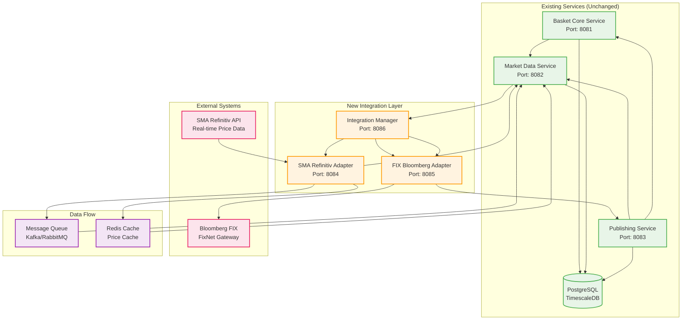
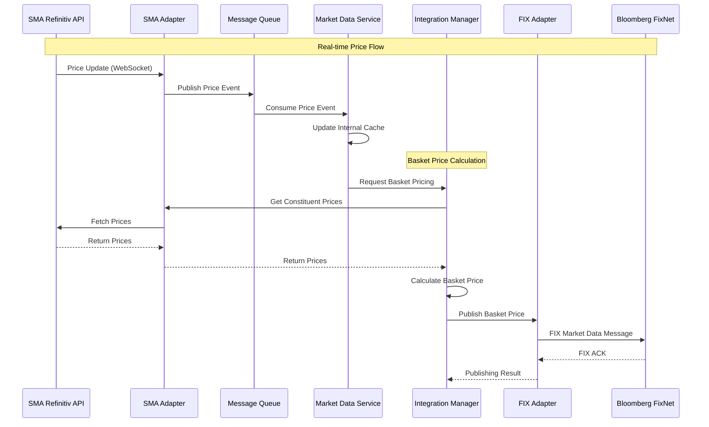
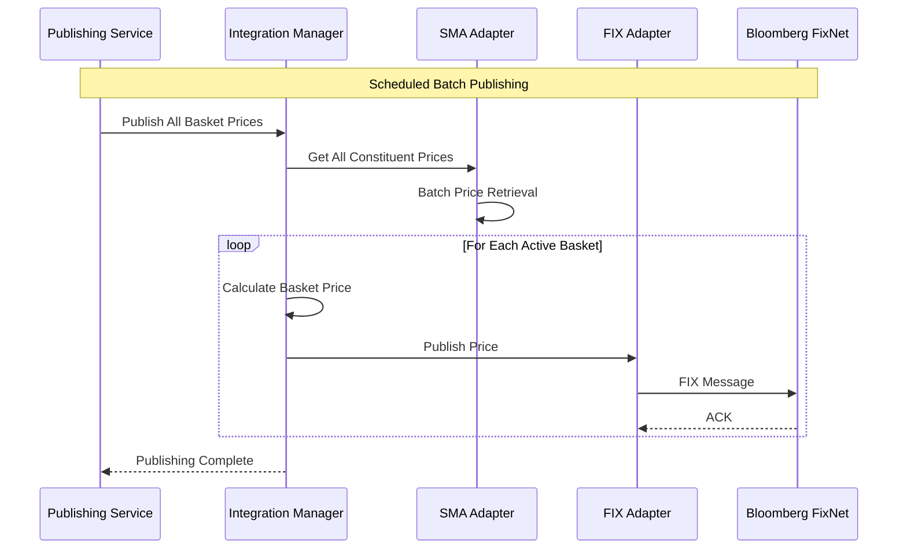

# SMA Refinitiv API & FIX Protocol Integration Design

## Overview

This document outlines the design for integrating **SMA Refinitiv API** for price data retrieval and **FIX protocol** for Bloomberg communication, without modifying the existing codebase. The solution uses middleware components that extend the current architecture seamlessly.

## Architecture Design

### Current System Architecture
```
┌─────────────────────┐    ┌─────────────────────┐    ┌─────────────────────┐
│   Basket Core       │    │   Market Data       │    │   Publishing        │
│   Service           │    │   Service           │    │   Service           │
│   Port: 8081       │    │   Port: 8082        │    │   Port: 8083        │
└─────────────────────┘    └─────────────────────┘    └─────────────────────┘
         │                          │                          │
         │                          │                          │
         └──────────────────────────┼──────────────────────────┘
                                    │
                    ┌─────────────────────────────────┐
                    │        PostgreSQL               │
                    │      TimescaleDB                │
                    │        Port: 5432               │
                    └─────────────────────────────────┘
```

### Enhanced Architecture with SMA & FIX Integration



## Component Design

### 1. SMA Refinitiv Adapter Service (Port 8084)

**Purpose**: Bridge between Refinitiv SMA API and existing Market Data Service

**Technology Stack**:
- Spring Boot 3.x
- Refinitiv Real-Time SDK (RTSDK)
- Enterprise Message API (EMA)
- Reactive programming (WebFlux)

**Key Features**:
```yaml
SMA Integration:
  - Real-time price data subscription
  - Historical data retrieval
  - Symbol validation and mapping
  - Data quality validation
  - Rate limiting and throttling

Data Transformation:
  - Convert SMA data to internal format
  - Symbol mapping between systems
  - Currency conversion
  - Timezone normalization

Caching & Performance:
  - Redis caching for frequently accessed data
  - Batch processing for bulk requests
  - Connection pooling
  - Circuit breaker pattern
```

**API Endpoints**:
```bash
# SMA Data Management
GET    /api/v1/sma/prices/{symbol}           # Get current price from SMA
GET    /api/v1/sma/prices/batch              # Batch price retrieval
POST   /api/v1/sma/subscribe                 # Subscribe to real-time feeds
GET    /api/v1/sma/history/{symbol}          # Historical data

# Health & Monitoring
GET    /api/v1/sma/health                    # SMA connection health
GET    /api/v1/sma/status                    # Service status
GET    /api/v1/sma/metrics                   # Performance metrics
```

### 2. FIX Bloomberg Adapter Service (Port 8085)

**Purpose**: Handle FIX protocol communication with Bloomberg FixNet

**Technology Stack**:
- Spring Boot 3.x
- QuickFIX/J (FIX protocol engine)
- Bloomberg FIX API
- Reactive programming (WebFlux)

**Key Features**:
```yaml
FIX Protocol Management:
  - FIX 4.4/5.0 protocol support
  - Session management
  - Message routing
  - Sequence number management
  - Heartbeat handling

Bloomberg Integration:
  - FixNet gateway connection
  - Market data publishing
  - Order management
  - Trade reporting
  - Authentication & authorization

Message Processing:
  - FIX message parsing/construction
  - Validation and transformation
  - Error handling and recovery
  - Logging and audit trail
```

**API Endpoints**:
```bash
# FIX Operations
POST   /api/v1/fix/publish/price             # Publish price via FIX
POST   /api/v1/fix/publish/basket            # Publish basket listing
GET    /api/v1/fix/sessions                  # Active FIX sessions
POST   /api/v1/fix/sessions/{id}/reconnect   # Reconnect session

# Bloomberg Specific
POST   /api/v1/fix/bloomberg/market-data     # Bloomberg market data
POST   /api/v1/fix/bloomberg/orders          # Order management
GET    /api/v1/fix/bloomberg/status          # Bloomberg connection status

# Health & Monitoring
GET    /api/v1/fix/health                    # FIX service health
GET    /api/v1/fix/metrics                   # FIX performance metrics
```

### 3. Integration Manager Service (Port 8086)

**Purpose**: Orchestrate data flow between SMA and FIX adapters

**Key Features**:
```yaml
Data Orchestration:
  - Coordinate SMA data retrieval
  - Transform data for FIX publishing
  - Manage data flow timing
  - Handle error scenarios

Business Logic:
  - Basket price calculation
  - Data validation rules
  - Publishing schedules
  - Vendor-specific formatting

Monitoring & Control:
  - End-to-end data flow tracking
  - Performance monitoring
  - Alert management
  - Configuration management
```

## Integration Points

### 1. Market Data Service Integration

**Current**: Mock Bloomberg proxy with simulated data
**Enhancement**: Add SMA adapter as additional data source

```java
// New SMA Data Source Proxy
@Component
public class SmaRefinitivProxy extends AbstractDataSourceProxy {
    
    @Autowired
    private SmaAdapterService smaAdapter;
    
    @Override
    protected Mono<RawMarketData> fetchFromSource(String instrumentId) {
        return smaAdapter.getPrice(instrumentId)
            .map(this::transformSmaData);
    }
    
    private RawMarketData transformSmaData(SmaPriceData smaData) {
        // Transform SMA format to internal format
        return RawMarketData.builder()
            .instrumentId(smaData.getSymbol())
            .price(smaData.getLastPrice())
            .dataSource("SMA_REFINITIV")
            .timestamp(smaData.getTimestamp())
            .build();
    }
}
```

### 2. Publishing Service Integration

**Current**: Mock vendor proxy services
**Enhancement**: Add FIX adapter for Bloomberg publishing

```java
// Enhanced Vendor Service with FIX Support
@Service
public class EnhancedVendorServiceImpl extends VendorServiceImpl {
    
    @Autowired
    private FixBloombergAdapter fixAdapter;
    
    @Override
    public Mono<PublishingResult> publishBasketPriceToVendor(
            String vendorName, PricePublishingRequest request) {
        
        if ("BLOOMBERG".equals(vendorName.toUpperCase())) {
            return fixAdapter.publishPrice(request);
        }
        
        // Fall back to existing mock implementation
        return super.publishBasketPriceToVendor(vendorName, request);
    }
}
```

## Data Flow Design

### 1. Real-time Price Flow



### 2. Batch Publishing Flow



## Configuration Design

### 1. SMA Refinitiv Configuration

```yaml
# application-sma.yml
sma:
  refinitiv:
    api:
      base-url: ${SMA_API_URL:https://api.refinitiv.com}
      app-key: ${SMA_APP_KEY:your-app-key}
      username: ${SMA_USERNAME:your-username}
      password: ${SMA_PASSWORD:your-password}
    
    connection:
      timeout: 30000
      retry-attempts: 3
      retry-delay: 1000
      max-connections: 10
    
    subscription:
      symbols: ${SMA_SYMBOLS:AAPL,MSFT,GOOGL}
      fields: ${SMA_FIELDS:BID,ASK,LAST_PRICE,VOLUME}
      update-frequency: ${SMA_FREQUENCY:1000} # milliseconds
    
    cache:
      enabled: true
      ttl: 300 # seconds
      max-size: 10000
```

### 2. FIX Bloomberg Configuration

```yaml
# application-fix.yml
fix:
  bloomberg:
    connection:
      host: ${BLOOMBERG_FIX_HOST:fix.bloomberg.com}
      port: ${BLOOMBERG_FIX_PORT:8080}
      sender-comp-id: ${FIX_SENDER_COMP_ID:YOUR_COMP_ID}
      target-comp-id: ${FIX_TARGET_COMP_ID:BLOOMBERG}
    
    session:
      begin-string: FIX.4.4
      heartbeat-interval: 30
      connection-timeout: 10
      reconnect-interval: 30
    
    authentication:
      username: ${BLOOMBERG_USERNAME:your-username}
      password: ${BLOOMBERG_PASSWORD:your-password}
      cert-path: ${BLOOMBERG_CERT_PATH:/path/to/cert}
    
    message:
      default-app-version: 9
      default-encoding: UTF-8
      validate-messages: true
```

## Deployment Strategy

### 1. Container Configuration

```yaml
# docker-compose.enhanced.yml
version: '3.8'

services:
  # Existing services (unchanged)
  basket-core-service:
    # ... existing configuration
    
  market-data-service:
    # ... existing configuration
    
  publishing-service:
    # ... existing configuration
    
  # New integration services
  sma-adapter-service:
    build:
      context: ./sma-adapter-service
      dockerfile: Dockerfile
    ports:
      - "8084:8084"
    environment:
      - SPRING_PROFILES_ACTIVE=sma
      - SMA_API_URL=${SMA_API_URL}
      - SMA_APP_KEY=${SMA_APP_KEY}
    depends_on:
      - redis
      - kafka
    networks:
      - basket-network
      
  fix-adapter-service:
    build:
      context: ./fix-adapter-service
      dockerfile: Dockerfile
    ports:
      - "8085:8085"
    environment:
      - SPRING_PROFILES_ACTIVE=fix
      - BLOOMBERG_FIX_HOST=${BLOOMBERG_FIX_HOST}
      - BLOOMBERG_USERNAME=${BLOOMBERG_USERNAME}
    depends_on:
      - redis
      - kafka
    networks:
      - basket-network
      
  integration-manager-service:
    build:
      context: ./integration-manager-service
      dockerfile: Dockerfile
    ports:
      - "8086:8086"
    environment:
      - SPRING_PROFILES_ACTIVE=integration
      - SMA_ADAPTER_URL=http://sma-adapter-service:8084
      - FIX_ADAPTER_URL=http://fix-adapter-service:8085
    depends_on:
      - sma-adapter-service
      - fix-adapter-service
    networks:
      - basket-network

networks:
  basket-network:
    driver: bridge
```

### 2. Service Discovery

```yaml
# Service registration for new components
integration:
  service-discovery:
    enabled: true
    consul:
      host: ${CONSUL_HOST:localhost}
      port: ${CONSUL_PORT:8500}
    
  health-check:
    interval: 30s
    timeout: 5s
    retries: 3
```

## Security Considerations

### 1. API Security

```yaml
security:
  sma:
    api-key-rotation: true
    rate-limiting: 1000/hour
    ip-whitelist: ${SMA_ALLOWED_IPS}
    
  fix:
    ssl-enabled: true
    certificate-validation: true
    message-encryption: true
    audit-logging: true
```

### 2. Data Privacy

```yaml
privacy:
  data-masking:
    enabled: true
    sensitive-fields: ["password", "api-key", "certificate"]
  
  encryption:
    at-rest: AES-256
    in-transit: TLS-1.3
    
  compliance:
    gdpr: true
    sox: true
```

## Monitoring & Observability

### 1. Metrics Collection

```yaml
monitoring:
  metrics:
    sma:
      - connection-status
      - api-response-time
      - data-quality-score
      - error-rate
      
    fix:
      - session-status
      - message-throughput
      - latency
      - error-rate
      
  alerts:
    sma-connection-down:
      condition: "sma.connection.status == 'DOWN'"
      severity: "HIGH"
      
    fix-session-disconnected:
      condition: "fix.session.status == 'DISCONNECTED'"
      severity: "CRITICAL"
```

### 2. Logging Strategy

```yaml
logging:
  level:
    com.custom.indexbasket.sma: DEBUG
    com.custom.indexbasket.fix: DEBUG
    
  appenders:
    - type: file
      file: /var/log/sma-adapter.log
    - type: console
      
  correlation-id: true
  request-tracing: true
```

## Testing Strategy

### 1. Unit Testing

```java
@Test
public void testSmaPriceTransformation() {
    // Test SMA data transformation
    SmaPriceData smaData = createTestSmaData();
    RawMarketData result = smaAdapter.transformSmaData(smaData);
    
    assertThat(result.getDataSource()).isEqualTo("SMA_REFINITIV");
    assertThat(result.getPrice()).isEqualTo(smaData.getLastPrice());
}

@Test
public void testFixMessageConstruction() {
    // Test FIX message creation
    PricePublishingRequest request = createTestPriceRequest();
    String fixMessage = fixAdapter.constructFixMessage(request);
    
    assertThat(fixMessage).contains("35=V"); // Market Data message type
    assertThat(fixMessage).contains("55=" + request.getSymbol());
}
```

### 2. Integration Testing

```java
@SpringBootTest
@TestPropertySource(properties = {
    "sma.mock.enabled=true",
    "fix.mock.enabled=true"
})
public class IntegrationTest {
    
    @Test
    public void testEndToEndPriceFlow() {
        // Test complete price flow from SMA to Bloomberg
        // 1. SMA adapter receives price update
        // 2. Integration manager calculates basket price
        // 3. FIX adapter publishes to Bloomberg
        // 4. Verify FIX message received
    }
}
```

## Implementation Phases

### Phase 1: SMA Integration (Week 1-2)
- [ ] Setup SMA Refinitiv SDK
- [ ] Implement SMA Adapter Service
- [ ] Create data transformation layer
- [ ] Add caching mechanism
- [ ] Unit tests

### Phase 2: FIX Integration (Week 3-4)
- [ ] Setup QuickFIX/J framework
- [ ] Implement FIX Adapter Service
- [ ] Create Bloomberg FixNet connection
- [ ] Add session management
- [ ] Unit tests

### Phase 3: Integration Manager (Week 5-6)
- [ ] Implement orchestration logic
- [ ] Add data flow coordination
- [ ] Create monitoring endpoints
- [ ] Integration tests

### Phase 4: Production Deployment (Week 7-8)
- [ ] Container configuration
- [ ] Security hardening
- [ ] Performance tuning
- [ ] Monitoring setup
- [ ] Production testing

## Benefits of This Design

### 1. **Non-Invasive Integration**
- No changes to existing services
- Preserves current functionality
- Maintains backward compatibility

### 2. **Scalable Architecture**
- Independent service scaling
- Load balancing capabilities
- Horizontal scaling support

### 3. **Fault Tolerance**
- Circuit breaker patterns
- Retry mechanisms
- Graceful degradation

### 4. **Observability**
- Comprehensive monitoring
- Real-time alerting
- Performance tracking

### 5. **Maintainability**
- Clear separation of concerns
- Modular design
- Easy testing and debugging

## Conclusion

This design provides a robust, scalable solution for integrating SMA Refinitiv API and FIX protocol with Bloomberg without modifying the existing codebase. The middleware approach ensures clean separation of concerns while maintaining system reliability and performance.

The phased implementation approach allows for incremental deployment and testing, reducing risk and ensuring smooth integration with the existing system.
