# Testing & Simulation Architecture

## Overview

The Custom Index Basket Management Platform requires comprehensive **proxy services** to simulate external dependencies for development, testing, and demonstration purposes. These proxy services eliminate the need for actual vendor connections while providing realistic data flows and API behaviors.

## 🎭 Proxy Services Architecture

```mermaid
graph TB
    subgraph "Platform Services"
        MDS[Market Data Service]
        PUB[Publishing Service]
        VAL[Valuation Service]
    end
    
    subgraph "Proxy Services (Simulation Layer)"
        MDP[Market Data Producer Proxy<br/>📊 Real-time Price Feeds]
        FXP[FX Rate Provider Proxy<br/>💱 Currency Exchange Rates]
        BBP[Bloomberg Vendor Proxy<br/>🏦 BB Listing & Pricing APIs]
        REP[Refinitiv Vendor Proxy<br/>🔄 RDP/Elektron APIs]
    end
    
    subgraph "Message Streaming"
        KAFKA[Kafka Topics]
        REDIS[Redis Cache]
    end
    
    subgraph "External Simulation"
        EXT_BB[Simulated Bloomberg APIs]
        EXT_REF[Simulated Refinitiv APIs]
        EXT_CB[Simulated Central Bank APIs]
    end
    
    %% Data flow from proxies to platform
    MDP --> KAFKA
    FXP --> KAFKA
    MDP --> REDIS
    FXP --> REDIS
    
    %% Platform consumption
    KAFKA --> MDS
    REDIS --> MDS
    MDS --> VAL
    
    %% Publishing flow to vendor proxies
    PUB --> BBP
    PUB --> REP
    
    %% Vendor proxy simulation
    BBP --> EXT_BB
    REP --> EXT_REF
    FXP --> EXT_CB
    
    %% Styling
    classDef platformService fill:#e8f5e8
    classDef proxyService fill:#fff3e0
    classDef messaging fill:#f3e5f5
    classDef external fill:#f1f8e9
    
    class MDS,PUB,VAL platformService
    class MDP,FXP,BBP,REP proxyService
    class KAFKA,REDIS messaging
    class EXT_BB,EXT_REF,EXT_CB external
```



## 📊 Market Data Producer Proxy

### Purpose
Simulates real-time market data feeds from various financial data vendors, providing realistic price movements, volume data, and market events.

### Key Features
```yaml
Price Feed Simulation:
  - Real-time equity prices with realistic volatility
  - ETF and index price calculations
  - Intraday price movements with market hours simulation
  - After-hours and pre-market pricing

Data Sources Simulation:
  - Bloomberg BLPAPI feed simulation
  - Refinitiv/EIKON real-time data simulation
  - Yahoo Finance API simulation
  - Alpha Vantage API simulation

Market Events:
  - Market open/close events
  - Trading halts and circuit breakers
  - Corporate actions (splits, dividends)
  - Holiday calendar simulation
```

### Technical Specifications
```yaml
Technology Stack:
  - Spring Boot 3.x + WebFlux
  - Kafka Producer for real-time streaming
  - Redis for price caching
  - Scheduled tasks for market simulation

Data Generation:
  - Geometric Brownian Motion for realistic price movements
  - Configurable volatility and drift parameters
  - Symbol-specific price patterns
  - Volume simulation based on time of day

Performance:
  - 1000+ symbols simultaneous simulation
  - Price updates every 1-5 seconds per symbol
  - Market event triggers
  - Configurable data feed frequency
```

### API Endpoints
```yaml
🐌 REST API Endpoints:
  GET  /api/simulation/symbols                 # Available symbols
  POST /api/simulation/symbols/add             # Add new symbol
  GET  /api/simulation/market/status           # Market status
  POST /api/simulation/market/open             # Force market open
  POST /api/simulation/market/close            # Force market close
  GET  /api/simulation/feeds/status            # Data feed status

📡 Kafka Topics (Published):
  market.data.equity.prices                   # Equity price updates
  market.data.etf.prices                      # ETF price updates
  market.data.index.prices                    # Index price updates
  market.events.session                       # Market session events
  market.events.corporate.actions             # Corporate action events

⚡ WebSocket Streams:
  /ws/prices/{symbol}                          # Real-time price stream
  /ws/market/events                            # Market event stream
```

### Configuration
```yaml
# application.yml
simulation:
  market-data:
    enabled: true
    update-frequency: 5s
    market-hours:
      start: "09:30"
      end: "16:00"
      timezone: "America/New_York"
    symbols:
      - symbol: "AAPL"
        initial-price: 150.00
        volatility: 0.25
        drift: 0.05
      - symbol: "GOOGL"
        initial-price: 2500.00
        volatility: 0.30
        drift: 0.08
    kafka:
      topic-prefix: "market.data"
      batch-size: 100
      linger-ms: 10
```

## 💱 FX Rate Provider Proxy

### Purpose
Simulates foreign exchange rates from central banks and financial institutions, providing real-time currency conversion data.

### Key Features
```yaml
Currency Simulation:
  - Major currency pairs (USD, EUR, GBP, JPY, CHF, CAD, AUD)
  - Emerging market currencies
  - Cryptocurrency rates (BTC, ETH)
  - Central bank rate announcements

Rate Generation:
  - Realistic FX volatility patterns
  - Weekend and holiday rate freezing
  - Central bank intervention simulation
  - Cross-currency rate calculation
```

### Technical Specifications
```yaml
Technology Stack:
  - Spring Boot 3.x + WebFlux
  - Kafka Producer for FX streaming
  - Redis for rate caching
  - External API simulation (ECB, Fed, BOE)

Data Generation:
  - Random walk with mean reversion
  - Configurable correlation between pairs
  - News event impact simulation
  - Time zone aware rate updates

Performance:
  - 50+ currency pairs
  - Rate updates every 30 seconds
  - Historical rate storage
  - Rate change alerts
```

### API Endpoints
```yaml
🐌 REST API Endpoints:
  GET  /api/fx/rates                           # Current FX rates
  GET  /api/fx/rates/{from}/{to}               # Specific rate pair
  GET  /api/fx/rates/historical                # Historical rates
  POST /api/fx/events/trigger                  # Trigger rate event

📡 Kafka Topics (Published):
  fx.rates.major                              # Major currency rates
  fx.rates.emerging                           # Emerging market rates
  fx.rates.crypto                             # Cryptocurrency rates
  fx.events.central.bank                      # Central bank events
```

## 🏦 Bloomberg Vendor Proxy

### Purpose
Simulates Bloomberg's BSYM (listing) and BLPAPI (pricing) services for basket publishing and price distribution testing.

### Key Features
```yaml
Listing Simulation (BSYM):
  - Basket definition submission
  - Symbol registration process
  - Approval workflow simulation
  - Error condition testing

Price Publishing (BLPAPI):
  - Real-time price ingestion
  - Price validation and formatting
  - Distribution confirmation
  - Performance metrics
```

### Technical Specifications
```yaml
API Simulation:
  - REST endpoints mimicking Bloomberg APIs
  - Authentication simulation
  - Rate limiting simulation
  - Error response patterns

Performance Testing:
  - Latency simulation (1-50ms)
  - Throughput testing (1000+ prices/sec)
  - Connection failure simulation
  - Recovery scenario testing
```

### API Endpoints
```yaml
🐌 REST API Endpoints (Bloomberg Simulation):
  POST /api/bloomberg/bsym/basket/create       # Create basket listing
  GET  /api/bloomberg/bsym/basket/{id}/status  # Listing status
  POST /api/bloomberg/blpapi/prices/publish    # Publish prices
  GET  /api/bloomberg/blpapi/connection/status # Connection health

📡 Event Simulation:
  bloomberg.listing.received                   # Listing request received
  bloomberg.listing.approved                   # Listing approved
  bloomberg.listing.rejected                   # Listing rejected
  bloomberg.price.published                    # Price published successfully
  bloomberg.connection.lost                    # Connection failure
```

## 🔄 Refinitiv Vendor Proxy

### Purpose
Simulates Refinitiv's RDP (Refinitiv Data Platform) and Elektron services for comprehensive vendor integration testing.

### Key Features
```yaml
RDP API Simulation:
  - Authentication and token management
  - Instrument registration
  - Market data subscription
  - Content distribution

Elektron Simulation:
  - Real-time market data streaming
  - Price contribution simulation
  - Service discovery
  - Connection management
```

### Technical Specifications
```yaml
API Simulation:
  - RESTful RDP API endpoints
  - WebSocket Elektron streaming
  - OAuth 2.0 authentication simulation
  - Service mesh simulation

Integration Testing:
  - Multi-tenant scenario testing
  - Bandwidth throttling simulation
  - Geographic distribution testing
  - Disaster recovery simulation
```

### API Endpoints
```yaml
🐌 REST API Endpoints (Refinitiv Simulation):
  POST /api/refinitiv/rdp/auth/token           # Authentication
  POST /api/refinitiv/rdp/instruments/register # Register instrument
  GET  /api/refinitiv/rdp/market-data/status   # Service status
  POST /api/refinitiv/elektron/prices/contribute # Contribute prices

⚡ WebSocket Streams (Elektron Simulation):
  /ws/refinitiv/elektron/realtime              # Real-time data stream
  /ws/refinitiv/elektron/contrib                # Price contribution stream
```

## 🐳 Docker Integration

### Development Environment
```yaml
# docker-compose-proxies.yml
version: '3.8'
services:
  market-data-producer-proxy:
    build: ./market-data-producer-proxy
    ports:
      - "9201:9090"
    environment:
      - SPRING_PROFILES_ACTIVE=docker
      - KAFKA_BOOTSTRAP_SERVERS=kafka:9092
      - REDIS_HOST=redis
    depends_on:
      - kafka
      - redis

  fx-rate-provider-proxy:
    build: ./fx-rate-provider-proxy
    ports:
      - "9202:9090"
    environment:
      - SPRING_PROFILES_ACTIVE=docker
      - KAFKA_BOOTSTRAP_SERVERS=kafka:9092
      - REDIS_HOST=redis
    depends_on:
      - kafka
      - redis

  bloomberg-vendor-proxy:
    build: ./bloomberg-vendor-proxy
    ports:
      - "9203:9090"
    environment:
      - SPRING_PROFILES_ACTIVE=docker
    volumes:
      - ./logs/bloomberg-proxy:/app/logs

  refinitiv-vendor-proxy:
    build: ./refinitiv-vendor-proxy
    ports:
      - "9204:9090"
    environment:
      - SPRING_PROFILES_ACTIVE=docker
    volumes:
      - ./logs/refinitiv-proxy:/app/logs
```

### Testing Commands
```bash
# Start all proxy services
docker-compose -f docker-compose-proxies.yml up -d

# Test market data simulation
curl -s http://localhost:9201/api/simulation/symbols | jq

# Test FX rate simulation
curl -s http://localhost:9202/api/fx/rates | jq

# Test Bloomberg vendor proxy
curl -s http://localhost:9203/api/bloomberg/bsym/health | jq

# Test Refinitiv vendor proxy
curl -s http://localhost:9204/api/refinitiv/rdp/health | jq
```

## 🧪 Testing Scenarios

### End-to-End Testing Flow
```yaml
1. Market Data Flow:
   - MarketDataProducer → Kafka → md-ingest-service
   - FXRateProvider → Kafka → md-ingest-service
   - Verify price caching in Redis
   - Confirm valuation calculations

2. Publishing Flow:
   - Basket approval → Publishing Service
   - Bloomberg proxy receives listing request
   - Refinitiv proxy receives listing request
   - Confirm listing status updates

3. Real-time Price Flow:
   - MarketDataProducer → Real-time prices
   - Valuation Service → Price calculations
   - Publishing Service → Vendor proxies
   - Confirm price distribution

4. Error Scenario Testing:
   - Vendor connection failures
   - Market data feed interruptions
   - FX rate service outages
   - Recovery and retry mechanisms
```

### Performance Testing
```yaml
Load Testing Scenarios:
  - 1000+ symbols with 5-second updates
  - 10,000 price updates per minute
  - Multiple basket simultaneous publishing
  - Vendor proxy latency simulation

Stress Testing:
  - Connection pool exhaustion
  - Memory pressure simulation
  - Network partition scenarios
  - High-frequency trading simulation
```

## 📊 Monitoring & Observability

### Proxy Service Metrics
```yaml
Market Data Metrics:
  - Symbols simulated count
  - Price update frequency
  - Message publish rate
  - Cache hit ratios

Vendor Proxy Metrics:
  - Listing request count
  - Price publish rate
  - Response latencies
  - Error rates by vendor

System Metrics:
  - CPU and memory usage
  - Kafka producer metrics
  - Redis connection metrics
  - Network throughput
```

### Health Checks
```yaml
Readiness Probes:
  - Kafka connection health
  - Redis connection health
  - Market simulation status
  - Vendor proxy availability

Liveness Probes:
  - Service responsiveness
  - Memory leak detection
  - Thread pool health
  - Circuit breaker status
```

This **testing and simulation architecture** provides a complete **sandbox environment** for developing, testing, and demonstrating the Custom Index Basket Management Platform without requiring actual vendor connections or live market data feeds. The proxy services enable **realistic end-to-end testing** while maintaining **full control** over data scenarios and error conditions.
