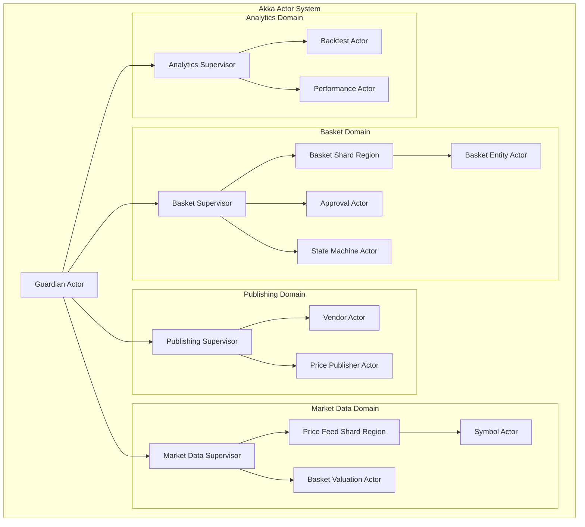

# Actor Model and gRPC Contracts

## Overview

This document defines the **Actor Model architecture using Akka Typed** and **gRPC service contracts with Protobuf** for high-performance, concurrent processing in the Custom Index Basket Management Platform. These patterns provide superior concurrency, type safety, and performance for internal service communication.

## Technology Stack Integration

```yaml
Concurrency Architecture:
  Actor System: Akka Typed 2.8.x (Java DSL)
  Message Passing: Type-safe actor communication
  Clustering: Akka Cluster for distributed actors
  Persistence: Akka Persistence for event sourcing
  Sharding: Akka Cluster Sharding for partitioned actors

Internal RPC:
  Protocol: gRPC 1.56+ for high-performance RPC
  Serialization: Protocol Buffers 4.x for efficient serialization
  Streaming: Bidirectional streaming for real-time data
  Load Balancing: Client-side load balancing
  Circuit Breaker: Integrated resilience patterns

Integration Points:
  ✅ REST APIs for external clients (existing)
  ✅ Actor system for internal concurrency (new)
  ✅ gRPC for inter-service communication (new)
  ✅ Event streaming via abstracted messaging (existing)
  ✅ Reactive streams integration (enhanced)
```

## Actor System Architecture

### Actor Hierarchy Design



### Core Actor Definitions

#### 1. Basket Entity Actor

```java
package com.custom.indexbasket.actors.basket;

import akka.actor.typed.ActorRef;
import akka.actor.typed.Behavior;
import akka.actor.typed.javadsl.AbstractBehavior;
import akka.actor.typed.javadsl.ActorContext;
import akka.actor.typed.javadsl.Behaviors;
import akka.actor.typed.javadsl.Receive;
import akka.cluster.sharding.typed.javadsl.EntityTypeKey;
import akka.persistence.typed.PersistenceId;
import akka.persistence.typed.javadsl.CommandHandler;
import akka.persistence.typed.javadsl.EventHandler;
import akka.persistence.typed.javadsl.EventSourcedBehavior;

/**
 * Partitioned basket entity actor using Akka Persistence
 * Each basket is managed by its own actor instance
 */
public class BasketEntityActor extends EventSourcedBehavior<BasketEntityActor.Command, BasketEntityActor.Event, BasketEntityActor.State> {
    
    public static final EntityTypeKey<Command> ENTITY_TYPE_KEY = 
        EntityTypeKey.create(Command.class, "BasketEntity");
    
    // Commands (external API)
    public interface Command extends CborSerializable {}
    
    public static final class CreateBasket implements Command {
        public final String basketCode;
        public final String basketName;
        public final String basketType;
        public final String baseCurrency;
        public final List<ConstituentData> constituents;
        public final String createdBy;
        public final ActorRef<CreateBasketResponse> replyTo;
        
        public CreateBasket(String basketCode, String basketName, String basketType, 
                           String baseCurrency, List<ConstituentData> constituents, 
                           String createdBy, ActorRef<CreateBasketResponse> replyTo) {
            this.basketCode = basketCode;
            this.basketName = basketName;
            this.basketType = basketType;
            this.baseCurrency = baseCurrency;
            this.constituents = constituents;
            this.createdBy = createdBy;
            this.replyTo = replyTo;
        }
    }
    
    public static final class UpdateBasket implements Command {
        public final String basketName;
        public final String basketType;
        public final List<ConstituentData> constituents;
        public final String updatedBy;
        public final ActorRef<UpdateBasketResponse> replyTo;
        
        public UpdateBasket(String basketName, String basketType, 
                           List<ConstituentData> constituents, String updatedBy,
                           ActorRef<UpdateBasketResponse> replyTo) {
            this.basketName = basketName;
            this.basketType = basketType;
            this.constituents = constituents;
            this.updatedBy = updatedBy;
            this.replyTo = replyTo;
        }
    }
    
    public static final class ChangeBasketStatus implements Command {
        public final String newStatus;
        public final String changedBy;
        public final String reason;
        public final ActorRef<StatusChangeResponse> replyTo;
        
        public ChangeBasketStatus(String newStatus, String changedBy, String reason,
                                 ActorRef<StatusChangeResponse> replyTo) {
            this.newStatus = newStatus;
            this.changedBy = changedBy;
            this.reason = reason;
            this.replyTo = replyTo;
        }
    }
    
    public static final class GetBasket implements Command {
        public final ActorRef<GetBasketResponse> replyTo;
        
        public GetBasket(ActorRef<GetBasketResponse> replyTo) {
            this.replyTo = replyTo;
        }
    }
    
    public static final class ValidateBasket implements Command {
        public final ActorRef<ValidationResponse> replyTo;
        
        public ValidateBasket(ActorRef<ValidationResponse> replyTo) {
            this.replyTo = replyTo;
        }
    }
    
    // Events (persisted to event store)
    public interface Event extends CborSerializable {}
    
    public static final class BasketCreated implements Event {
        public final String basketCode;
        public final String basketName;
        public final String basketType;
        public final String baseCurrency;
        public final List<ConstituentData> constituents;
        public final String createdBy;
        public final LocalDateTime createdAt;
        
        public BasketCreated(String basketCode, String basketName, String basketType,
                            String baseCurrency, List<ConstituentData> constituents,
                            String createdBy, LocalDateTime createdAt) {
            this.basketCode = basketCode;
            this.basketName = basketName;
            this.basketType = basketType;
            this.baseCurrency = baseCurrency;
            this.constituents = constituents;
            this.createdBy = createdBy;
            this.createdAt = createdAt;
        }
    }
    
    public static final class BasketUpdated implements Event {
        public final String basketName;
        public final String basketType;
        public final List<ConstituentData> constituents;
        public final String updatedBy;
        public final LocalDateTime updatedAt;
        public final String version;
        
        public BasketUpdated(String basketName, String basketType,
                            List<ConstituentData> constituents, String updatedBy,
                            LocalDateTime updatedAt, String version) {
            this.basketName = basketName;
            this.basketType = basketType;
            this.constituents = constituents;
            this.updatedBy = updatedBy;
            this.updatedAt = updatedAt;
            this.version = version;
        }
    }
    
    public static final class BasketStatusChanged implements Event {
        public final String oldStatus;
        public final String newStatus;
        public final String changedBy;
        public final String reason;
        public final LocalDateTime changedAt;
        
        public BasketStatusChanged(String oldStatus, String newStatus, String changedBy,
                                  String reason, LocalDateTime changedAt) {
            this.oldStatus = oldStatus;
            this.newStatus = newStatus;
            this.changedBy = changedBy;
            this.reason = reason;
            this.changedAt = changedAt;
        }
    }
    
    // Actor State
    public static final class State implements CborSerializable {
        public final String basketCode;
        public final String basketName;
        public final String basketType;
        public final String baseCurrency;
        public final List<ConstituentData> constituents;
        public final String status;
        public final String version;
        public final String createdBy;
        public final LocalDateTime createdAt;
        public final String updatedBy;
        public final LocalDateTime updatedAt;
        public final boolean exists;
        
        public State(String basketCode, String basketName, String basketType,
                    String baseCurrency, List<ConstituentData> constituents,
                    String status, String version, String createdBy, LocalDateTime createdAt,
                    String updatedBy, LocalDateTime updatedAt, boolean exists) {
            this.basketCode = basketCode;
            this.basketName = basketName;
            this.basketType = basketType;
            this.baseCurrency = baseCurrency;
            this.constituents = constituents;
            this.status = status;
            this.version = version;
            this.createdBy = createdBy;
            this.createdAt = createdAt;
            this.updatedBy = updatedBy;
            this.updatedAt = updatedAt;
            this.exists = exists;
        }
        
        public static State empty(String basketCode) {
            return new State(basketCode, null, null, null, List.of(), 
                           "DRAFT", "v1.0", null, null, null, null, false);
        }
        
        public State createBasket(BasketCreated event) {
            return new State(event.basketCode, event.basketName, event.basketType,
                           event.baseCurrency, event.constituents, "DRAFT", "v1.0",
                           event.createdBy, event.createdAt, null, null, true);
        }
        
        public State updateBasket(BasketUpdated event) {
            return new State(basketCode, event.basketName, event.basketType,
                           baseCurrency, event.constituents, status, event.version,
                           createdBy, createdAt, event.updatedBy, event.updatedAt, exists);
        }
        
        public State changeStatus(BasketStatusChanged event) {
            return new State(basketCode, basketName, basketType, baseCurrency,
                           constituents, event.newStatus, version, createdBy, createdAt,
                           event.changedBy, event.changedAt, exists);
        }
    }
    
    // Response types
    public interface Response extends CborSerializable {}
    
    public static final class CreateBasketResponse implements Response {
        public final boolean success;
        public final String basketCode;
        public final String message;
        
        public CreateBasketResponse(boolean success, String basketCode, String message) {
            this.success = success;
            this.basketCode = basketCode;
            this.message = message;
        }
        
        public static CreateBasketResponse success(String basketCode) {
            return new CreateBasketResponse(true, basketCode, "Basket created successfully");
        }
        
        public static CreateBasketResponse failure(String basketCode, String message) {
            return new CreateBasketResponse(false, basketCode, message);
        }
    }
    
    // Constructor and behavior setup
    private final String basketCode;
    
    public static Behavior<Command> create(String basketCode) {
        return Behaviors.setup(context -> new BasketEntityActor(context, basketCode));
    }
    
    private BasketEntityActor(ActorContext<Command> context, String basketCode) {
        super(PersistenceId.of(ENTITY_TYPE_KEY.name(), basketCode));
        this.basketCode = basketCode;
    }
    
    @Override
    public State emptyState() {
        return State.empty(basketCode);
    }
    
    @Override
    public CommandHandler<Command, Event, State> commandHandler() {
        return newCommandHandlerBuilder()
            .forAnyState()
            .onCommand(CreateBasket.class, this::onCreateBasket)
            .onCommand(UpdateBasket.class, this::onUpdateBasket)
            .onCommand(ChangeBasketStatus.class, this::onChangeBasketStatus)
            .onCommand(GetBasket.class, this::onGetBasket)
            .onCommand(ValidateBasket.class, this::onValidateBasket)
            .build();
    }
    
    @Override
    public EventHandler<State, Event> eventHandler() {
        return newEventHandlerBuilder()
            .forAnyState()
            .onEvent(BasketCreated.class, (state, event) -> state.createBasket(event))
            .onEvent(BasketUpdated.class, (state, event) -> state.updateBasket(event))
            .onEvent(BasketStatusChanged.class, (state, event) -> state.changeStatus(event))
            .build();
    }
    
    // Command handlers
    private Effect<Event, State> onCreateBasket(State state, CreateBasket command) {
        if (state.exists) {
            command.replyTo.tell(CreateBasketResponse.failure(command.basketCode, 
                "Basket already exists"));
            return Effect().none();
        }
        
        // Validate basket data
        ValidationResult validation = validateBasketData(command);
        if (!validation.isValid()) {
            command.replyTo.tell(CreateBasketResponse.failure(command.basketCode, 
                validation.getErrorMessage()));
            return Effect().none();
        }
        
        BasketCreated event = new BasketCreated(
            command.basketCode, command.basketName, command.basketType,
            command.baseCurrency, command.constituents, command.createdBy,
            LocalDateTime.now()
        );
        
        return Effect()
            .persist(event)
            .thenReply(command.replyTo, updatedState -> 
                CreateBasketResponse.success(command.basketCode));
    }
    
    private Effect<Event, State> onUpdateBasket(State state, UpdateBasket command) {
        if (!state.exists) {
            command.replyTo.tell(new UpdateBasketResponse(false, "Basket not found"));
            return Effect().none();
        }
        
        if (!"DRAFT".equals(state.status)) {
            command.replyTo.tell(new UpdateBasketResponse(false, 
                "Cannot update basket in status: " + state.status));
            return Effect().none();
        }
        
        String newVersion = incrementVersion(state.version);
        BasketUpdated event = new BasketUpdated(
            command.basketName, command.basketType, command.constituents,
            command.updatedBy, LocalDateTime.now(), newVersion
        );
        
        return Effect()
            .persist(event)
            .thenReply(command.replyTo, updatedState -> 
                new UpdateBasketResponse(true, "Basket updated successfully"));
    }
    
    private Effect<Event, State> onChangeBasketStatus(State state, ChangeBasketStatus command) {
        if (!state.exists) {
            command.replyTo.tell(new StatusChangeResponse(false, "Basket not found"));
            return Effect().none();
        }
        
        // Validate state transition
        if (!isValidStateTransition(state.status, command.newStatus)) {
            command.replyTo.tell(new StatusChangeResponse(false, 
                "Invalid state transition from " + state.status + " to " + command.newStatus));
            return Effect().none();
        }
        
        BasketStatusChanged event = new BasketStatusChanged(
            state.status, command.newStatus, command.changedBy,
            command.reason, LocalDateTime.now()
        );
        
        return Effect()
            .persist(event)
            .thenReply(command.replyTo, updatedState -> 
                new StatusChangeResponse(true, "Status changed successfully"));
    }
    
    private Effect<Event, State> onGetBasket(State state, GetBasket command) {
        command.replyTo.tell(new GetBasketResponse(state.exists, state));
        return Effect().none();
    }
    
    private Effect<Event, State> onValidateBasket(State state, ValidateBasket command) {
        if (!state.exists) {
            command.replyTo.tell(new ValidationResponse(false, "Basket not found"));
            return Effect().none();
        }
        
        ValidationResult validation = validateBasketState(state);
        command.replyTo.tell(new ValidationResponse(validation.isValid(), 
            validation.getErrorMessage()));
        return Effect().none();
    }
    
    // Helper methods
    private ValidationResult validateBasketData(CreateBasket command) {
        // Implement comprehensive validation logic
        if (command.basketCode == null || command.basketCode.trim().isEmpty()) {
            return ValidationResult.invalid("Basket code is required");
        }
        
        if (!command.basketCode.matches("^[A-Z0-9_]{3,20}$")) {
            return ValidationResult.invalid("Invalid basket code format");
        }
        
        if (command.constituents == null || command.constituents.isEmpty()) {
            return ValidationResult.invalid("Basket must contain at least one constituent");
        }
        
        // Validate weight allocation
        double totalWeight = command.constituents.stream()
            .mapToDouble(c -> c.weight.doubleValue())
            .sum();
        
        if (Math.abs(totalWeight - 100.0) > 0.05) {
            return ValidationResult.invalid("Total weight must equal 100%");
        }
        
        return ValidationResult.valid();
    }
    
    private ValidationResult validateBasketState(State state) {
        // Implement state validation logic
        return ValidationResult.valid();
    }
    
    private boolean isValidStateTransition(String currentStatus, String newStatus) {
        // Implement state machine transition validation
        return BasketStateMachine.isValidTransition(currentStatus, newStatus);
    }
    
    private String incrementVersion(String currentVersion) {
        // Simple version increment logic
        String[] parts = currentVersion.substring(1).split("\\.");
        int minor = Integer.parseInt(parts[1]) + 1;
        return "v" + parts[0] + "." + minor;
    }
    
    // Additional response classes
    public static final class UpdateBasketResponse implements Response {
        public final boolean success;
        public final String message;
        
        public UpdateBasketResponse(boolean success, String message) {
            this.success = success;
            this.message = message;
        }
    }
    
    public static final class StatusChangeResponse implements Response {
        public final boolean success;
        public final String message;
        
        public StatusChangeResponse(boolean success, String message) {
            this.success = success;
            this.message = message;
        }
    }
    
    public static final class GetBasketResponse implements Response {
        public final boolean exists;
        public final State basketState;
        
        public GetBasketResponse(boolean exists, State basketState) {
            this.exists = exists;
            this.basketState = basketState;
        }
    }
    
    public static final class ValidationResponse implements Response {
        public final boolean isValid;
        public final String message;
        
        public ValidationResponse(boolean isValid, String message) {
            this.isValid = isValid;
            this.message = message;
        }
    }
    
    // Validation result helper
    private static class ValidationResult {
        private final boolean valid;
        private final String errorMessage;
        
        private ValidationResult(boolean valid, String errorMessage) {
            this.valid = valid;
            this.errorMessage = errorMessage;
        }
        
        public static ValidationResult valid() {
            return new ValidationResult(true, null);
        }
        
        public static ValidationResult invalid(String message) {
            return new ValidationResult(false, message);
        }
        
        public boolean isValid() {
            return valid;
        }
        
        public String getErrorMessage() {
            return errorMessage;
        }
    }
}
```

#### 2. Market Data Symbol Actor

```java
package com.custom.indexbasket.actors.market;

import akka.actor.typed.ActorRef;
import akka.actor.typed.Behavior;
import akka.actor.typed.javadsl.AbstractBehavior;
import akka.actor.typed.javadsl.ActorContext;
import akka.actor.typed.javadsl.Behaviors;
import akka.actor.typed.javadsl.Receive;
import akka.cluster.sharding.typed.javadsl.EntityTypeKey;

/**
 * Symbol actor for managing real-time price updates and subscriptions
 * Each symbol has its own actor instance for concurrent processing
 */
public class SymbolActor extends AbstractBehavior<SymbolActor.Command> {
    
    public static final EntityTypeKey<Command> ENTITY_TYPE_KEY = 
        EntityTypeKey.create(Command.class, "SymbolEntity");
    
    public interface Command extends CborSerializable {}
    
    public static final class UpdatePrice implements Command {
        public final BigDecimal price;
        public final BigDecimal bid;
        public final BigDecimal ask;
        public final Long volume;
        public final LocalDateTime timestamp;
        public final String source;
        
        public UpdatePrice(BigDecimal price, BigDecimal bid, BigDecimal ask,
                          Long volume, LocalDateTime timestamp, String source) {
            this.price = price;
            this.bid = bid;
            this.ask = ask;
            this.volume = volume;
            this.timestamp = timestamp;
            this.source = source;
        }
    }
    
    public static final class SubscribeToPrice implements Command {
        public final ActorRef<PriceUpdate> subscriber;
        
        public SubscribeToPrice(ActorRef<PriceUpdate> subscriber) {
            this.subscriber = subscriber;
        }
    }
    
    public static final class UnsubscribeFromPrice implements Command {
        public final ActorRef<PriceUpdate> subscriber;
        
        public UnsubscribeFromPrice(ActorRef<PriceUpdate> subscriber) {
            this.subscriber = subscriber;
        }
    }
    
    public static final class GetCurrentPrice implements Command {
        public final ActorRef<CurrentPriceResponse> replyTo;
        
        public GetCurrentPrice(ActorRef<CurrentPriceResponse> replyTo) {
            this.replyTo = replyTo;
        }
    }
    
    public static final class PriceUpdate implements CborSerializable {
        public final String symbol;
        public final BigDecimal price;
        public final BigDecimal bid;
        public final BigDecimal ask;
        public final Long volume;
        public final LocalDateTime timestamp;
        public final String source;
        
        public PriceUpdate(String symbol, BigDecimal price, BigDecimal bid, BigDecimal ask,
                          Long volume, LocalDateTime timestamp, String source) {
            this.symbol = symbol;
            this.price = price;
            this.bid = bid;
            this.ask = ask;
            this.volume = volume;
            this.timestamp = timestamp;
            this.source = source;
        }
    }
    
    public static final class CurrentPriceResponse implements CborSerializable {
        public final String symbol;
        public final boolean available;
        public final PriceUpdate currentPrice;
        
        public CurrentPriceResponse(String symbol, boolean available, PriceUpdate currentPrice) {
            this.symbol = symbol;
            this.available = available;
            this.currentPrice = currentPrice;
        }
    }
    
    // Actor state
    private final String symbol;
    private PriceUpdate currentPrice;
    private final Set<ActorRef<PriceUpdate>> subscribers = new HashSet<>();
    
    public static Behavior<Command> create(String symbol) {
        return Behaviors.setup(context -> new SymbolActor(context, symbol));
    }
    
    private SymbolActor(ActorContext<Command> context, String symbol) {
        super(context);
        this.symbol = symbol;
    }
    
    @Override
    public Receive<Command> createReceive() {
        return newReceiveBuilder()
            .onMessage(UpdatePrice.class, this::onUpdatePrice)
            .onMessage(SubscribeToPrice.class, this::onSubscribeToPrice)
            .onMessage(UnsubscribeFromPrice.class, this::onUnsubscribeFromPrice)
            .onMessage(GetCurrentPrice.class, this::onGetCurrentPrice)
            .build();
    }
    
    private Behavior<Command> onUpdatePrice(UpdatePrice command) {
        PriceUpdate newPrice = new PriceUpdate(
            symbol, command.price, command.bid, command.ask,
            command.volume, command.timestamp, command.source
        );
        
        this.currentPrice = newPrice;
        
        // Notify all subscribers
        subscribers.forEach(subscriber -> subscriber.tell(newPrice));
        
        getContext().getLog().debug("Updated price for {}: {}", symbol, command.price);
        
        return this;
    }
    
    private Behavior<Command> onSubscribeToPrice(SubscribeToPrice command) {
        subscribers.add(command.subscriber);
        
        // Send current price if available
        if (currentPrice != null) {
            command.subscriber.tell(currentPrice);
        }
        
        getContext().getLog().debug("Added subscriber for {}", symbol);
        
        return this;
    }
    
    private Behavior<Command> onUnsubscribeFromPrice(UnsubscribeFromPrice command) {
        subscribers.remove(command.subscriber);
        getContext().getLog().debug("Removed subscriber for {}", symbol);
        
        return this;
    }
    
    private Behavior<Command> onGetCurrentPrice(GetCurrentPrice command) {
        boolean available = currentPrice != null;
        CurrentPriceResponse response = new CurrentPriceResponse(symbol, available, currentPrice);
        command.replyTo.tell(response);
        
        return this;
    }
}
```

## gRPC Service Contracts

### Protocol Buffer Definitions

#### 1. Basket Service gRPC Contract

```protobuf
// basket_service.proto
syntax = "proto3";

package com.custom.indexbasket.grpc.basket;

import "google/protobuf/timestamp.proto";
import "google/protobuf/empty.proto";

option java_package = "com.custom.indexbasket.grpc.basket";
option java_outer_classname = "BasketServiceProto";
option java_multiple_files = true;

// Basket Service - Internal gRPC API
service BasketService {
    // Basket CRUD operations
    rpc CreateBasket(CreateBasketRequest) returns (CreateBasketResponse);
    rpc GetBasket(GetBasketRequest) returns (GetBasketResponse);
    rpc UpdateBasket(UpdateBasketRequest) returns (UpdateBasketResponse);
    rpc DeleteBasket(DeleteBasketRequest) returns (DeleteBasketResponse);
    
    // Basket listing operations
    rpc ListBaskets(ListBasketsRequest) returns (ListBasketsResponse);
    rpc SearchBaskets(SearchBasketsRequest) returns (SearchBasketsResponse);
    
    // State management
    rpc GetBasketState(GetBasketStateRequest) returns (GetBasketStateResponse);
    rpc TransitionBasketState(TransitionBasketStateRequest) returns (TransitionBasketStateResponse);
    
    // Approval workflow
    rpc SubmitForApproval(SubmitForApprovalRequest) returns (SubmitForApprovalResponse);
    rpc ApproveBasket(ApproveBasketRequest) returns (ApproveBasketResponse);
    rpc RejectBasket(RejectBasketRequest) returns (RejectBasketResponse);
    
    // Validation
    rpc ValidateBasket(ValidateBasketRequest) returns (ValidateBasketResponse);
    
    // Streaming operations
    rpc StreamBasketUpdates(StreamBasketUpdatesRequest) returns (stream BasketUpdateEvent);
    rpc StreamApprovalEvents(google.protobuf.Empty) returns (stream ApprovalEvent);
}

// Core data types
message Basket {
    string basket_code = 1;
    string basket_name = 2;
    string description = 3;
    string basket_type = 4;
    string base_currency = 5;
    double total_weight = 6;
    string status = 7;
    string version = 8;
    string previous_version = 9;
    string created_by = 10;
    google.protobuf.Timestamp created_at = 11;
    string updated_by = 12;
    google.protobuf.Timestamp updated_at = 13;
    string approved_by = 14;
    google.protobuf.Timestamp approved_at = 15;
    google.protobuf.Timestamp listed_at = 16;
    google.protobuf.Timestamp activated_at = 17;
    repeated BasketConstituent constituents = 18;
}

message BasketConstituent {
    string symbol = 1;
    string symbol_name = 2;
    double weight = 3;
    int64 shares = 4;
    double target_allocation = 5;
    string sector = 6;
    string country = 7;
    string currency = 8;
    google.protobuf.Timestamp added_at = 9;
}

// Request/Response messages
message CreateBasketRequest {
    string basket_code = 1;
    string basket_name = 2;
    string description = 3;
    string basket_type = 4;
    string base_currency = 5;
    repeated CreateConstituentRequest constituents = 6;
    string created_by = 7;
    map<string, string> metadata = 8;
}

message CreateConstituentRequest {
    string symbol = 1;
    double weight = 2;
    int64 shares = 3;
    string sector = 4;
    string country = 5;
    string currency = 6;
}

message CreateBasketResponse {
    bool success = 1;
    string message = 2;
    Basket basket = 3;
    repeated ValidationError errors = 4;
}

message GetBasketRequest {
    string basket_code = 1;
    bool include_constituents = 2;
    bool include_history = 3;
}

message GetBasketResponse {
    bool found = 1;
    Basket basket = 2;
    string message = 3;
}

message UpdateBasketRequest {
    string basket_code = 1;
    string basket_name = 2;
    string description = 3;
    string basket_type = 4;
    repeated UpdateConstituentRequest constituents = 5;
    string updated_by = 6;
    string reason = 7;
}

message UpdateConstituentRequest {
    string symbol = 1;
    double weight = 2;
    int64 shares = 3;
    string sector = 4;
    string country = 5;
    string currency = 6;
    ChangeType change_type = 7;
}

enum ChangeType {
    CHANGE_TYPE_UNSPECIFIED = 0;
    CHANGE_TYPE_ADD = 1;
    CHANGE_TYPE_UPDATE = 2;
    CHANGE_TYPE_REMOVE = 3;
}

message UpdateBasketResponse {
    bool success = 1;
    string message = 2;
    Basket basket = 3;
    repeated ValidationError errors = 4;
}

// State management messages
message GetBasketStateRequest {
    string basket_code = 1;
}

message GetBasketStateResponse {
    string basket_code = 1;
    string current_state = 2;
    string previous_state = 3;
    google.protobuf.Timestamp last_transition_at = 4;
    int32 transition_count = 5;
    int32 retry_count = 6;
    repeated string allowed_transitions = 7;
    map<string, string> state_metadata = 8;
}

message TransitionBasketStateRequest {
    string basket_code = 1;
    string event = 2;
    string reason = 3;
    map<string, string> event_data = 4;
    bool force_transition = 5;
    string triggered_by = 6;
}

message TransitionBasketStateResponse {
    bool success = 1;
    string message = 2;
    string old_state = 3;
    string new_state = 4;
    google.protobuf.Timestamp transition_time = 5;
}

// Approval workflow messages
message SubmitForApprovalRequest {
    string basket_code = 1;
    string comments = 2;
    string approval_type = 3; // SINGLE, DUAL
    string preferred_approver = 4;
    string priority = 5; // NORMAL, URGENT, EXPEDITED
    string submitted_by = 6;
}

message SubmitForApprovalResponse {
    bool success = 1;
    string message = 2;
    string approval_id = 3;
    google.protobuf.Timestamp submitted_at = 4;
    string estimated_approval_time = 5;
}

message ApproveBasketRequest {
    string basket_code = 1;
    string approval_id = 2;
    string comments = 3;
    repeated string conditions = 4;
    google.protobuf.Timestamp effective_date = 5;
    string approved_by = 6;
}

message ApproveBasketResponse {
    bool success = 1;
    string message = 2;
    string approval_id = 3;
    google.protobuf.Timestamp approved_at = 4;
    int32 approval_time_minutes = 5;
    string sla_status = 6;
}

// Validation messages
message ValidateBasketRequest {
    string basket_code = 1;
    ValidationScope scope = 2;
}

enum ValidationScope {
    VALIDATION_SCOPE_UNSPECIFIED = 0;
    VALIDATION_SCOPE_BASIC = 1;
    VALIDATION_SCOPE_BUSINESS_RULES = 2;
    VALIDATION_SCOPE_MARKET_DATA = 3;
    VALIDATION_SCOPE_COMPREHENSIVE = 4;
}

message ValidateBasketResponse {
    bool is_valid = 1;
    string message = 2;
    repeated ValidationError errors = 3;
    repeated ValidationWarning warnings = 4;
}

message ValidationError {
    string field = 1;
    string rejected_value = 2;
    string message = 3;
    string code = 4;
    string object_name = 5;
}

message ValidationWarning {
    string field = 1;
    string message = 2;
    string code = 3;
    string severity = 4;
}

// Streaming messages
message StreamBasketUpdatesRequest {
    repeated string basket_codes = 1;
    bool include_state_changes = 2;
    bool include_constituent_changes = 3;
}

message BasketUpdateEvent {
    string basket_code = 1;
    string event_type = 2;
    google.protobuf.Timestamp timestamp = 3;
    string triggered_by = 4;
    oneof update_data {
        BasketCreatedEvent basket_created = 5;
        BasketUpdatedEvent basket_updated = 6;
        BasketStatusChangedEvent status_changed = 7;
        BasketConstituentsChangedEvent constituents_changed = 8;
    }
}

message BasketCreatedEvent {
    Basket basket = 1;
}

message BasketUpdatedEvent {
    Basket basket = 1;
    repeated string changed_fields = 2;
}

message BasketStatusChangedEvent {
    string old_status = 1;
    string new_status = 2;
    string reason = 3;
}

message BasketConstituentsChangedEvent {
    repeated ConstituentChange changes = 1;
}

message ConstituentChange {
    string symbol = 1;
    ChangeType change_type = 2;
    BasketConstituent old_data = 3;
    BasketConstituent new_data = 4;
}

message ApprovalEvent {
    string approval_id = 1;
    string basket_code = 2;
    string event_type = 3;
    google.protobuf.Timestamp timestamp = 4;
    string triggered_by = 5;
    map<string, string> event_data = 6;
}

// List and search messages
message ListBasketsRequest {
    int32 page = 1;
    int32 size = 2;
    string status = 3;
    string basket_type = 4;
    string created_by = 5;
    string sort_by = 6;
    string sort_direction = 7;
}

message ListBasketsResponse {
    repeated BasketSummary baskets = 1;
    int32 total_elements = 2;
    int32 total_pages = 3;
    int32 current_page = 4;
    bool has_next = 5;
    bool has_previous = 6;
}

message BasketSummary {
    string basket_code = 1;
    string basket_name = 2;
    string basket_type = 3;
    string base_currency = 4;
    string status = 5;
    string version = 6;
    string created_by = 7;
    google.protobuf.Timestamp created_at = 8;
    google.protobuf.Timestamp updated_at = 9;
    int32 constituent_count = 10;
    double total_weight = 11;
}

message SearchBasketsRequest {
    string query = 1;
    repeated string fields = 2;
    SearchFilter filter = 3;
    int32 page = 4;
    int32 size = 5;
}

message SearchFilter {
    repeated string statuses = 1;
    repeated string basket_types = 2;
    repeated string currencies = 3;
    google.protobuf.Timestamp created_after = 4;
    google.protobuf.Timestamp created_before = 5;
}

message SearchBasketsResponse {
    repeated BasketSummary baskets = 1;
    int32 total_results = 2;
    int32 total_pages = 3;
    int32 current_page = 4;
    string query = 5;
    double search_time_ms = 6;
}

message DeleteBasketRequest {
    string basket_code = 1;
    string reason = 2;
    bool force_delete = 3;
    string deleted_by = 4;
}

message DeleteBasketResponse {
    bool success = 1;
    string message = 2;
    google.protobuf.Timestamp deleted_at = 3;
}

message RejectBasketRequest {
    string basket_code = 1;
    string approval_id = 2;
    string comments = 3;
    string rejection_reason = 4;
    string rejected_by = 5;
}

message RejectBasketResponse {
    bool success = 1;
    string message = 2;
    string approval_id = 3;
    google.protobuf.Timestamp rejected_at = 4;
}
```

#### 2. Market Data Service gRPC Contract

```protobuf
// market_data_service.proto
syntax = "proto3";

package com.custom.indexbasket.grpc.marketdata;

import "google/protobuf/timestamp.proto";
import "google/protobuf/empty.proto";

option java_package = "com.custom.indexbasket.grpc.marketdata";
option java_outer_classname = "MarketDataServiceProto";
option java_multiple_files = true;

// Market Data Service - Internal gRPC API
service MarketDataService {
    // Historical data operations
    rpc GetHistoricalPrices(GetHistoricalPricesRequest) returns (stream HistoricalPrice);
    rpc GetBasketHistoricalData(GetBasketHistoricalDataRequest) returns (stream BasketHistoricalData);
    rpc GetIndexHistoricalData(GetIndexHistoricalDataRequest) returns (stream IndexHistoricalData);
    
    // Real-time data operations
    rpc GetCurrentPrice(GetCurrentPriceRequest) returns (GetCurrentPriceResponse);
    rpc GetCurrentBasketValuation(GetCurrentBasketValuationRequest) returns (GetCurrentBasketValuationResponse);
    rpc GetMultipleCurrentPrices(GetMultipleCurrentPricesRequest) returns (GetMultipleCurrentPricesResponse);
    
    // Subscription operations
    rpc SubscribeToPriceUpdates(SubscribeToPriceUpdatesRequest) returns (stream PriceUpdate);
    rpc SubscribeToBasketValuations(SubscribeToBasketValuationsRequest) returns (stream BasketValuation);
    
    // Data management operations
    rpc RefreshMarketData(RefreshMarketDataRequest) returns (RefreshMarketDataResponse);
    rpc GetDataStatus(GetDataStatusRequest) returns (GetDataStatusResponse);
    rpc GetSupportedSymbols(GetSupportedSymbolsRequest) returns (GetSupportedSymbolsResponse);
    
    // Data quality operations
    rpc ValidateSymbol(ValidateSymbolRequest) returns (ValidateSymbolResponse);
    rpc GetDataQualityMetrics(GetDataQualityMetricsRequest) returns (GetDataQualityMetricsResponse);
}

// Core data types
message MarketPrice {
    string symbol = 1;
    double price = 2;
    double bid = 3;
    double ask = 4;
    int64 volume = 5;
    string currency = 6;
    string exchange = 7;
    google.protobuf.Timestamp timestamp = 8;
    string source = 9;
    double previous_close = 10;
    double price_change = 11;
    double price_change_percent = 12;
    string quality_flag = 13;
    int32 age_seconds = 14;
}

message HistoricalPrice {
    string symbol = 1;
    google.protobuf.Timestamp date = 2;
    double open = 3;
    double high = 4;
    double low = 5;
    double close = 6;
    double adjusted_close = 7;
    int64 volume = 8;
    double dividend = 9;
    double split_ratio = 10;
    string currency = 11;
    string source = 12;
}

message BasketValuation {
    string basket_code = 1;
    double total_value = 2;
    string base_currency = 3;
    int32 constituent_count = 4;
    google.protobuf.Timestamp timestamp = 5;
    google.protobuf.Timestamp last_updated = 6;
    string calculation_source = 7;
    repeated ConstituentValuation constituent_values = 8;
    double daily_return = 9;
    double intraday_change_percent = 10;
    double volatility = 11;
    string quality_score = 12;
    int32 stale_data_count = 13;
    google.protobuf.Timestamp oldest_data_point = 14;
}

message ConstituentValuation {
    string symbol = 1;
    double price = 2;
    double weight = 3;
    int64 shares = 4;
    double value = 5;
    double contribution = 6;
    string currency = 7;
    google.protobuf.Timestamp last_price_update = 8;
    string price_source = 9;
}

message BasketHistoricalData {
    string basket_code = 1;
    google.protobuf.Timestamp date = 2;
    double basket_value = 3;
    string currency = 4;
    repeated ConstituentHistoricalData constituents = 5;
    double daily_return = 6;
    double cumulative_return = 7;
}

message ConstituentHistoricalData {
    string symbol = 1;
    double price = 2;
    double adjusted_price = 3;
    int64 volume = 4;
    double weight = 5;
    double value = 6;
    double contribution = 7;
}

message IndexHistoricalData {
    string index_code = 1;
    string index_name = 2;
    google.protobuf.Timestamp date = 3;
    double value = 4;
    double open = 5;
    double high = 6;
    double low = 7;
    double close = 8;
    int64 volume = 9;
    double market_cap = 10;
    int32 constituent_count = 11;
    string currency = 12;
}

// Request/Response messages
message GetHistoricalPricesRequest {
    string symbol = 1;
    google.protobuf.Timestamp start_date = 2;
    google.protobuf.Timestamp end_date = 3;
    Frequency frequency = 4;
    bool adjustments = 5;
    string source = 6;
}

enum Frequency {
    FREQUENCY_UNSPECIFIED = 0;
    FREQUENCY_INTRADAY = 1;
    FREQUENCY_DAILY = 2;
    FREQUENCY_WEEKLY = 3;
    FREQUENCY_MONTHLY = 4;
}

message GetBasketHistoricalDataRequest {
    string basket_code = 1;
    google.protobuf.Timestamp start_date = 2;
    google.protobuf.Timestamp end_date = 3;
    Frequency frequency = 4;
    string currency = 5;
}

message GetIndexHistoricalDataRequest {
    string index_code = 1;
    google.protobuf.Timestamp start_date = 2;
    google.protobuf.Timestamp end_date = 3;
    Frequency frequency = 4;
}

message GetCurrentPriceRequest {
    string symbol = 1;
    string source = 2;
    bool force_refresh = 3;
}

message GetCurrentPriceResponse {
    bool found = 1;
    MarketPrice price = 2;
    string message = 3;
    google.protobuf.Timestamp cache_timestamp = 4;
}

message GetCurrentBasketValuationRequest {
    string basket_code = 1;
    string currency = 2;
    bool force_refresh = 3;
    bool include_constituents = 4;
}

message GetCurrentBasketValuationResponse {
    bool found = 1;
    BasketValuation valuation = 2;
    string message = 3;
    google.protobuf.Timestamp calculation_time = 4;
}

message GetMultipleCurrentPricesRequest {
    repeated string symbols = 1;
    string source = 2;
    bool force_refresh = 3;
}

message GetMultipleCurrentPricesResponse {
    map<string, MarketPrice> prices = 1;
    repeated string not_found = 2;
    int32 total_requested = 3;
    int32 total_found = 4;
}

// Subscription messages
message SubscribeToPriceUpdatesRequest {
    repeated string symbols = 1;
    Frequency frequency = 2;
    bool include_volume = 3;
    bool include_bid_ask = 4;
}

message PriceUpdate {
    MarketPrice price = 1;
    string update_type = 2; // REAL_TIME, DELAYED, CALCULATED
    int32 sequence_number = 3;
}

message SubscribeToBasketValuationsRequest {
    repeated string basket_codes = 1;
    string frequency = 2;
    bool include_constituents = 3;
}

// Data management messages
message RefreshMarketDataRequest {
    repeated string symbols = 1;
    string data_type = 2; // CURRENT, HISTORICAL, BOTH
    string source = 3; // BLOOMBERG, REFINITIV, ALL
    bool force_refresh = 4;
    string requested_by = 5;
}

message RefreshMarketDataResponse {
    bool success = 1;
    string message = 2;
    string refresh_id = 3;
    int32 total_symbols = 4;
    int32 success_count = 5;
    int32 error_count = 6;
    repeated string errors = 7;
    google.protobuf.Timestamp started_at = 8;
    google.protobuf.Timestamp completed_at = 9;
    string status = 10;
}

message GetDataStatusRequest {
    repeated string symbols = 1;
    bool include_sources = 2;
}

message GetDataStatusResponse {
    map<string, DataStatus> symbol_status = 1;
    google.protobuf.Timestamp last_checked = 2;
}

message DataStatus {
    string symbol = 1;
    bool available = 2;
    google.protobuf.Timestamp last_update = 3;
    repeated SourceStatus sources = 4;
    string primary_source = 5;
    string quality_grade = 6;
}

message SourceStatus {
    string source = 1;
    bool available = 2;
    google.protobuf.Timestamp last_update = 3;
    int32 response_time_ms = 4;
    string status = 5;
}

message GetSupportedSymbolsRequest {
    string exchange = 1;
    string sector = 2;
    string currency = 3;
    int32 page = 4;
    int32 size = 5;
}

message GetSupportedSymbolsResponse {
    repeated SymbolInfo symbols = 1;
    int32 total_symbols = 2;
    int32 current_page = 3;
    bool has_more = 4;
}

message SymbolInfo {
    string symbol = 1;
    string name = 2;
    string exchange = 3;
    string sector = 4;
    string currency = 5;
    string market_cap_category = 6;
    bool options_available = 7;
    repeated string data_sources = 8;
}

// Validation messages
message ValidateSymbolRequest {
    string symbol = 1;
    bool check_market_data = 2;
    repeated string allowed_exchanges = 3;
}

message ValidateSymbolResponse {
    bool is_valid = 1;
    string message = 2;
    SymbolInfo symbol_info = 3;
    repeated ValidationIssue issues = 4;
}

message ValidationIssue {
    string type = 1;
    string message = 2;
    string severity = 3;
}

// Data quality messages
message GetDataQualityMetricsRequest {
    repeated string symbols = 1;
    google.protobuf.Timestamp start_time = 2;
    google.protobuf.Timestamp end_time = 3;
}

message GetDataQualityMetricsResponse {
    map<string, QualityMetrics> symbol_metrics = 1;
    QualityMetrics overall_metrics = 2;
}

message QualityMetrics {
    double completeness_percent = 1;
    double accuracy_percent = 2;
    double timeliness_percent = 3;
    int32 total_data_points = 4;
    int32 missing_data_points = 5;
    int32 late_data_points = 6;
    double average_delay_seconds = 7;
    repeated QualityIssue issues = 8;
}

message QualityIssue {
    string type = 1;
    string description = 2;
    int32 occurrence_count = 3;
    google.protobuf.Timestamp first_occurrence = 4;
    google.protobuf.Timestamp last_occurrence = 5;
}
```

### gRPC Service Implementation with Akka Integration

```java
package com.custom.indexbasket.grpc.basket;

import akka.actor.typed.ActorRef;
import akka.actor.typed.ActorSystem;
import akka.cluster.sharding.typed.javadsl.ClusterSharding;
import akka.cluster.sharding.typed.javadsl.EntityRef;
import com.custom.indexbasket.actors.basket.BasketEntityActor;
import com.custom.indexbasket.grpc.basket.BasketServiceGrpc.BasketServiceImplBase;
import io.grpc.stub.StreamObserver;
import org.springframework.stereotype.Component;

import java.time.Duration;
import java.util.concurrent.CompletionStage;

/**
 * gRPC service implementation that delegates to Akka actors
 */
@Component
public class BasketServiceGrpcImpl extends BasketServiceImplBase {
    
    private final ActorSystem<Void> actorSystem;
    private final ClusterSharding sharding;
    private final Duration askTimeout = Duration.ofSeconds(10);
    
    public BasketServiceGrpcImpl(ActorSystem<Void> actorSystem) {
        this.actorSystem = actorSystem;
        this.sharding = ClusterSharding.get(actorSystem);
    }
    
    @Override
    public void createBasket(CreateBasketRequest request, StreamObserver<CreateBasketResponse> responseObserver) {
        // Get or create basket entity actor
        EntityRef<BasketEntityActor.Command> basketEntity = 
            sharding.entityRefFor(BasketEntityActor.ENTITY_TYPE_KEY, request.getBasketCode());
        
        // Convert gRPC request to actor command
        List<ConstituentData> constituents = request.getConstituentsList().stream()
            .map(this::convertToConstituentData)
            .collect(Collectors.toList());
        
        // Send command to actor
        CompletionStage<BasketEntityActor.CreateBasketResponse> future = 
            AskPattern.ask(basketEntity, 
                replyTo -> new BasketEntityActor.CreateBasket(
                    request.getBasketCode(),
                    request.getBasketName(),
                    request.getBasketType(),
                    request.getBaseCurrency(),
                    constituents,
                    request.getCreatedBy(),
                    replyTo
                ),
                askTimeout,
                actorSystem.scheduler()
            );
        
        // Convert actor response to gRPC response
        future.whenComplete((actorResponse, throwable) -> {
            if (throwable != null) {
                responseObserver.onError(Status.INTERNAL
                    .withDescription("Internal error: " + throwable.getMessage())
                    .asRuntimeException());
            } else {
                CreateBasketResponse grpcResponse = CreateBasketResponse.newBuilder()
                    .setSuccess(actorResponse.success)
                    .setMessage(actorResponse.message)
                    .build();
                
                responseObserver.onNext(grpcResponse);
                responseObserver.onCompleted();
            }
        });
    }
    
    @Override
    public void getBasket(GetBasketRequest request, StreamObserver<GetBasketResponse> responseObserver) {
        EntityRef<BasketEntityActor.Command> basketEntity = 
            sharding.entityRefFor(BasketEntityActor.ENTITY_TYPE_KEY, request.getBasketCode());
        
        CompletionStage<BasketEntityActor.GetBasketResponse> future = 
            AskPattern.ask(basketEntity,
                BasketEntityActor.GetBasket::new,
                askTimeout,
                actorSystem.scheduler()
            );
        
        future.whenComplete((actorResponse, throwable) -> {
            if (throwable != null) {
                responseObserver.onError(Status.INTERNAL
                    .withDescription("Internal error: " + throwable.getMessage())
                    .asRuntimeException());
            } else {
                GetBasketResponse.Builder grpcResponseBuilder = GetBasketResponse.newBuilder()
                    .setFound(actorResponse.exists);
                
                if (actorResponse.exists) {
                    Basket grpcBasket = convertToGrpcBasket(actorResponse.basketState);
                    grpcResponseBuilder.setBasket(grpcBasket);
                }
                
                responseObserver.onNext(grpcResponseBuilder.build());
                responseObserver.onCompleted();
            }
        });
    }
    
    @Override
    public void streamBasketUpdates(StreamBasketUpdatesRequest request, 
                                   StreamObserver<BasketUpdateEvent> responseObserver) {
        // Create a streaming actor to handle updates
        ActorRef<StreamingActor.Command> streamingActor = 
            actorSystem.systemActorOf(StreamingActor.create(responseObserver), 
                "basket-stream-" + UUID.randomUUID());
        
        // Subscribe to basket updates
        request.getBasketCodesList().forEach(basketCode -> {
            EntityRef<BasketEntityActor.Command> basketEntity = 
                sharding.entityRefFor(BasketEntityActor.ENTITY_TYPE_KEY, basketCode);
            
            // Subscribe to updates (implementation depends on your event system)
            basketEntity.tell(new BasketEntityActor.SubscribeToUpdates(streamingActor));
        });
        
        // Handle client disconnect
        responseObserver.onError(throwable -> {
            streamingActor.tell(StreamingActor.Stop.INSTANCE);
        });
    }
    
    // Helper methods
    private ConstituentData convertToConstituentData(CreateConstituentRequest grpcConstituent) {
        return new ConstituentData(
            grpcConstituent.getSymbol(),
            BigDecimal.valueOf(grpcConstituent.getWeight()),
            grpcConstituent.getShares(),
            grpcConstituent.getSector(),
            grpcConstituent.getCountry(),
            grpcConstituent.getCurrency()
        );
    }
    
    private Basket convertToGrpcBasket(BasketEntityActor.State state) {
        return Basket.newBuilder()
            .setBasketCode(state.basketCode)
            .setBasketName(state.basketName)
            .setBasketType(state.basketType)
            .setBaseCurrency(state.baseCurrency)
            .setStatus(state.status)
            .setVersion(state.version)
            .setCreatedBy(state.createdBy)
            .setCreatedAt(Timestamps.fromMillis(state.createdAt.toInstant().toEpochMilli()))
            .addAllConstituents(convertConstituentsToGrpc(state.constituents))
            .build();
    }
    
    private List<BasketConstituent> convertConstituentsToGrpc(List<ConstituentData> constituents) {
        return constituents.stream()
            .map(constituent -> BasketConstituent.newBuilder()
                .setSymbol(constituent.symbol)
                .setWeight(constituent.weight.doubleValue())
                .setShares(constituent.shares)
                .setSector(constituent.sector)
                .setCountry(constituent.country)
                .setCurrency(constituent.currency)
                .build())
            .collect(Collectors.toList());
    }
}
```

This integration provides:

✅ **High-Performance Concurrency**: Akka Typed actors for partitioned basket management  
✅ **Type-Safe Communication**: Protobuf schemas with compile-time validation  
✅ **Efficient Serialization**: Binary protobuf for internal service communication  
✅ **Streaming Support**: Bidirectional gRPC streaming for real-time updates  
✅ **Actor Persistence**: Event sourcing with Akka Persistence  
✅ **Cluster Sharding**: Distributed actor placement for scalability  
✅ **Circuit Breaker Integration**: Built-in resilience patterns  
✅ **Load Balancing**: Client-side load balancing for gRPC calls
