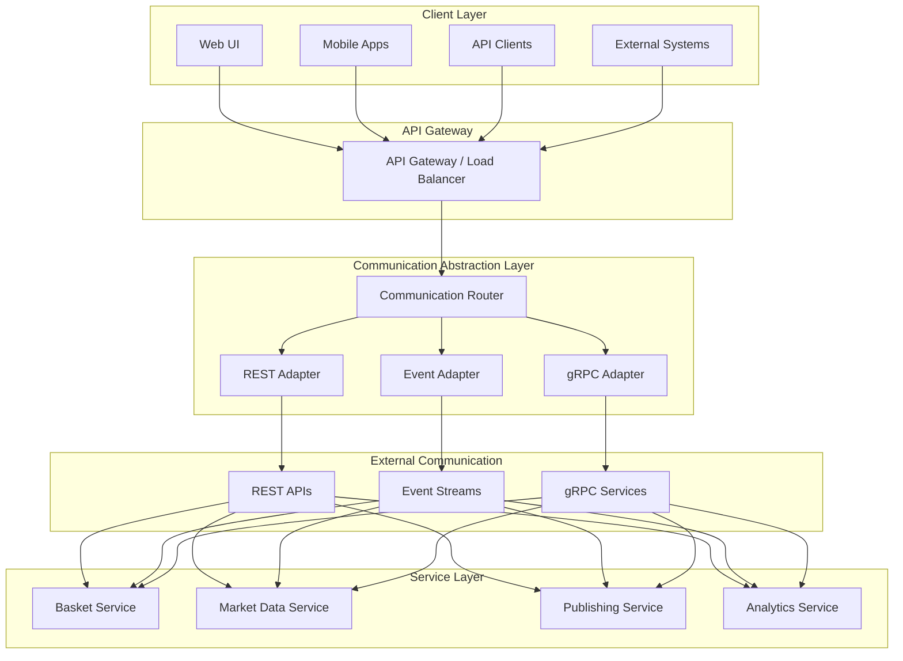

# Hybrid Communication Strategy

## Overview

This document defines a **smart communication architecture** that uses different protocols based on latency requirements and use case characteristics. The platform dynamically chooses between REST APIs, Event Streaming, and gRPC based on performance needs and communication patterns.

## Communication Protocol Decision Matrix

```yaml
Protocol Selection Criteria:
  📱 REST APIs: User-facing operations, external integrations, low frequency
  📡 Event Streaming: Asynchronous workflows, audit trails, eventual consistency
  ⚡ gRPC: High-frequency internal calls, real-time processing, low latency critical

Latency Requirements:
  🐌 > 100ms: REST APIs acceptable
  🚶 10-100ms: Event streaming preferred  
  🏃 < 10ms: gRPC required
  ⚡ < 1ms: gRPC + Actor model mandatory
```

## Communication Architecture



## Use Case to Protocol Mapping

### 🐌 **REST APIs (Latency: 100ms+ acceptable)**

```yaml
Use Cases:
  ✅ User-facing operations (basket CRUD, user management)
  ✅ External system integrations (vendor APIs, third-party services)
  ✅ Administrative operations (configuration, reporting)
  ✅ Bulk operations (batch uploads, data exports)
  ✅ One-time operations (account setup, system configuration)

Characteristics:
  - Human-initiated requests
  - Infrequent operations (< 100 requests/second)
  - Request-response pattern
  - Stateless operations
  - Cacheable responses
  - SEO/Documentation important

Examples:
  🔹 Create basket via web UI
  🔹 Generate backtest report
  🔹 User authentication
  🔹 Admin configuration changes
  🔹 Bulk basket upload
```

### 📡 **Event Streaming (Latency: 10-100ms)**

```yaml
Use Cases:
  ✅ Asynchronous workflows (approval processes, notifications)
  ✅ Audit trail and compliance (state changes, user actions)
  ✅ Data synchronization (cache updates, database replication)
  ✅ Business process orchestration (basket lifecycle, publishing workflow)
  ✅ Integration events (external system notifications)

Characteristics:
  - Fire-and-forget messaging
  - Eventual consistency acceptable
  - Decoupled services
  - Event sourcing patterns
  - Replay capability needed
  - Order preservation important

Examples:
  🔹 Basket status changes
  🔹 Approval workflow events
  🔹 Audit log entries
  🔹 Cache invalidation events
  🔹 Notification triggers
```

### ⚡ **gRPC (Latency: < 10ms critical)**

```yaml
Use Cases:
  ✅ Real-time price updates (market data feeds)
  ✅ High-frequency trading operations (basket valuations)
  ✅ Internal service-to-service calls (data lookups, validations)
  ✅ Streaming data (price feeds, real-time analytics)
  ✅ Actor message passing (basket state updates)

Characteristics:
  - Sub-10ms latency required
  - High frequency (1000+ requests/second)
  - Binary protocol efficiency
  - Streaming support needed
  - Type safety critical
  - Internal service communication

Examples:
  🔹 Real-time basket valuation
  🔹 Price feed processing
  🔹 Actor state queries
  🔹 Market data lookup
  🔹 Validation checks
```

## Implementation: Smart Communication Router

### 1. Communication Router Interface

```java
package com.custom.indexbasket.communication;

import reactor.core.publisher.Mono;
import reactor.core.publisher.Flux;
import java.time.Duration;

/**
 * Smart communication router that selects optimal protocol
 * based on latency requirements and operation characteristics
 */
public interface CommunicationRouter {
    
    /**
     * Execute operation with automatic protocol selection
     */
    <T, R> Mono<R> execute(CommunicationRequest<T, R> request);
    
    /**
     * Execute streaming operation with protocol selection
     */
    <T, R> Flux<R> executeStream(StreamingRequest<T, R> request);
    
    /**
     * Execute with explicit protocol preference
     */
    <T, R> Mono<R> executeWithProtocol(CommunicationRequest<T, R> request, ProtocolType protocol);
}

/**
 * Communication request with requirements
 */
public class CommunicationRequest<T, R> {
    private final String operation;
    private final T payload;
    private final Class<R> responseType;
    private final LatencyRequirement latencyRequirement;
    private final ConsistencyRequirement consistencyRequirement;
    private final FrequencyPattern frequencyPattern;
    private final Duration timeout;
    
    // builders and getters
}

/**
 * Latency requirements enum
 */
public enum LatencyRequirement {
    REAL_TIME(Duration.ofMillis(1)),     // < 1ms - Actor model + gRPC
    LOW_LATENCY(Duration.ofMillis(10)),  // < 10ms - gRPC
    MEDIUM_LATENCY(Duration.ofMillis(100)), // < 100ms - Events or gRPC
    HIGH_LATENCY(Duration.ofSeconds(1)), // < 1s - REST API
    BATCH(Duration.ofSeconds(30));       // Batch operations - REST API
    
    private final Duration maxLatency;
    
    LatencyRequirement(Duration maxLatency) {
        this.maxLatency = maxLatency;
    }
    
    public Duration getMaxLatency() {
        return maxLatency;
    }
}

/**
 * Protocol types
 */
public enum ProtocolType {
    REST_API,
    EVENT_STREAMING,
    GRPC,
    ACTOR_MODEL
}

/**
 * Consistency requirements
 */
public enum ConsistencyRequirement {
    STRONG,      // Immediate consistency - gRPC/REST
    EVENTUAL,    // Eventual consistency - Events
    NONE         // No consistency needed
}

/**
 * Frequency patterns
 */
public enum FrequencyPattern {
    ONE_TIME,           // Single request - REST preferred
    LOW_FREQUENCY,      // < 10/sec - REST acceptable
    MEDIUM_FREQUENCY,   // 10-100/sec - gRPC preferred
    HIGH_FREQUENCY,     // 100-1000/sec - gRPC required
    ULTRA_HIGH_FREQUENCY // > 1000/sec - Actor model required
}
```

### 2. Smart Protocol Selection Logic

```java
@Component
public class SmartCommunicationRouter implements CommunicationRouter {
    
    private final RestApiAdapter restApiAdapter;
    private final EventStreamAdapter eventStreamAdapter;
    private final GrpcAdapter grpcAdapter;
    private final ActorSystemAdapter actorAdapter;
    
    @Override
    public <T, R> Mono<R> execute(CommunicationRequest<T, R> request) {
        ProtocolType optimalProtocol = selectOptimalProtocol(request);
        return executeWithProtocol(request, optimalProtocol);
    }
    
    @Override
    public <T, R> Mono<R> executeWithProtocol(CommunicationRequest<T, R> request, ProtocolType protocol) {
        return switch (protocol) {
            case REST_API -> restApiAdapter.execute(request);
            case EVENT_STREAMING -> eventStreamAdapter.execute(request);
            case GRPC -> grpcAdapter.execute(request);
            case ACTOR_MODEL -> actorAdapter.execute(request);
        };
    }
    
    /**
     * Smart protocol selection algorithm
     */
    private <T, R> ProtocolType selectOptimalProtocol(CommunicationRequest<T, R> request) {
        // Priority 1: Ultra-low latency requirements
        if (request.getLatencyRequirement() == LatencyRequirement.REAL_TIME) {
            return ProtocolType.ACTOR_MODEL;
        }
        
        // Priority 2: Low latency with high frequency
        if (request.getLatencyRequirement() == LatencyRequirement.LOW_LATENCY ||
            request.getFrequencyPattern() == FrequencyPattern.HIGH_FREQUENCY ||
            request.getFrequencyPattern() == FrequencyPattern.ULTRA_HIGH_FREQUENCY) {
            return ProtocolType.GRPC;
        }
        
        // Priority 3: Asynchronous operations with eventual consistency
        if (request.getConsistencyRequirement() == ConsistencyRequirement.EVENTUAL &&
            request.getLatencyRequirement() != LatencyRequirement.REAL_TIME) {
            return ProtocolType.EVENT_STREAMING;
        }
        
        // Priority 4: External facing or low frequency operations
        if (request.getFrequencyPattern() == FrequencyPattern.ONE_TIME ||
            request.getFrequencyPattern() == FrequencyPattern.LOW_FREQUENCY ||
            isExternalOperation(request.getOperation())) {
            return ProtocolType.REST_API;
        }
        
        // Default to gRPC for internal high-performance needs
        return ProtocolType.GRPC;
    }
    
    private boolean isExternalOperation(String operation) {
        return operation.startsWith("external.") || 
               operation.startsWith("user.") || 
               operation.startsWith("admin.");
    }
}
```

### 3. Service-Specific Implementations

#### Basket Service Communication Strategy

```java
@Service
public class BasketCommunicationService {
    
    private final CommunicationRouter communicationRouter;
    
    /**
     * Create basket - User operation, REST API preferred
     */
    public Mono<Basket> createBasket(CreateBasketRequest request, String userId) {
        CommunicationRequest<CreateBasketRequest, Basket> commRequest = 
            CommunicationRequest.<CreateBasketRequest, Basket>builder()
                .operation("user.basket.create")
                .payload(request)
                .responseType(Basket.class)
                .latencyRequirement(LatencyRequirement.HIGH_LATENCY)    // User can wait
                .consistencyRequirement(ConsistencyRequirement.STRONG)  // Must be consistent
                .frequencyPattern(FrequencyPattern.LOW_FREQUENCY)       // Infrequent operation
                .timeout(Duration.ofSeconds(10))
                .build();
        
        return communicationRouter.execute(commRequest);
    }
    
    /**
     * Get basket state - Internal operation, gRPC preferred
     */
    public Mono<BasketState> getBasketState(String basketCode) {
        CommunicationRequest<String, BasketState> commRequest = 
            CommunicationRequest.<String, BasketState>builder()
                .operation("internal.basket.getState")
                .payload(basketCode)
                .responseType(BasketState.class)
                .latencyRequirement(LatencyRequirement.LOW_LATENCY)     // Fast lookup needed
                .consistencyRequirement(ConsistencyRequirement.STRONG)  // Current state required
                .frequencyPattern(FrequencyPattern.MEDIUM_FREQUENCY)    // Regular lookups
                .timeout(Duration.ofMillis(500))
                .build();
        
        return communicationRouter.execute(commRequest);
    }
    
    /**
     * Basket approval workflow - Event streaming preferred
     */
    public Mono<Void> submitForApproval(String basketCode, String userId) {
        CommunicationRequest<ApprovalRequest, Void> commRequest = 
            CommunicationRequest.<ApprovalRequest, Void>builder()
                .operation("workflow.approval.submit")
                .payload(new ApprovalRequest(basketCode, userId))
                .responseType(Void.class)
                .latencyRequirement(LatencyRequirement.MEDIUM_LATENCY)  // Workflow can be async
                .consistencyRequirement(ConsistencyRequirement.EVENTUAL) // Eventual consistency OK
                .frequencyPattern(FrequencyPattern.LOW_FREQUENCY)       // Approvals are infrequent
                .timeout(Duration.ofSeconds(5))
                .build();
        
        return communicationRouter.execute(commRequest);
    }
    
    /**
     * Real-time basket valuation - Actor model required
     */
    public Mono<BasketValuation> getRealTimeValuation(String basketCode) {
        CommunicationRequest<String, BasketValuation> commRequest = 
            CommunicationRequest.<String, BasketValuation>builder()
                .operation("realtime.basket.valuation")
                .payload(basketCode)
                .responseType(BasketValuation.class)
                .latencyRequirement(LatencyRequirement.REAL_TIME)       // Sub-millisecond required
                .consistencyRequirement(ConsistencyRequirement.STRONG)  // Latest price needed
                .frequencyPattern(FrequencyPattern.ULTRA_HIGH_FREQUENCY) // Every few milliseconds
                .timeout(Duration.ofMillis(10))
                .build();
        
        return communicationRouter.execute(commRequest);
    }
}
```

#### Market Data Service Communication Strategy

```java
@Service
public class MarketDataCommunicationService {
    
    private final CommunicationRouter communicationRouter;
    
    /**
     * Historical data request - REST API acceptable
     */
    public Flux<HistoricalPrice> getHistoricalData(String symbol, LocalDate startDate, LocalDate endDate) {
        StreamingRequest<HistoricalDataRequest, HistoricalPrice> commRequest = 
            StreamingRequest.<HistoricalDataRequest, HistoricalPrice>builder()
                .operation("external.marketdata.historical")
                .payload(new HistoricalDataRequest(symbol, startDate, endDate))
                .responseType(HistoricalPrice.class)
                .latencyRequirement(LatencyRequirement.HIGH_LATENCY)    // Batch operation
                .frequencyPattern(FrequencyPattern.LOW_FREQUENCY)       // Infrequent requests
                .build();
        
        return communicationRouter.executeStream(commRequest);
    }
    
    /**
     * Real-time price feed - gRPC streaming required
     */
    public Flux<PriceUpdate> subscribeToPriceFeed(String symbol) {
        StreamingRequest<String, PriceUpdate> commRequest = 
            StreamingRequest.<String, PriceUpdate>builder()
                .operation("realtime.marketdata.pricefeed")
                .payload(symbol)
                .responseType(PriceUpdate.class)
                .latencyRequirement(LatencyRequirement.LOW_LATENCY)     // Real-time feed
                .frequencyPattern(FrequencyPattern.HIGH_FREQUENCY)      // Continuous stream
                .build();
        
        return communicationRouter.executeStream(commRequest);
    }
    
    /**
     * Price validation - Actor model for speed
     */
    public Mono<Boolean> validatePrice(String symbol, BigDecimal price) {
        CommunicationRequest<PriceValidationRequest, Boolean> commRequest = 
            CommunicationRequest.<PriceValidationRequest, Boolean>builder()
                .operation("realtime.validation.price")
                .payload(new PriceValidationRequest(symbol, price))
                .responseType(Boolean.class)
                .latencyRequirement(LatencyRequirement.REAL_TIME)       // Immediate validation
                .frequencyPattern(FrequencyPattern.ULTRA_HIGH_FREQUENCY) // Every price update
                .timeout(Duration.ofMillis(5))
                .build();
        
        return communicationRouter.execute(commRequest);
    }
}
```

## Protocol Performance Characteristics

### Performance Comparison Matrix

| Operation Type | REST API | Event Streaming | gRPC | Actor Model |
|----------------|----------|----------------|------|-------------|
| **Latency** | 50-500ms | 10-100ms | 1-10ms | <1ms |
| **Throughput** | 100 req/s | 10K msg/s | 100K req/s | 1M msg/s |
| **Overhead** | High (HTTP headers) | Medium (event metadata) | Low (binary) | Minimal |
| **Consistency** | Strong | Eventual | Strong | Strong |
| **Fault Tolerance** | Retry/Circuit Breaker | Dead Letter Queue | Circuit Breaker | Supervision |
| **Debugging** | Easy (HTTP tools) | Medium (event traces) | Medium (gRPC tools) | Complex (actor traces) |

### Use Case Performance Targets

```yaml
User Operations (REST API):
  - Target Latency: < 500ms P95
  - Throughput: 100-1,000 requests/second
  - Availability: 99.9%
  - Use Cases: Web UI, mobile apps, external APIs

Business Workflows (Event Streaming):
  - Target Latency: < 100ms P95
  - Throughput: 10,000-50,000 events/second  
  - Availability: 99.95%
  - Use Cases: Approval workflows, audit trails, notifications

Internal Services (gRPC):
  - Target Latency: < 10ms P99
  - Throughput: 100,000+ requests/second
  - Availability: 99.99%
  - Use Cases: Service-to-service calls, data lookups

Real-Time Processing (Actor Model):
  - Target Latency: < 1ms P99
  - Throughput: 1,000,000+ messages/second
  - Availability: 99.99%
  - Use Cases: Price feeds, basket valuations, state management
```

## Configuration-Driven Protocol Selection

### Application Configuration

```yaml
# application.yml
communication:
  default-protocol: grpc
  
  # Protocol selection rules
  protocol-rules:
    - pattern: "user.*"
      protocol: rest-api
      latency-requirement: high
      
    - pattern: "external.*"
      protocol: rest-api
      latency-requirement: high
      
    - pattern: "workflow.*"
      protocol: event-streaming
      consistency: eventual
      
    - pattern: "realtime.*"
      protocol: actor-model
      latency-requirement: real-time
      
    - pattern: "internal.*"
      protocol: grpc
      latency-requirement: low
  
  # Protocol-specific configurations
  rest-api:
    timeout: 30s
    retry-attempts: 3
    circuit-breaker:
      failure-threshold: 5
      timeout: 30s
  
  event-streaming:
    batch-size: 1000
    linger-ms: 10
    delivery-semantics: at-least-once
    
  grpc:
    timeout: 5s
    retry-attempts: 3
    keepalive-time: 30s
    max-message-size: 4MB
    
  actor-model:
    ask-timeout: 1s
    mailbox-size: 10000
    supervision-strategy: restart
```

### Dynamic Protocol Switching

```java
@Component
public class DynamicProtocolSelector {
    
    @EventListener
    public void handleLatencyAlert(LatencyAlertEvent event) {
        if (event.getLatency().compareTo(Duration.ofMillis(100)) > 0) {
            // Switch from REST to gRPC for this operation
            protocolOverrides.put(event.getOperation(), ProtocolType.GRPC);
            log.warn("Switching {} to gRPC due to high latency: {}ms", 
                event.getOperation(), event.getLatency().toMillis());
        }
    }
    
    @EventListener
    public void handleThroughputAlert(ThroughputAlertEvent event) {
        if (event.getRequestsPerSecond() > 1000) {
            // Switch to actor model for ultra-high frequency
            protocolOverrides.put(event.getOperation(), ProtocolType.ACTOR_MODEL);
            log.warn("Switching {} to Actor Model due to high throughput: {} req/s", 
                event.getOperation(), event.getRequestsPerSecond());
        }
    }
}
```

## Benefits of Hybrid Approach

### 1. **Optimal Performance**
```yaml
Right Tool for Right Job:
  ✅ REST APIs: Human-friendly, cacheable, stateless
  ✅ Events: Decoupled, resilient, auditable  
  ✅ gRPC: Fast, type-safe, efficient
  ✅ Actors: Ultra-fast, concurrent, fault-tolerant

Performance Optimization:
  ✅ No over-engineering for simple operations
  ✅ Maximum performance for critical paths
  ✅ Efficient resource utilization
  ✅ Scalable communication patterns
```

### 2. **Operational Flexibility**
```yaml
Development:
  ✅ Start simple with REST APIs
  ✅ Add gRPC for performance-critical paths
  ✅ Introduce events for workflows
  ✅ Use actors for ultra-high performance

Operations:
  ✅ Different monitoring for different protocols
  ✅ Protocol-specific optimization
  ✅ Gradual migration paths
  ✅ A/B testing of protocols
```

### 3. **Business Value**
```yaml
User Experience:
  ✅ Fast UI responses (REST APIs with caching)
  ✅ Real-time updates (gRPC streaming)
  ✅ Reliable workflows (event streaming)
  ✅ Sub-second pricing (actor model)

Cost Optimization:
  ✅ Efficient bandwidth usage
  ✅ Optimal infrastructure sizing
  ✅ Reduced latency costs
  ✅ Better resource utilization
```

This hybrid communication strategy ensures you get the **best performance characteristics** for each use case while maintaining **architectural simplicity** and **operational flexibility**! 🚀
